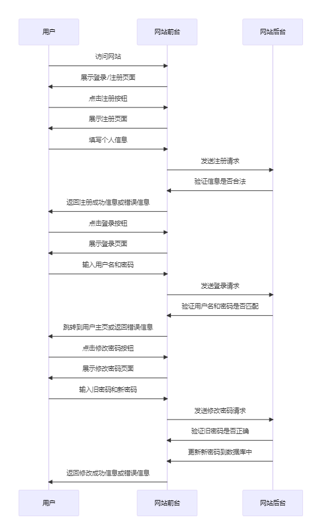

---

PMAI网址

```
https://www.pm-ai.cn/prd
```


## 前置知识

```
流程图和时序图的区别
```

流程图和时序图都是用来表示过程或工作流程的图形工具，但它们之间存在一些区别。

流程图是一种图形表示法，用于表示过程或工作流程中的各个步骤及其之间的关系。它使用不同形状的框来表示不同的步骤，并使用箭头来显示控制流从一个步骤到下一个步骤的流动。流程图通常用于业务和工程领域，以记录、分析和优化过程。

时序图是一种交互图，用于表示对象之间交互的时间顺序。它使用水平轴表示时间，垂直轴表示对象，并使用箭头来显示消息在对象之间的传递。时序图通常用于软件开发领域，以描述系统中各个组件之间的交互。

总之，流程图和时序图都是用来表示过程或工作流程的图形工具，但它们侧重点不同：流程图侧重于描述过程中各个步骤及其之间的关系，而时序图侧重于描述对象之间交互的时间顺序。

---


2 / 2

流程图和时序图都是软件工程中常用的建模工具，但它们的用途和表达方式略有不同。

流程图（Flowchart）是一种图形化的表达方式，用于表示一个系统、过程或算法中的流程和操作步骤。流程图通常采用不同形状的符号来表示各种不同的操作和决策点，如矩形表示操作步骤、菱形表示判断或决策点、圆角矩形表示起点和终点等。流程图的目的是清晰地表示一段过程或流程中各个环节的关系和依赖，以便分析、理解和改进这个过程或流程。

时序图（Sequence diagram）是一种图形化的表达方式，用于表示系统中不同对象之间的交互和消息传递。时序图通常由垂直的虚线表示对象，而对象之间的消息则由水平的箭头线表示。时序图的目的是清晰地表示系统中不同对象之间的交互和消息传递的顺序、时序和时机，以便分析、理解和改进这个系统的交互流程。

因此，流程图和时序图都是用于表达系统、过程或流程中的不同方面的工具。流程图主要关注整个过程或流程中各个环节之间的关系和依赖，而时序图主要关注系统中不同对象之间的交互和消息传递的顺序、时序和时机。


流程图


时序图



## 设计

```
高并发下的投票系统

1. 员工设定投票主题
2. 客户只允许微信打开
3. 可进行结果统计
4. 限制周期类投票: 如一天投一次
5. 热点投票放入redis缓存
6. 确保缓存和数据库中的数据一致
```


```
我是一个产品经理,帮我出一个产品文档: 高并发下的投票系统
需求: 
1. 员工设定投票主题
2. 客户只允许微信打开
3. 可进行结果统计
4. 限制周期类投票: 如一天投一次
5. 热点投票放入redis缓存
6. 确保缓存和数据库中的数据一致
```


生成内容


```
### 概述

本文档描述了一个高并发下的投票系统的需求，该系统允许员工设定投票主题，客户只能通过微信打开，可以进行结果统计，限制周期类投票，将热点投票放入redis缓存，并确保缓存和数据库中的数据一致。

### 目标

该系统的目标是提供一个高效、可靠、安全的投票系统，满足企业内部和外部的投票需求，同时保证数据的准确性和一致性。

### 用户使用旅程

1. 员工设定投票主题
2. 员工设定投票选项
3. 员工设定投票周期和限制条件
4. 客户通过微信打开投票页面
5. 客户选择投票选项
6. 投票结果实时统计
7. 员工查看投票结果

### 功能概述

1. 员工可以设定投票主题和选项
2. 客户只能通过微信打开投票页面
3. 投票结果可以实时统计
4. 可以限制周期类投票，如一天只能投一次
5. 热点投票可以放入redis缓存
6. 确保缓存和数据库中的数据一致

### 实现逻辑

1. 员工设定投票主题和选项
   - 员工登录系统，进入投票管理页面
   - 员工创建新的投票主题，输入主题名称和选项
   - 员工设置投票周期和限制条件
   - 员工保存投票主题和选项到数据库
2. 客户只能通过微信打开投票页面
   - 客户扫描投票二维码或者通过微信公众号进入投票页面
   - 系统验证客户身份，只允许微信用户投票
3. 投票结果可以实时统计
   - 系统实时统计投票结果，将结果保存到数据库
   - 员工可以查看投票结果，包括投票人数和每个选项的得票数
4. 可以限制周期类投票，如一天只能投一次
   - 系统记录客户投票时间和投票次数
   - 系统根据员工设定的限制条件，限制客户投票次数和投票周期
5. 热点投票可以放入redis缓存
   - 系统监测投票数据，将热点投票放入redis缓存
   - 系统定期清理redis缓存，保证缓存数据的准确性
6. 确保缓存和数据库中的数据一致
   - 系统监测缓存和数据库中的数据一致性
   - 系统定期同步缓存和数据库中的数据，保证数据的一致性

### 功能详细描述

1. 员工设定投票主题和选项
   - 定义：员工可以创建新的投票主题，输入主题名称和选项，设置投票周期和限制条件
   - 操作交互：
     - 员工登录系统，进入投票管理页面
     - 员工点击“创建新的投票主题”按钮
     - 系统弹出新建投票主题的对话框
     - 员工输入主题名称和选项，设置投票周期和限制条件
     - 员工点击“保存”按钮
     - 系统保存投票主题和选项到数据库
   - 注意事项：
     - 主题名称和选项不能为空
     - 投票周期和限制条件不能为空
2. 客户只能通过微信打开投票页面
   - 定义：客户只能通过微信打开投票页面，系统验证客户身份，只允许微信用户投票
   - 操作交互：
     - 客户扫描投票二维码或者通过微信公众号进入投票页面
     - 系统验证客户身份，只允许微信用户投票
   - 注意事项：
     - 投票页面必须支持微信登录
3. 投票结果可以实时统计
   - 定义：系统实时统计投票结果，将结果保存到数据库，员工可以查看投票结果，包括投票人数和每个选项的得票数
   - 操作交互：
     - 系统实时统计投票结果，将结果保存到数据库
     - 员工登录系统，进入投票管理页面
     - 员工选择需要查看的投票主题
     - 系统显示投票结果，包括投票人数和每个选项的得票数
   - 注意事项：
     - 投票结果必须实时统计，保证数据的准确性
4. 可以限制周期类投票，如一天只能投一次
   - 定义：系统记录客户投票时间和投票次数，根据员工设定的限制条件，限制客户投票次数和投票周期
   - 操作交互：
     - 系统记录客户投票时间和投票次数
     - 系统根据员工设定的限制条件，限制客户投票次数和投票周期
   - 注意事项：
     - 投票周期和限制条件必须符合员工设定的要求
5. 热点投票可以放入redis缓存
   - 定义：系统监测投票数据，将热点投票放入redis缓存，定期清理redis缓存，保证缓存数据的准确性
   - 操作交互：
     - 系统监测投票数据，将热点投票放入redis缓存
     - 系统定期清理redis缓存，保证缓存数据的准确性
   - 注意事项：
     - 热点投票必须放入redis缓存，提高系统性能
6. 确保缓存和数据库中的数据一致
   - 定义：系统监测缓存和数据库中的数据一致性，定期同步缓存和数据库中的数据，保证数据的一致性
   - 操作交互：
     - 系统监测缓存和数据库中的数据一致性
     - 系统定期同步缓存和数据库中的数据，保证数据的一致性
   - 注意事项：
     - 缓存和数据库中的数据必须保持一致，避免数据错误。
```

