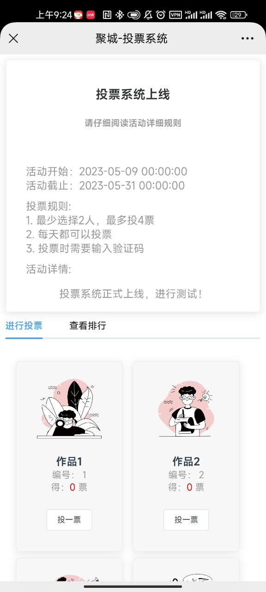

# 产品名称

## 1. 产品概述

1. 用户可以创建投票活动,生成链接与二维码。投票活动有单选,多选,是否为周期性投票,投票时是否需要输入验证码等设置。其他用户可以进行投票,生成投票排行,导出投票结果统计为excel等。

2. 采用 shiro进行登录认证与权限管理。系统管理员可以对用户迸行管理,对用户进行角色分配,对角色进行权限分配等。

   

## 2. 功能描述


### 2.1 投票创建

1. 点击投票系统 -创建投票

2. 填写基本信息、作品管理、自定义配置

   1. 基本信息：投票基本信息，包括标题、投票开始、结束时间以及描述

   2. 作品管理：添加作品，修改封面（默认上传OSS，vote文件夹按日期排序）

   3. 自定义配置： 可选择投票类型（是否多选），是否输入验证码、是否为周期投票以及作品投票限制。

   4. 点击发布： 一个完整的投票创建完成(默认保存公司ID以及操作人uid)。

      


### 2.2 公众号设置

此功能可直接生成发送到对应公众号的二维码和链接，只生成存入缓存，不存数据库。

**注： 不同公众号appid不同，生成链接也不同**

1. 默认展示配置的公众号信息
2. 点击启用发送会自动生成活动的二维码和链接（链接可直接复制）
3. 此配置默认存在redis，过期时间为30天

### 2.3 客户端投票

1. 客户按设定好的投票规则进行投票
2. 投票用户默认取openid作为唯一标识进行锁定
3. 只允许使用微信客户端打开链接，H5打开后默认跳转提示错误页面

### 2.4 投票统计

1. 默认展示所有用户的投票结果以及占比
2. 可将投票结果导出为Excel文档


## 3. 操作界面


### 3.1 员工端


### 3.2 公众号设置


### 3.3 客户端



投票后受限： 


只允许微信打开：


### 3.4 投票统计


## 4. 技术规格

1. 后端采用 SpringCloud,SpringBoot,JPA, shiro 
2. 前端采用vue, elementUI, axios 
3. 数据库采用MySQL,redis
4. 文件存储使用OSS

## 5. 常见问题

（在这里列出用户在使用产品过程中可能遇到的问题，并提供解决方案）

1. 投票系统新增配置

   1. sys_menu找到菜单

      ```
      INSERT INTO.`sys_menu` (`menu_id`, `parent_id`, `name`, `url`, `perms`, `type`, `icon`, `order_num`, `gmt_create`, `gmt_modified`, `explain`, `menu_name`, `path`, `component`, `is_frame`, `is_cache`, `menu_type`, `visible`, `status`, `update_by`, `update_time`, `remark`, `create_by`, `create_time`, `icon1`, `menu_affiliation`, `query`) VALUES (2002214, 102055, '投票系统', '/survey/vote', '', 1, '', 20, NULL, NULL, NULL, NULL, '', NULL, 1, 0, '', '0', '0', '', NULL, '', '', NULL, '#', NULL, '');
      ```

      


## 6. 版本历史

| 版本号 | 更新日期          | 开发人员 | 更新内容                   |
| ------ | ----------------- | -------- | -------------------------- |
| 1.0.0  | 2023-5-9 09:35:46 | 邹宇     | 初始版本，实现了基础功能。 |
|        |                   |          |                            |
|        |                   |          |                            |
|        |                   |          |                            |


