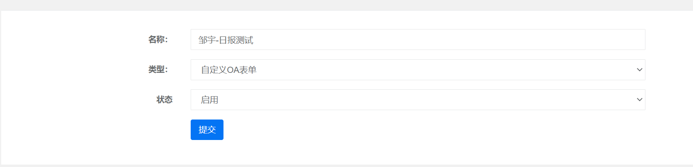
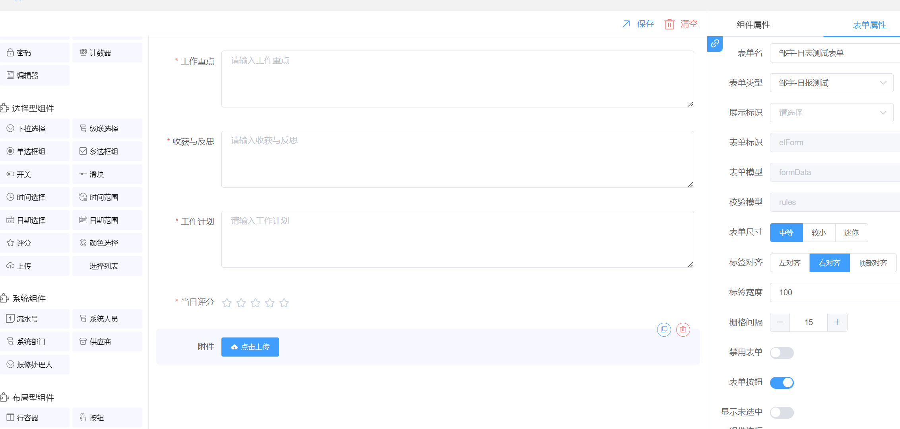
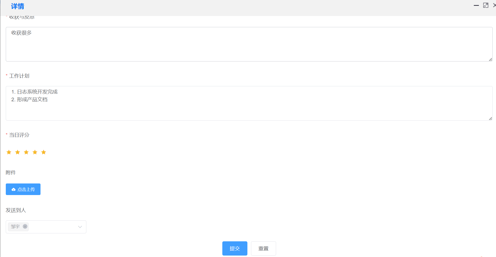
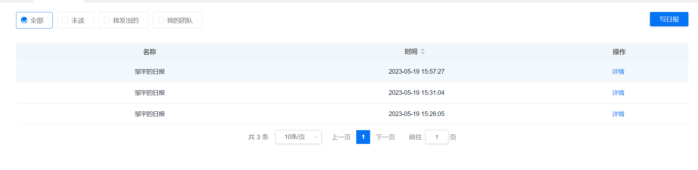
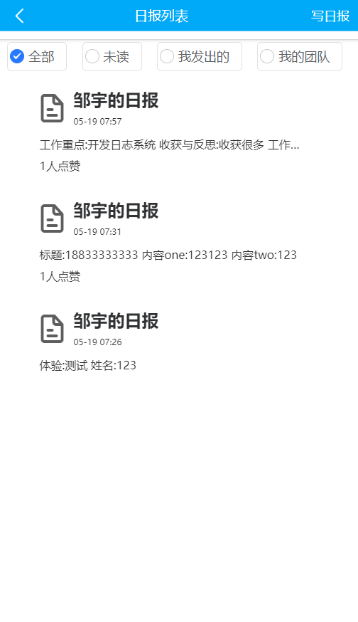
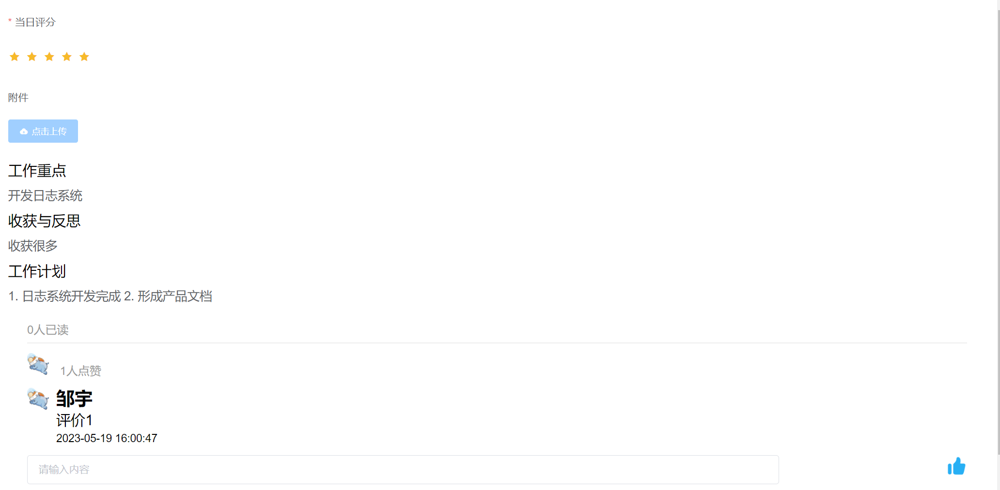
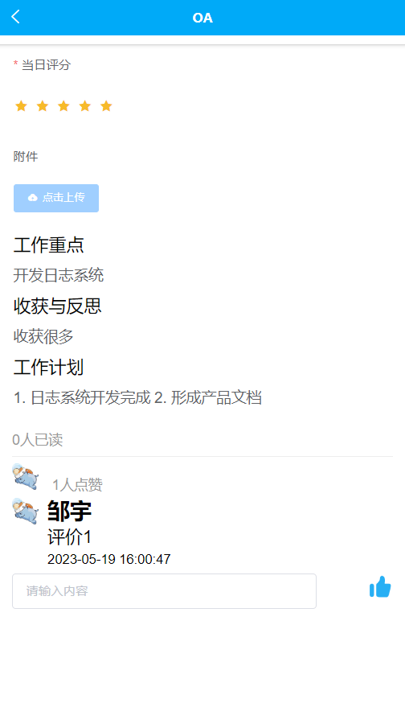

# 产品名称

## 1. 产品概述

日报系统是一种实用的工具，能够帮助企业和组织跟踪其日常进度和活动。

## 2. 功能描述

### 2.1 日报类型

 表单类型新增 OA表单

### 2.2 日报设计

此功能使用OA自定义表单，可自行进行设计

### 2.3 日报提交

1. 此功能可选择需填写的日志模板
1. 日志并填写完成后，选择发送的人员，对应人员会收到该日志，但不会提醒。

### 2.4 日报查看

1. 可查看未读，我发出的，我团队的日志
1. 可查看详情

### 2.5  日报详情

1. 可查看填写的日报信息
2. 可进行评论、点赞

## 3. 操作界面

### 3.1 日报类型

### 3.2 日报设计

### 3.3 日报提交

### 3.4 日报查看

PC端

APP端

### 3.5 日报详情

PC端

APP端

## 4. 技术规格

1. 后端采用 SpringBoot
2. 前端采用vue, elementUI, 
3. 日志显示采用开源表单设计器
4. 数据库采用MySQL,MongoDB

## 5. 常见问题

（在这里列出用户在使用产品过程中可能遇到的问题，并提供解决方案）

* 优化点: 
  * 旧版表单可升级为新表单
  * 日志提交后不会提醒相应人员，必须打开APP或者PC页面刷新才会看到新提交的日报
  * MongoDB 新增操作服务,内网通信
* bug
  * 上述2.2 表单类型必须选择 "日报"  两字
  * 日报填写 发送到人可发到被删除人员
  * PC端提交成功会显示选择模板页面
  * 已读功能不会主动更新

## 6. 版本历史

| 版本号 | 更新日期           | 开发人员 | 更新内容     |
| ------ | ------------------ | -------- | ------------ |
| 1.0.0  | 2023-5-19 16:09:00 | 邹宇     | 汇总日报功能 |
|        |                    |          |              |
|        |                    |          |              |
|        |                    |          |              |

