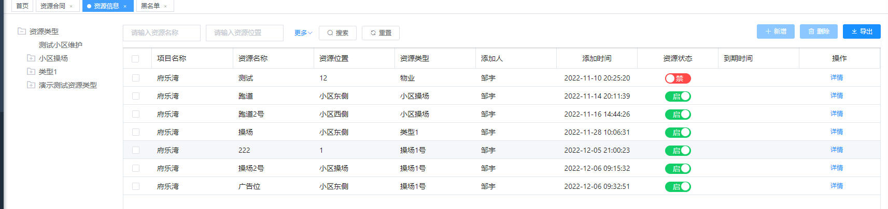
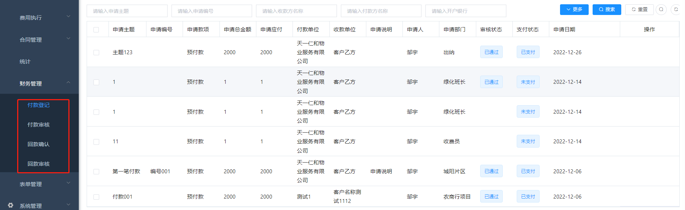

# **合同管理系统**


---


本文档旨在提供关于服务合同系统产品的详细信息，包括功能、特点和使用方法。服务合同系统旨在帮助用户管理和监控服务合同，提高效率并确保合规性。


以下是服务合同的产品操作步骤：


一、客户信息维护

1. 在系统首页点击“客户信息”按钮。
2. 点击“新增客户”按钮，填写客户基本信息（如公司名称、联系人、联系方式等）。
3. 点击“保存”按钮，将客户信息保存至系统中。
4. 可以通过搜索或筛选功能查找已有客户信息并进行编辑或删除。

二、签约合同记录

1. 在系统首页点击“合同管理”按钮。
2. 点击“新建合同”按钮，填写合同相关信息（如编号、客户、开始日期、结束日期、服务内容、费用等）。
3. 点击“保存”按钮，将合同记录保存至系统中。
4. 生成收付款计划
5. 可以通过搜索或筛选功能查找已有合同记录并进行编辑或删除。

三、合同审批

1. 在系统首页进入合同审批页面。
2. 点击合同条目后可以查看合同详情。
3. 根据实际情况进行审批，点击“通过”或“拒绝”按钮操作。
4. 审批结果会自动更新至合同记录中。

四、付款

1. 在系统首页进入付款页面。
2. 点击合同条目后可以查看合同详情。
3. 填写付款信息（如付款方式、金额等）。
4. 点击“确认付款”按钮进行付款操作。
5. 付款结果会自动更新至合同记录中。

五、归档

1. 在系统首页，进入归档页面。
2. 点击合同条目后可以查看合同详情。

以上为本产品的基本操作说明，请根据实际情况进行操作。


---


# 一、合同管理

## 1．资源管理

可通过此功能登记物业公司所有项目的可利用的多种经营的场地资源，用作多种经营合同的资源选择，已经签订合同的资源状态进行变更。未签订合同的资源状态为空置。通过此列表可以直观的看到物业公司所有项目所有空置可利用的资源信息，方便综合部门进行多种经营的业务推广。

### 1.1 资源类型维护

1. 可无限级添加资源类型
2. 选择对应类别添加多个资源

### 1.2 资源添加

1. 添加的资源和默认选择的项目进行绑定
2. 点击详情可查看此资源的签约情况，显示对应合同




## **2．客户管理**

本模块描述了客户管理模块的功能，包括客户档案管理、联系人管理、合同管理等功能。本模块主要面向企业客户，帮助企业有效地管理客户信息、销售订单、合同履行等业务，提高企业的销售和服务效率。

### **2.1客户管理**

客户档案管理是本模块最基本的功能

通过此功能，进行客户信息管理，客户信息包括甲方和乙方信息。

关注客户，分配客户给业务人员，移入黑名单，查询跟进状态等。

**字段说明**：

1. 是否甲方： 甲方为付款方，服务合同中甲方添加时默认检索甲方客户
2. 客户来源：选择后必填来源对象
3. 税目类别在数据库中字典维护


**功能说明**：

1. 客户添加页面可直接填写基础信息和联系人、银行账户、税目等信息
2. 关注客户： 业务人员可直接关注客户进行跟进
3. 移入黑名单： 填写拉黑理由后可将此客户拉黑。
4. 变更： 只可更改客户信息，此步骤没有审批
5. 客户详情信息： 默认显示客户基本信息、签约的合同列表、该客户的跟进状态、银行账户以及联系人信息


## **3．银行账户**

对公司、客户的银行账户信息进行管理

1. 归属类型： 选择客户为正常的外部客户，选择公司为公司内部

2. 归属对象名： 归属类型选择客户需填写客户名称，选择公司需选择员工名称

   


## 4．服务合同

### **4.1 合同添加**

通过此功能，选择已审核通过的客户名称，填写相关信息。

1. 字典信息存于数据库和缓存中，系统重启就会重新加载数据
2. 收支类型分为支出和收入，选择支出则生成付款计划，选择收入则生成回款计划


### **4.2 合同详情**

通过此功能，可查看合同的全部详情信息，包含基本信息、相关附件、收款协议和应收款条目等。

1. 审批通过之后不能编辑，只允许变更


### **4.3 合同审核**

合同确定之后，进行合同提交，进入审批流程，审核过程合同不允许任何操作。

多种审批

```
合同-服务合同审批
合同-合同变更审批
合同-回款计划审批
合同-回款计划变更审批
费用执行-付款审批
费用执行-回款审批
费用执行-报销审批
费用执行-借款审批
合同-付款申请审批
```


### 4.4 合同提醒-未做

根据合同录入的情况以及费用生成的情况，可以设置费用在几天内进行收取，如果超过时间，则进行提醒合同发起人，由发起人进行催促客户尽快完成付款。

### **4.5 合同变更**

对已经审核完成后的合同进行补充协议、附加条款的修改.


### **4.6 合同续签**

此功能可进行合同续签，延长合同有效期。


## 5.合同收付款计划生成

1. 设计计划： 根据合同的总额进行计划生成

2. 费用分摊： 根据生成的计划设置分摊（预算模块）

3. 收入合同： 不涉及到分摊，无需设定。

   


## 6.多经合同

多种经营合同记录

### **6.1合同添加**

通过此功能，选择客户名称，填写相关信息。与服务合同不同点为： 需选择多经资源绑定。


### **6.2合同审核**

合同确定之后，进行合同提交，进入审批流程，审批流程通过后，直接给各个项目上生成多经费用，进行收款结算，同服务合同。


### 6.3与服务合同不同点

1. 合同添加必须选择对应资源
2. 不涉及到费用分摊，暂不计算进年收入预算
3. 多经合同全为回款

### 


## 7．回款、付款计划

**此功能可对合同设定**应收未收款项，设置预计回款时间，预计回款金额，提醒员工及时催款。可查询合同的未回款和已回款项

1. 发起人先提起申请，财务付款、回款后不能再次发起
1. 流程：发起人发起收付款提报->财务审核后收款或者付款





## **8．合同归集**

显示所有已审核的合同信息或者其他上传文件，起到文件封存查阅作用。

1. 合同审批通过后,最后节点审批人可以进行合同归集 

2. 根据档案类型可以区分合同还是其他类

   


# 二、实施步骤


## 业务流程

1. 维护资源信息
2. 维护客户信息包括联系人、电话、银行账户
3. 新增合同信息
4. 生成收款计划（设置分摊）
5. 合同审批
6. 审批后合同进行归档
7. 根据合同的开始和结束时间，也无人进行收付款提报
8. 提报审批
9. 审批通过之后财务进行审核
10. 审核完成进行收付款

## 字典参数

数据库表：

sys_dict_data
sys_dict_type


## 菜单添加

sys_menu表添加 id>2000000的所有菜单，包含合同和预算模块

菜单添加完成后，将权限加到对应角色


