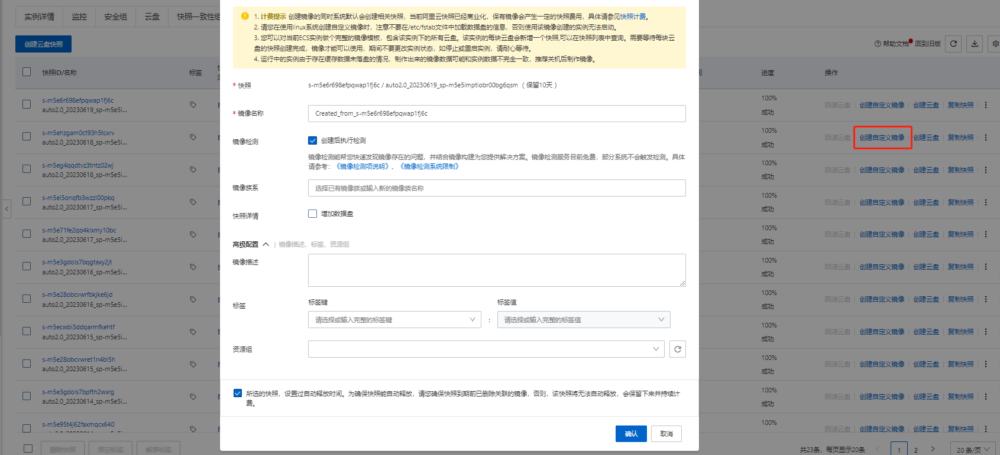
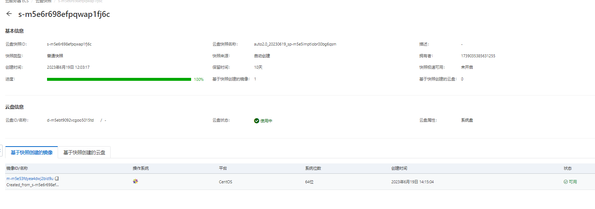
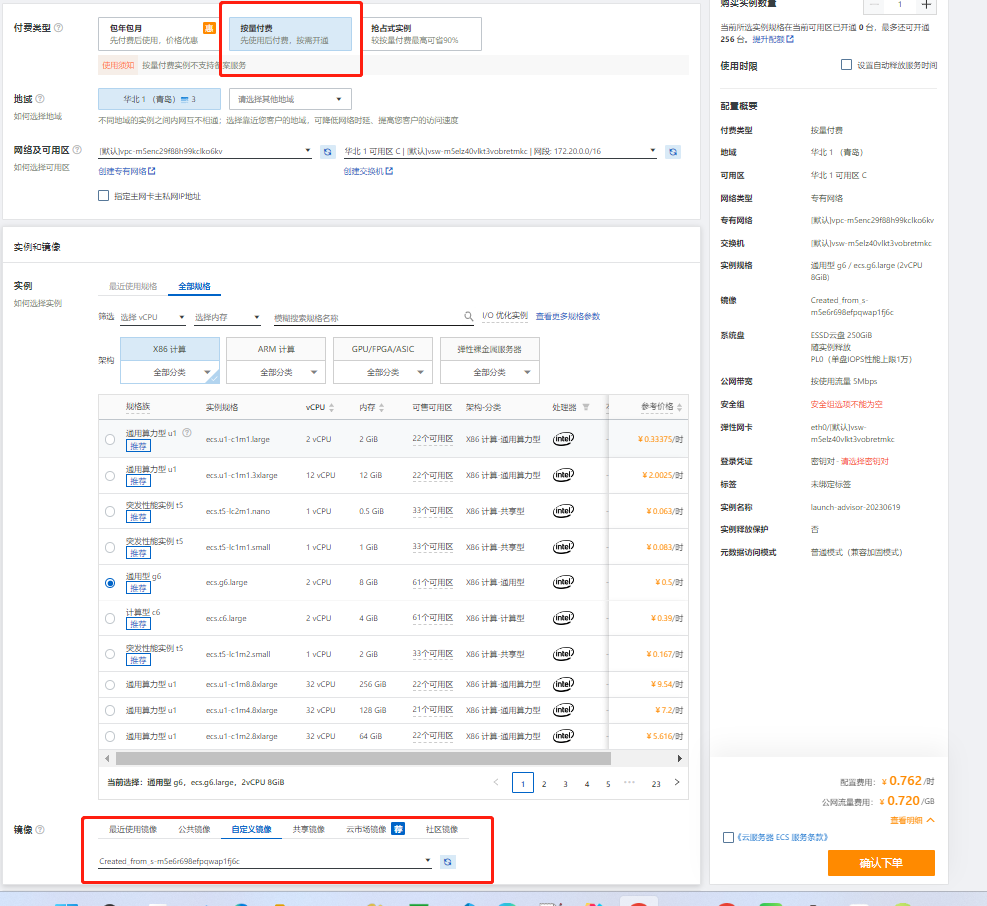
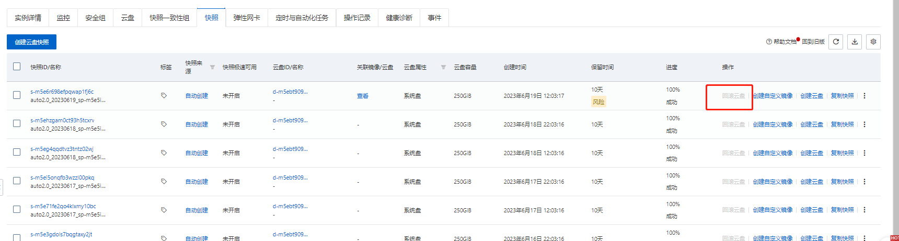

---

## 1. 适用背景

1. 云服务器会定时备份
2. 当数据被删除但当时没有做数据备份
3. 查找某个时间点之前的数据

## 2. 数据库服务器恢复

一般用于只有数据库的服务器进行恢复，在目前版本不受影响的情况下获取丢失或者误删除的数据。

1. 登陆阿里云后台找到实例

2. 找到具体实例后点击快照 - 找到具体需要环境的时间点快照

3. 点击创建自定义镜像

   

   

4. 通过以上步骤，一个可运行的快照镜像就生成完成，下面创建具体的实例

5. 首页点击-创建实例

6. 付费类型 -选择 按量付费 （注： 一定选择按量付费，数据处理完成后及时释放）

7. 镜像-选择 自定义镜像 粘贴镜像ID到此处

   

8. 点击下单，账户中剩余金额要超过100元

9. 下单完成后一个实例就创建成功，点击启动就可以登陆进入服务器内部

10. 处理完数据后一定记住及时释放此实例，按量付费会按时间产生费用。

## 3. 程序服务器恢复

一般用于程序服务器，不会有数据增量的机器。中病毒等情况下可通过此类方法恢复。（注： 对于部分增量数据不会恢复，所以一定要先做下面第一条）

1. 找到实例-创建云盘快照，保存目前的服务器状态。

2. 实例停机，回滚云盘

   

3. 等待回滚完毕后就恢复在固定时间点的快照状态。

