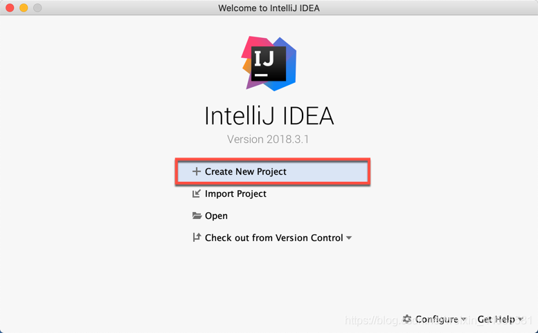
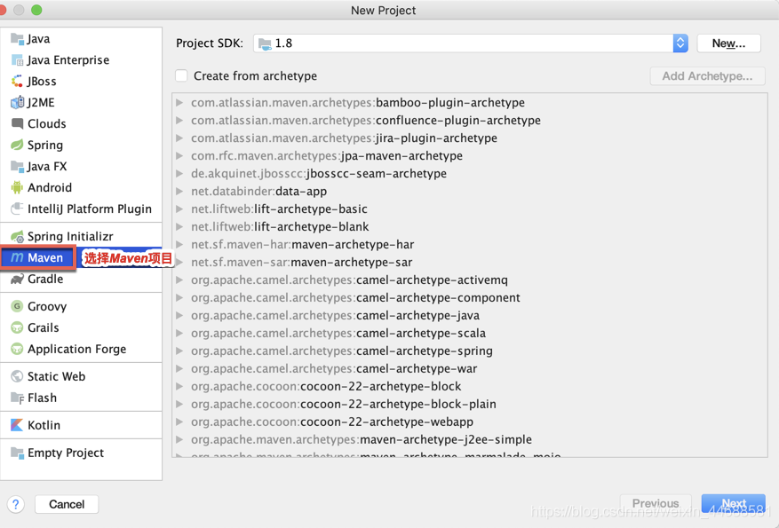
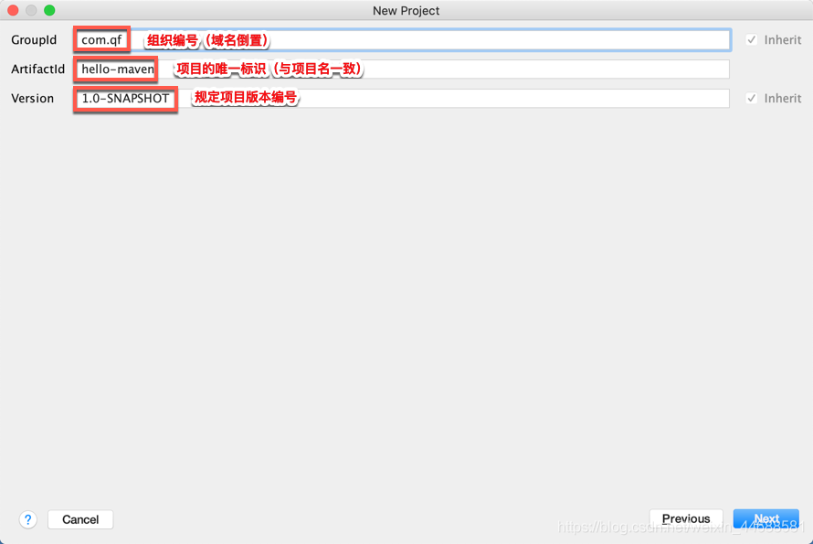
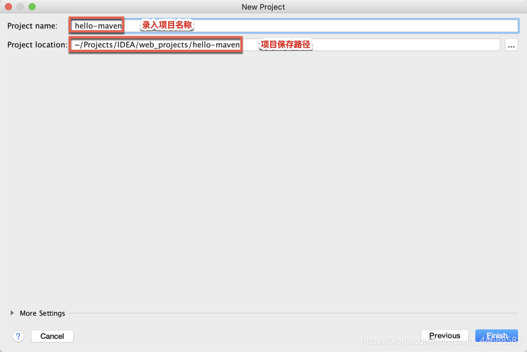



@[toc]
### 一、引言

------

#### 1.1 什么是框架？

> [软件的半成品，解决了软件开发过程当中的普适性问题]()，从而简化了开发步骤，提供了开发的效率。


#### 1.2 什么是ORM框架？

> * ORM（Object Relational Mapping）对象关系映射，将程序中的[一个对象与表中的一行数据一一对应]()。
> * ORM框架提供了持久化类与表的映射关系，在运行时参照映射文件的信息，[把对象持久化到数据库中`]()。


####  1.3 使用JDBC完成ORM操作的缺点？

> * 存在大量的冗余代码。
>
> * 手工创建 Connection、Statement 等。
>
> * 手工将结果集封装成实体对象。
>
> * 查询效率低，没有对数据访问进行过优化（Not Cache）。


###  二、MyBatis框架

------

#### 2.1 概念

> * MyBatis本是Apache软件基金会的一个开源项目iBatis, 2010年这个项目由apache software foundation 迁移到了Google Code，并且改名为MyBatis 。2013年11月迁移到Github。
> * MyBatis是一个[优秀的基于Java的持久层框架]()，支持自定义SQL，存储过程和高级映射。
> * MyBatis[对原有JDBC操作进行了封装]()，几乎消除了所有JDBC代码，使开发者只需关注 SQL 本身。
> * MyBatis可以使用简单的XML或Annotation来配置执行SQL，并[自动完成ORM操作]()，将执行结果返回。


#### 2.2 访问与下载

> 官方网站：<http://www.mybatis.org/mybatis-3/>
>
> 下载地址：<https://github.com/mybatis/mybatis-3/releases/tag/mybatis-3.5.1>


### 三、构建Maven项目

------

#### 3.1 新建项目

|                使用IDEA打开已创建的文件夹目录                |
| :----------------------------------------------------------: |
|  |
   |


#### 3.2 选择Maven目录

|                        选择Maven项目                         |
| :----------------------------------------------------------: |
|  |
 |


#### 3.3 GAV坐标

|                           GAV坐标                            |
| :----------------------------------------------------------: |
|  |
|



### 四、MyBatis环境搭建【`重点`】

------

#### 4.1 pom.xml中引入MyBatis核心依赖

> 在pom.xml中引入相关依赖

```xml
<?xml version="1.0" encoding="UTF-8"?>

<project xmlns="http://maven.apache.org/POM/4.0.0" 	
         xmlns:xsi="http://www.w3.org/2001/XMLSchema-instance"
         xsi:schemaLocation=
         "http://maven.apache.org/POM/4.0.0 
          http://maven.apache.org/xsd/maven-4.0.0.xsd">
    
    <modelVersion>4.0.0</modelVersion>

    <!--项目配置-->
    <groupId>com.qf</groupId>
    <artifactId>hello-mybatis</artifactId>
    <version>1.0-SNAPSHOT</version>

    <!--依赖-->
    <dependencies>
        <!--MyBatis核心依赖-->
        <dependency>
            <groupId>org.mybatis</groupId>
            <artifactId>mybatis</artifactId>
            <version>3.4.6</version>
        </dependency>

        <!--MySql驱动依赖-->
        <dependency>
            <groupId>mysql</groupId>
            <artifactId>mysql-connector-java</artifactId>
            <version>5.1.47</version>
        </dependency>
	  </dependencies>
</project>
```


#### 4.2 创建MyBatis配置文件

> 创建并配置mybatis-config.xml


补充：config全部默认写到resource下
```xml
<?xml version="1.0" encoding="UTF-8" ?>
<!DOCTYPE configuration PUBLIC "-//mybatis.org//DTD Config 3.0//EN"
	"http://mybatis.org/dtd/mybatis-3-config.dtd">

<!--MyBatis配置-->
<configuration>
    <!--JDBC环境配置、选中默认环境-->
    <environments default="shine_config">
        <!--MySql数据库环境配置 id自己写-->
        <environment id="shine_config">
            <!--事务管理-->
            <transactionManager type="JDBC"/>
            <!--连接池-->
            <dataSource type="org.apache.ibatis.datasource.pooled.PooledDataSourceFactory">
                <property name="driver" value="com.mysql.jdbc.Driver"/>
                <!-- &转义&amp; 3306后加数据库名 -->
                <property name="url" value="jdbc:mysql://localhost:3306/mybatis_shine?useUnicode=true&amp;characterEncoding=utf-8"/>
                <property name="username" value="root"/>
                <property name="password" value="root"/>
            </dataSource>
        </environment>
    </environments>

    <!--Mapper注册-->

    <!--Mapper文件注册位置-->
    <mappers>
        <!--注册Mapper文件-->
        <mapper resource="UserDAOMapper.xml"/>
    </mappers>
</configuration>
```

* `注意：mapper.xml默认建议存放在resources中,路径不能以/开头`

补充：```&amp;```五个字符是&符号的转译。
environment id 是配置数据库的配置名

### 五、MyBatis开发步骤【`重点`】

------

#### 5.1 建表

```	sql
create database mybatis_shine default charset =utf8;

create table t_user(
  id int primary key auto_increment,
  username varchar(50),
  password varchar(50),
  gender tinyint,
  regist_time datetime
)default charset =utf8;
```


可选择数据库

#### 5.2 定义实体类

> 定义所需CURD操作的实体类

```java
package com.qf.entity;

import java.util.Date;

public class User {
    private Integer id;
    private String username;
    private String password;
    private Boolean gender;
    private Date registTime;

    public User(){}
    public User(Integer id, String username, String password, Boolean gender, Date registTime) {
        this.id = id;
        this.username = username;
        this.password = password;
        this.gender = gender;
        this.registTime = registTime;
    }

    @Override
    public String toString() {
        return "User{" +
                "id=" + id +
                ", username='" + username + '\'' +
                ", password='" + password + '\'' +
                ", gender=" + gender +
                ", registTime=" + registTime +
                '}';
    }

    public Integer getId() {
        return id;
    }

    public void setId(Integer id) {
        this.id = id;
    }

    public String getUsername() {
        return username;
    }

    public void setUsername(String username) {
        this.username = username;
    }

    public String getPassword() {
        return password;
    }

    public void setPassword(String password) {
        this.password = password;
    }

    public Boolean getGender() {
        return gender;
    }

    public void setGender(Boolean gender) {
        this.gender = gender;
    }

    public Date getRegistTime() {
        return registTime;
    }

    public void setRegistTime(Date registTime) {
        this.registTime = registTime;
    }
}

```


#### 5.3 定义DAO接口

> 根据所需DAO定义接口、以及方法

```java
package com.qf.dao;

import com.qf.entity.User;

public interface UserDAO {
    User queryUserById(Integer id);
}
```


#### 5.4 编写Mapper.xml

> 在resources目录中创建Mapper.xml文件

```xml
<?xml version="1.0" encoding="UTF-8" ?>
<!DOCTYPE mapper PUBLIC "-//mybatis.org//DTD Mapper 3.0//EN"
        "http://mybatis.org/dtd/mybatis-3-mapper.dtd">

<!--namespace = 所需实现的接口全限定名-->
<mapper namespace="com.qf.dao.UserDAO">
    <!--id = 所需重写的接口抽象方法，resultType = 查询后所需返回的对象类型-->
    <select id="queryUserById" resultType="com.qf.entity.User">
        <!--#{arg0} = 方法的第一个形参-->
        SELECT * FROM t_user WHERE id = #{arg0}
    </select>
</mapper>
```
最终结果是通过queryUserById 获取到arg0，查出并封装为User对象。
对应依据：如果是同名那自动对应，如果不同名，可以在SQL语句中使用AS对不同字段起别名对应实体类中字段，就可以实现对应映射。


#### 5.5 注册Mapper

> 将Mapper.xml注册到mybatis-config.xml中

```xml

   <!--Mapper注册-->

    <!--Mapper文件注册位置-->
    <mappers>
        <!--注册Mapper文件-->
        <mapper resource="UserDAOMapper.xml"/>
    </mappers>
```


#### 5.6 测试一

> MyBatis的API操作方式

```java
package com.qf;

import com.qf.dao.UserDAO;
import org.apache.ibatis.io.Resources;
import org.apache.ibatis.session.SqlSession;
import org.apache.ibatis.session.SqlSessionFactory;
import org.apache.ibatis.session.SqlSessionFactoryBuilder;
import org.junit.Test;

import java.io.IOException;
import java.io.InputStream;

public class UserTest {
    @Test
    public void test1() throws IOException {
        //1.获得读取MyBatis配置文件的流对象
        InputStream is = Resources.getResourceAsStream("mybatis-config.xml");

        //2.构建SqlSession连接对象的工厂
        SqlSessionFactory factory = new SqlSessionFactoryBuilder().build(is);

        //3.通过工厂获得连接对象
        SqlSession sqlSession = factory.openSession();

        //4.通过连接对象获得接口实现类对象
        UserDAO userDao = sqlSession.getMapper(UserDAO.class);

        //5.调用接口中的方法
        System.out.println(userDao.queryUserById(1));
    }
}

```
注意UserDAO接口要传入正确


#### 5.7 测试二【了解】

> iBatis传统操作方式

```java
package com.qf.mybatis.part1.basic;

import org.apache.ibatis.io.Resources;
import org.apache.ibatis.session.SqlSession;
import org.apache.ibatis.session.SqlSessionFactory;
import org.apache.ibatis.session.SqlSessionFactoryBuilder;
import org.junit.Test;

import java.io.IOException;
import java.io.InputStream;

public class HelloMyBatis {

    @Test
    public void test2() throws IOException {
		//1.获得读取MyBatis配置文件的流对象
        InputStream is = Resources.getResourceAsStream("mybatis-config.xml");

        //2.构建SqlSession连接对象的工厂
        SqlSessionFactory factory = new SqlSessionFactoryBuilder().build(is);

        //3.通过工厂获得连接对象
        SqlSession sqlSession = factory.openSession();

        //4.通过连接对象直接调用接口中的方法
		Object o = sqlSession.selectOne("com.qf.mybatis.part1.basic.UserDao.selectUserById", 1);
      
      	System.out.println(o);
    }
}
```


### 六、细节补充

------

#### 6.1 解决mapper.xml存放在resources以外路径中的读取问题
如果是放在resources之外需要添加配置，原因是maven如果编译java文件下的文件只会编译.java文件，其他文件一概不管，现在就需要管一下，统一编译下xml文件就需要添加配置（补充：机器只识别target文件下的编译后文件，如果不配置，里面是不会有编译的xml文件的）


> 在pom.xml文件最后追加< build >标签，以便可以将xml文件复制到classes中，并在程序运行时正确读取。


```xml
<build>
        <!-- 更改maven编译规则 -->
        <resources>
            <resource>
                <!-- 资源目录 -->
                <directory>src/main/java</directory>
                <includes>
                    <include>*.xml</include><!-- 默认（新添加自定义则失效） -->
                    <include>**/*.xml</include><!-- 新添加 */代表1级目录 **/代表多级目录 -->
                </includes>
                <filtering>true</filtering>
            </resource>
        </resources>
    </build>
```

可能会报错：Cause: com.sun.org.apache.xerces.internal.impl.io.MalformedByteSequenceExcep
在pom添加配置
```xml

    <properties>
        <project.build.sourceEncoding>UTF-8</project.build.sourceEncoding>
    </properties>
```


#### 6.2 properties配置文件
多环境多配置文件，需要分别读取，那就把常用配置写在不同的文件下

> 对于mybatis-config.xml的核心配置中，如果存在需要频繁改动的数据内容，可以提取到properties中。

```properties
#jdbc.properties
jdbc.url=jdbc:mysql://localhost:3306/mybatis_shine?useUnicode=true&characterEncoding=utf-8
jdbc.driver=com.mysql.jdbc.Driver
jdbc.username=root
jdbc.password=root
```


> 修改mybatis-config.xml。

```xml
<?xml version="1.0" encoding="UTF-8" ?>
<!DOCTYPE configuration PUBLIC "-//mybatis.org//DTD Config 3.0//EN"
        "http://mybatis.org/dtd/mybatis-3-config.dtd">

<!--MyBatis配置-->
<configuration>
    <!--添加properties配置文件路径(外部配置、动态替换)-->
    <properties resource="jdbc.properties" />

    <!--JDBC环境配置、选中默认环境-->
    <environments default="shine_config">
        <!--MySql数据库环境配置-->
        <environment id="shine_config">
            <!--事务管理-->
            <transactionManager type="JDBC"/>
            <!--连接池-->
            <dataSource type="org.apache.ibatis.datasource.pooled.PooledDataSourceFactory">
                <!--使用$ + 占位符-->
                <property name="driver" value="${jdbc.driver}"/>
                <!-- &转义&amp; -->
                <property name="url" value="${jdbc.url}"/>
                <property name="username" value="${jdbc.username}"/>
                <property name="password" value="${jdbc.password}"/>
            </dataSource>
        </environment>
    </environments>

    <!--Mapper注册-->

    <!--Mapper文件注册位置-->
    <mappers>
        <!--注册Mapper文件-->
        <!--<mapper resource="UserDAOMapper.xml"/>-->
        <mapper resource="com/qf/dao/UserDAOMapper.xml"/>
    </mappers>
</configuration>
```
测试成功，其中最后字段为null对应前面对应机制


#### 6.3 类型别名

mapper配置文件中后面会涉及到各种各样的查询，里面都涉及到实体类，如果每次都添加上路径那就太麻烦了


> 为实体类定义别名，提高书写效率。

```xml
<?xml version="1.0" encoding="UTF-8" ?>
<!DOCTYPE configuration PUBLIC "-//mybatis.org//DTD Config 3.0//EN"
        "http://mybatis.org/dtd/mybatis-3-config.dtd">

<configuration>
    <properties ... />
    
    <!--定义别名二选一-->
    <typeAliases>
        <!--定义类的别名-->
        <typeAlias type="com.qf.mybatis.part1.basic.User" alias="user" />
        
        <!--自动扫描包，将原类名作为别名-->
        <package name="com.qf.mybatis.part1.basic" />

    </typeAliases>
  
  	...
</configuration>
```
补：
```
    <!-- 实体类别名 -->
    <typeAliases>
        <typeAlias type="com.qf.entity.User" alias="user_shine"/>
        <!-- 定义实体类所在的package，每个实体类都会自动注册一个别名=类名 -->
 		<!--       <package name="com.qf.entity"/>-->
    </typeAliases>
```

注意：两者选其一。推荐定义实体类所在package
#### 6.4 创建log4j配置文件

> pom.xml添加log4j依赖

```xml
<!-- log4j日志依赖 https://mvnrepository.com/artifact/log4j/log4j -->
<dependency>
		<groupId>log4j</groupId>
		<artifactId>log4j</artifactId>
		<version>1.2.17</version>
</dependency>
```


> 创建并配置log4j.properties

```properties
# Global logging configuration
log4j.rootLogger=DEBUG, stdout
# MyBatis logging configuration...
log4j.logger.org.mybatis.example.BlogMapper=TRACE
# Console output...
log4j.appender.stdout=org.apache.log4j.ConsoleAppender
log4j.appender.stdout.layout=org.apache.log4j.PatternLayout
log4j.appender.stdout.layout.ConversionPattern=%5p [%t] - %m%n
```


|   级别    | 描述                                                         |
| :-------: | :----------------------------------------------------------- |
| ALL LEVEL | 打开所有日志记录开关；是最低等级的，用于打开所有日志记录。   |
| [DEBUG]() | [输出调试信息；指出细粒度信息事件对调试应用程序是非常有帮助的。]() |
|   INFO    | 输出提示信息；消息在粗粒度级别上突出强调应用程序的运行过程。 |
|   WARN    | 输出警告信息；表明会出现潜在错误的情形。                     |
|   ERROR   | 输出错误信息；指出虽然发生错误事件，但仍然不影响系统的继续运行。 |
|   FATAL   | 输出致命错误；指出每个严重的错误事件将会导致应用程序的退出。 |
| OFF LEVEL | 关闭所有日志记录开关；是最高等级的，用于关闭所有日志记录。   |


### 七、MyBatis的CRUD操作【`重点`】

------

#### 7.1 查询

> 标签：< select id="" resultType="" >


##### 7.1.1 序号参数绑定

```java
public interface UserDao {
		//使用原生参数绑定
    public User selectUserByIdAndPwd(Integer id , String pwd);
}
```

```xml
<select id="selectUserByIdAndPwd" resultType="user">
    SELECT * FROM t_users
    WHERE id = #{arg0} AND password = #{arg1} <!--arg0 arg1 arg2 ...-->
</select>

<select id="selectUserByIdAndPwd" resultType="user">
	SELECT * FROM t_users
    WHERE id = #{param1} AND password = #{param2} <!--param1 param2 param3 ...-->
</select>
```
说明：#{arg0}和#{param1}


##### 7.1.2 注解参数绑定【推荐】

```java
import org.apache.ibatis.annotations.Param; //引入注解

public interface UserDao {
    //使用MyBatis提供的@Param进行参数绑定
    public User selectUserByIdAndPwd(@Param("id") Integer id , @Param("pwd") String pwd);
}
```

```xml
<select id="selectUserByIdAndPwd" resultType="user">
    SELECT * FROM t_users
    WHERE id = #{id} AND password = #{pwd} <!-- 使用注解值 @Param("pwd") -->
</select>
```


##### 7.1.3 Map参数绑定

```java
public interface UserDao {
    //添加Map进行参数绑定
		public User selectUserByIdAndPwd_map(Map values);
}
```

```java
Map values = new HashMap(); //测试类创建Map
values.put("myId",1); //自定义key，绑定参数
values.put("myPwd","123456");
User user = userDao.selectUserByIdAndPwd_map(values);
```

```xml
<select id="selectUserByIdAndPwd_map" resultType="user">
    SELECT * FROM t_users 
  	WHERE id = #{myId} AND password = #{myPwd} <!-- 通过key获得value -->
</select>
```
补充：凡是调用使用map集合id的方法，就把返回值给map，我们只需要知道Map的key就可以


##### 7.1.4 对象参数绑定

```java
public interface UserDao {
    //使用对象属性进行参数绑定
    public User selectUserByUserInfo(User user);
}
```

```xml
<select id="selectUserByUserInfo" resultType="user">
    SELECT * FROM t_users
    WHERE id = #{id} AND password = #{password} <!-- #{id}取User对象的id属性值、#{password}同理 -->
</select>
```

补充：

UserDAO
```java
package com.qf.dao;

import com.qf.entity.User;
import org.apache.ibatis.annotations.Param;

import java.util.Map;

public interface UserDAO {
    User queryUserById(Integer id);
    User queryUserByIdAndUsername(Integer id, String username);

   //使用注解@Param() ,在需要传入的参数之前加上该注解，习惯上和参数保持一直
    User queryUserByIdAndPassword(@Param("id") Integer id,@Param("password") String password);
    //使用map集合 map -> key-value类型，主需要传入key
    User queryUserByIdAndPassword2(Map map);
    //类比上述Map集合传参方法，也可以封装User对象传入
    User queryUserByIdAndPassword3(User user);
}

```
Mapper.xml
```xml
<?xml version="1.0" encoding="UTF-8" ?>
<!DOCTYPE mapper PUBLIC "-//mybatis.org//DTD Mapper 3.0//EN"
        "http://mybatis.org/dtd/mybatis-3-mapper.dtd">

<!--namespace = 所需实现的接口全限定名-->
<mapper namespace="com.qf.dao.UserDAO">
    <!--id = 所需重写的接口抽象方法，resultType = 查询后所需返回的对象类型-->
    <select id="queryUserById" resultType="User">
        <!--#{arg0} = 方法的第一个形参-->
        SELECT * FROM t_user WHERE id = #{arg0}
    </select>


    <!--param参数，从1开始-->
    <select id="queryUserByIdAndUsername" resultType="User">
        select id,username,password,gender,regist_time as registTime
        from t_user
        where id=#{param1} and username=#{param2}
    </select>

    <!--@param()注解-->
    <select id="queryUserByIdAndPassword" resultType="User">
        select id,username,password,gender,regist_time as registTime
        from t_user
        where id=#{id} and password = #{password}
    </select>

    <!--Map集合-->
    <select id="queryUserByIdAndPassword2" resultType="User">
        select id,username,password,gender,regist_time as registTime
        from t_user
        where id=#{id} and password = #{password}
    </select>

    <!--User对象-->
    <select id="queryUserByIdAndPassword3" resultType="User">
        select id,username,password,gender,regist_time as registTime
        from t_user
        where id=#{id} and password = #{password}<!-- #{id}取User对象的id属性值、#{password}同理 -->
    </select>

</mapper>
```
UserTest

```java
package com.qf;

import com.qf.dao.UserDAO;
import com.qf.entity.User;
import org.apache.ibatis.io.Resources;
import org.apache.ibatis.session.SqlSession;
import org.apache.ibatis.session.SqlSessionFactory;
import org.apache.ibatis.session.SqlSessionFactoryBuilder;
import org.junit.Test;

import java.io.IOException;
import java.io.InputStream;
import java.util.HashMap;
import java.util.Map;

public class UserTest {
    @Test
    public void test1() throws IOException {
        //1.获得读取MyBatis配置文件的流对象
        InputStream is = Resources.getResourceAsStream("mybatis-config.xml");

        //2.构建SqlSession连接对象的工厂
        SqlSessionFactory factory = new SqlSessionFactoryBuilder().build(is);

        //3.通过工厂获得连接对象
        SqlSession sqlSession = factory.openSession();

        //4.通过连接对象获得接口实现类对象
        UserDAO userDao = sqlSession.getMapper(UserDAO.class);

        //5.调用接口中的方法

        //arg0参数
        System.out.println(userDao.queryUserById(1));
        //param
        System.out.println(userDao.queryUserByIdAndUsername(2,"zhangsan"));
        //@param()注解
        System.out.println(userDao.queryUserByIdAndPassword(1,"123"));
        //Map集合
        Map values = new HashMap(); //测试类创建Map
        values.put("id",1); //自定义key，绑定参数
        values.put("password","123456");
        System.out.println(userDao.queryUserByIdAndPassword2(values));
        //User对象
        User user = new User();
        user.setId(1);
        user.setPassword("123");
        System.out.println(userDao.queryUserByIdAndPassword3(user));
    }
}

```

注：@param()注解和对象常用

##### 7.1.5 模糊查询
注：
1. 查询时返回多结果需要使用集合
2. mapper的id写入方法值，resultType写入泛型
3. concat（）函数做拼接
```java
public interface UserDao {
    public List<User> selectUsersByKeyword(@Param("keyword") String keyword);
}
```

```xml
<mapper namespace="com.qf.mybatis.part1.different.UserDao">
    <select id="selectUsersByKeyword" resultType="user">
        SELECT * FROM t_users 
  		WHERE name LIKE concat('%',#{keyword},'%') <!-- 拼接'%' -->
    </select>
</mapper>
```
注：Expected one result (or null) to be returned by selectOne(), but found: 2
如果报错是因为没有设定返回值为集合，只能返回一个对象，如果有多个返回值会报这个错。

方法：
```java
 //模糊查询
    public List<User> queryUserByusername(@Param("username") String username);

```
Mapper.xml
```xml

    <select id="queryUserByusername" resultType="User">
        select id,username,password,gender,regist_time as registTime
        from t_user
        where   username like concat('%',#{username},'%')
    </select>
```
测试
```java
//模糊查询
        System.out.println(userDao.queryUserByusername("zhangsan"));
    }
```
结果：

```java
DEBUG [main] - ==>  Preparing: select id,username,password,gender,regist_time as registTime from t_user where username like concat('%',?,'%') 
DEBUG [main] - ==> Parameters: zhangsan(String)
DEBUG [main] - <==      Total: 2
[User{id=1, username='zhangsan', password='123', gender=true, registTime=Wed Apr 21 12:21:46 CST 2021}, User{id=6, username='zhangsan', password='232323', gender=false, registTime=Tue Dec 08 13:10:16 CST 2020}]

```

#### 7.2 删除
和之前一样，先在dao中定义方法，然后使用mapper.xml描述方法
> 标签：< delete id="" parameterType="" >
> id写入方法名称，parameterType写入方法的参数类型

```xml
 <delete id="deleteUser" parameterType="int">
    DELETE FROM t_users
    WHERE id = #{id} <!--只有一个参数时，#{任意书写}-->
</delete>
```
补充：

```java
1
  //该方法不需要返回值
    void deleteUser(@Param("id") Integer id);


2
    <!--删除-->
    <delete id="deleteUser" parameterType="int">
        delete from t_user
        where  id=#{id}
    </delete>


3
    //删除
        userDao.deleteUser(2);

```


查看数据中数据并没有被删除，查看日志


原因：事务的自动提交默认为false，也就是说不会影响到数据，数据不会持久化。
解决办法：添加事务的提交

```java
    @Test
    public void test1() throws IOException {
        //1.获得读取MyBatis配置文件的流对象
        InputStream is = Resources.getResourceAsStream("mybatis-config.xml");

        //2.构建SqlSession连接对象的工厂
        SqlSessionFactory factory = new SqlSessionFactoryBuilder().build(is);

        //3.通过工厂获得连接对象
        SqlSession sqlSession = factory.openSession();

        //4.通过连接对象获得接口实现类对象
        UserDAO userDao = sqlSession.getMapper(UserDAO.class);

        //5.调用接口中的方法


        //删除
        userDao.deleteUser(2);
        //提交事务
        sqlSession.commit();
```

发现id为2的数据被删除。
测试回滚

```java
        //删除
        userDao.deleteUser(1);
        //提交事务
//        sqlSession.commit();
        //回滚
        sqlSession.rollback();
```
没有被删除


#### 7.3 修改

> 标签：< update id="" parameterType="" >

```xml
<update id="updateUser" parameterType="user">
    UPDATE t_users SET name=#{name}, password=#{password}, sex=#{sex}, birthday=#{birthday}
    WHERE id = #{id} <!--方法参数为对象时，可直接使用#{属性名}进行获取-->
</update>
```
补充 :
```java
void updateUser(User user);
```

```xml
<!--修改-->
    <update id="updateUser" parameterType="User">
        update t_user
        set username=#{username},password=#{password},gender=#{gender},regist_time=#{registTime}
        where id=#{id}
    </update>
```

```java

        User xiaohuzi = new User(6, "xiaohuzi", "2222", true, new Date());
        userDao.updateUser(xiaohuzi);

        sqlSession.commit();

```


#### 7.4 添加

> 标签：< insert id="" parameterType="" >

```xml
<!--手动主键-->
<insert id="insertUser" parameterType="user">
    INSERT INTO t_users VALUES(#{id},#{name},#{password},#{sex},#{birthday},NULL);
</insert>

<!--自动主键-->
<insert id="insertUser" parameterType="user">
	<!-- 自动增长主键，以下两种方案均可 -->
    INSERT INTO t_users VALUES(#{id},#{name},#{password},#{sex},#{birthday},NULL);
	INSERT INTO t_users VALUES(NULL,#{name},#{password},#{sex},#{birthday},NULL);
</insert>
```

补充：

```java
Integer insertUser(User user);
```

```java
    <insert id="insertUser" parameterType="User">

        insert into t_user values(#{id},#{username},#{password},#{gender},#{registTime})
    </insert>
```

```java
        //添加，主键自增可设为null
        User xiaozhu = new User(null, "xiaozhu", "2222", true, new Date());

        userDao.insertUser(xiaozhu);

        sqlSession.commit();
```


补充：如果想显示返回行数，把方法中void改成integer，其他不需要修改

```java
    void deleteUser(@Param("id") Integer id);

    void updateUser(User user);

    Integer insertUser(User user);
```

```java
        //添加，主键自增可设为null
        User xiaozhu = new User(null, "xiaozhu", "2222", true, new Date());

        Integer integer = userDao.insertUser(xiaozhu);
        System.out.println("插入了"+integer+"条数据");

        sqlSession.commit();
```


#### 7.5 主键回填--添加数据的场景

> 标签：< selectKey id="" parameterType="" order="AFTER|BEFORE">

添加之后需要返回主键信息

##### 7.5.1 通过last_insert_id()查询主键

```sql
create table t_product(
  id int primary key auto_increment,
  name varchar(50)
)default charset = utf8;
```

```java
class Product{
    private Integer id;
    private String name;
    //set+get ...
}
```

```xml
<mapper namespace="com.qf.mybatis.part1.basic.ProductDao">
    <insert id="insertProduct" parameterType="product">
        <selectKey keyProperty="id" resultType="int" order="AFTER"> <!-- 插入之后 -->
            SELECT LAST_INSERT_ID() <!-- 适用于整数类型自增主键 -->
        </selectKey>

        INSERT INTO t_product(id,name) VALUES(#{id},#{name})
    </insert>
</mapper>
```
补充：

insertUser方法返回主键值：
```java
    <insert id="insertUser" parameterType="User">
        <selectKey order="AFTER" resultType="int" keyProperty="id">
            select  last_insert_id()
        </selectKey>

        insert into t_user values(#{id},#{username},#{password},#{gender},#{registTime})
    </insert>
```


```java
        //1.获得读取MyBatis配置文件的流对象
        InputStream is = Resources.getResourceAsStream("mybatis-config.xml");

        //2.构建SqlSession连接对象的工厂
        SqlSessionFactory factory = new SqlSessionFactoryBuilder().build(is);

        //3.通过工厂获得连接对象
        SqlSession sqlSession = factory.openSession();

        //4.通过连接对象获得接口实现类对象
        StudentDAO studentDAO = sqlSession.getMapper(StudentDAO.class);
        UserDAO user = sqlSession.getMapper(UserDAO.class);

        //5.调用接口中的方法

        User user1 = new User(null,"zhangsansan","123",true,new Date());

        user.insertUser(user1);

        System.out.println(user1);
        //提交
        sqlSession.commit();
```


使用这个方法适合整数类型并且自增，id是在运行insert方法后返回，但是分布式分表时基本不用int类型做主键，会使用varchar（32）类型加uuid做主键。


##### 7.5.2 通过uuid()查询主键
需要在插入之前就生成id
```sql
create table t_student(
  id varchar(32) primary key,#字符型主键
  name varchar(50),
  gender tinyint
)default charset =utf8;
```
注意：id的类型是varchar类型，自然也谈不上自增。
```java
package com.qf.entity;

public class Student {
    private String id;//注意：要和数据库的字段类型一样
    private String name;
    private boolean gender;

    public Student() {
    }

    @Override
    public String toString() {
        return "Student{" +
                "id='" + id + '\'' +
                ", name='" + name + '\'' +
                ", gender=" + gender +
                '}';
    }

    public String getId() {
        return id;
    }

    public void setId(String id) {
        this.id = id;
    }

    public String getName() {
        return name;
    }

    public void setName(String name) {
        this.name = name;
    }

    public boolean isGender() {
        return gender;
    }

    public void setGender(boolean gender) {
        this.gender = gender;
    }

    public Student(String id, String name, boolean gender) {
        this.id = id;
        this.name = name;
        this.gender = gender;
    }
}


```
DAO：
```java
public interface StudentDAO {
    Integer insertStudent(Student student);
}
```

Mapper：
```xml
<!--namespace = 所需实现的接口全限定名-->
<mapper namespace="com.qf.dao.StudentDAO">

    <insert id="insertStudent" parameterType="Student">
        <selectKey order="BEFORE" keyProperty="id" resultType="String"><!-- 插入之前 --><!-- 赋值给下面的id属性 --><!-- 返回值为String类型 -->
            SELECT REPLACE(UUID(),'-','') <!-- 适用于字符类型主键 -->
        </selectKey>
        insert into t_student values(#{id},#{name},#{gender})
    </insert>


</mapper>
```

Test：

```java
    @Test
    public void test1() throws IOException {
        //1.获得读取MyBatis配置文件的流对象
        InputStream is = Resources.getResourceAsStream("mybatis-config.xml");

        //2.构建SqlSession连接对象的工厂
        SqlSessionFactory factory = new SqlSessionFactoryBuilder().build(is);

        //3.通过工厂获得连接对象
        SqlSession sqlSession = factory.openSession();

        //4.通过连接对象获得接口实现类对象
        StudentDAO studentDAO = sqlSession.getMapper(StudentDAO.class);


        //5.调用接口中的方法


        Student xiaoming = new Student(null, "xiaoming", true);
        studentDAO.insertStudent(xiaoming);
        System.out.println(xiaoming);

        //提交
        sqlSession.commit();


    }
```

成功插入数据，并返回主键id！


