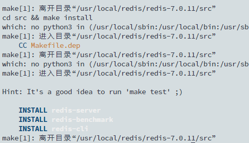
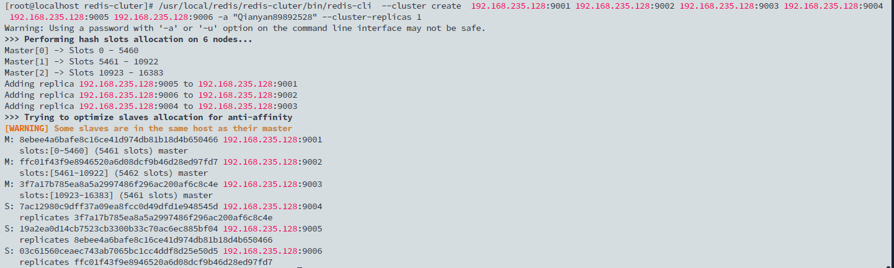

---


参考文档:

https://help.fanruan.com/finereport/doc-view-2870.html

https://juejin.cn/post/6844904083321536526

https://developer.aliyun.com/article/767317


https://www.cnblogs.com/mafly/p/redis_cluster.html

---


----

```
gem sources --add https://gems.ruby-china.com/ --remove https://rubygems.org/
```


```
/usr/local/redis/redis-cluster/bin/redis-trib.rb create --replicas 1 192.168.235.128:9001 192.168.235.128:9002 192.168.235.128:9003 192.168.235.128:9004 192.168.235.128:9005 192.168.235.128:9006
```

```
/usr/local/redis/redis-cluter/bin/redis-cli  --cluster create  192.168.235.128:9001 192.168.235.128:9002 192.168.235.128:9003 192.168.235.128:9004 192.168.235.128:9005 192.168.235.128:9006 --cluster-replicas 1
```


## 1. 概述


### 1.1 版本

| 服务器版本 |
| :--------: |
|  CentOS7   |


### 1.2 Redis 集群原理

1）Redis 集群结构：N 个平权主节点（master），每个主节点对应 M 个从节点（slave）。

注：因为投票机制，N 须为奇数。必须要 3 个或以上的主节点，否则在创建集群时会失败，并且当存活的节点数小于总节点数的一半时，整个集群就无法提供服务了。

2）Redis 集群投票机制：服务器之间通过互相的 ping-pong 判断是否节点可以连接上。如果有一半以上的节点去 ping 一个节点的时候没有回应，集群就认为这个节点宕机了。此时该主节点对应的从节点上升为主节点。当没有从节点可替补时，集群宕机。


### 1.3 功能简介

为达到 Web 集群极致高可用的目标，本文将提供 Redis 集群的部署和配置方案。

## 2. 操作步骤


### 2.1 前期准备

部署 Redis 集群至少需要 3 台服务器，参考 [环境准备](https://help.fanruan.com/finereport/doc-view-2642.html)，准备 3 台 Linux 服务器，每台服务器上部署 2 个节点，3 台服务器运行 6 个 Redis 实例，组成一个经典的「三主三从」的 Redis 集群。

注1：用户若需要搭建 Web 集群和 Redis 集群，其中 Web 节点和 Redis 节点可以共存在一台机器上，不需要准备单独的机器安装 Redis 节点。

注2：需要部署更多节点的 Redis 集群可以基于此方案类推。

注3：主节点必须在不同的服务器上，本文示例中，7002是7001的从节点，7004是7003的从节点，7006是7005的从节点。

| 服务器  | 服务器IP地址（示例） |  **端口**  |
| :------ | :------------------: | :--------: |
| 服务器1 |    192.168.5.248     | 7001、7002 |
| 服务器2 |    192.168.5.221     | 7003、7004 |
| 服务器3 |    192.168.5.102     | 7005、7006 |


### 2.2 服务器上创建两个 Redis 节点

#### 2.2.1 编译环境

安装 Redis 时需对源码包编译，此步骤依赖 gcc 编译器，如果没有 gcc 环境，则需要自行安装，联网安装命令

```
 yum install -y gcc
```


```
gcc -v #检查是否有 gcc 编译器
```

#### 2.2.2 下载源码包

要求使用 5.0.0 以上版本 Redis，部署和启动 Redis 集群时无须依赖 ruby。

1）下载： redis-7.0.11.tar.gz                                

2）官网下载：http://download.redis.io/releases/

#### 2.2.3 安装 Redis

```
mkdir /usr/local/redis #创建Redis目录
cd /usr/local/redis #进入目录
#将redis-7.0.11.tar.gz传输到该目录下#
tar zxvf redis-7.0.11.tar.gz #解压安装包
cd /usr/local/redis/redis-7.0.11 #进入解压目录
make && make install #安装命令
```

安装成功后可以看到：



#### 2.2.4 创建节点

```
mkdir /usr/local/redis/redis-cluster #创建集群目录redis-cluster
cd /usr/local/redis/redis-cluster #进入redis-cluster目录
mkdir 7001 7002 #创建两个redis节点的目录
```

#### 2.2.5 修改配置

下载配置文件：redis.conf：[redis.zip](https://help.fanruan.com/finereport/doc-download-/finereport/uploads/file/20221201/redis.zip)，手动放入放置到 7001 和 7002 两个文件夹。

本文提供的配置文件相比默认的 redis.conf 已经修改内容如下：

注：redis 相关密码本文示例设置的较简单，用户实际操作时请修改为更安全的密码。

```
#bind 127.0.0.1 # 取消仅限本地访问的限制
daemonize yes # 设置redis默认后台运行
protected-mode no # 关闭保护模式
maxmemory 2147483648 # 最大内存2G
maxmemory-policy allkeys-lru # 过期清理策略
pidfile /var/run/redis_7001.pid # pidfile文件对应7001
port 7001 # 端口7001 
requirepass admin123456 # redis登录密码，默认admin123456
masterauth admin123456 # redis认证密码,默认admin123456
cluster-enabled yes # 开启集群 
cluster-config-file nodes-7001.conf # 集群的配置，配置文件首次启动自动生成7001
dbfilename 7001dump.rdb   #redis dump落盘文件
logfile "7001.log"    #redis日志文件
appendfilename "7001appendonly.aof"    #redis aof落盘文件
显示代码
```

7001 文件夹的 redis.conf 无须再修改，7002 文件夹的 redis.conf 需将配置里的 7001 替换为 7002，操作如下：

```
cd /usr/redis/redis-cluster/7002/ #进入7002目录
vi redis.conf #编辑redis.conf文件
:%s/7001/7002/g  # 将7002的conf文件中所有7001替换为7002，一共三处
:wq # 保存配置
```

#### 2.2.6 启动节点

```
cd /usr/redis/redis-5.0.4/src/ #进入启动目录
./redis-server /usr/redis/redis-cluster/7001/redis.conf  # 指定7001的配置文件，启动该节点
./redis-server /usr/redis/redis-cluster/7002/redis.conf  # 指定7002的配置文件，启动该节点
```


在启动7001 和 7002 节点后，redis 节点之间会用到17001 和 17002 端口供集群选举通信使用（CLUSTER MEET），即使用端口的大小加上 10000（端口是XXXX，那么通信端口是1XXXX），若节点间服务器有防火墙，需要对这些端口进行开放。


### 2.3 创建其他四个节点

创建更多节点，重复操作本文 2.2.1-2.2.6 的步骤。在服务器 2 和服务器 3 上分别创建 7003、7004 和 7005、7006 节点并启动。


### 2.4 创建Redis集群

节点创建完毕后，各个节点实际上是独立的，并没有组成一个集群，还需要下面的操作。

注：下面第二行代码中，前三个节点是主节点，后三个节点是从节点。

```
cd /usr/redis/redis-5.0.4/src/ #进入任一节点的启动目录
./redis-cli --cluster create 192.168.5.248:7001 192.168.5.221:7003 192.168.5.102:7005 192.168.5.248:7002 192.168.5.221:7004 192.168.5.102:7006 --cluster-replicas 1 -a admin123456 #创建集群的命令，命令最后的admin123456是设置的认证密码，-replicas 1的意思是每台redis服务器有一个备份机，执行完此命令后，该脚本会自动为这6个redis实例分配主从和槽
```

当程序提示: Can I set the above configuration? (type 'yes' to accept) 时，键入 yes 回车：


至此集群搭建完成！

## 3. 运维知识

```
cd /usr/redis/redis-5.0.4/src/ #进入启动目录
./redis-server /usr/redis/redis-cluster/7001/redis.conf  #指定7001的配置文件，启动该节点，其他节点启动方式同理
redis-cli -h ip  -c -p 端口 -a 密码 #客户端远程连接某个节点，要输入对应的ip、端口、密码
192.168.1.124:7001> cluster nodes  #进入任意一个节点，查询集群主从分布及健康状态
```

更多运维操作，详情见：[Linux 系统 Redis 运维手册](https://help.fanruan.com/finereport/doc-view-2951.html)

注：Redis 集群官方搭建指导请参见：[Redis 集群教程](https://redis.io/topics/cluster-tutorial)

## 4. 注意事项


### 4.1 平台修改 Redis 地址失败

**问题描述**

Redis 集群搭建成功后，想在平台修改 Redis 的地址，测试并连接显示成功，但无法修改成功。

**原因分析**

Redis 集群显示的节点 ip 和端口都是 Redis 服务器上执行 cluster nodes 读取出来的 ip 地址，与手动填写的 ip 可能是不一致的（可能服务器存在多个 ip ）。

**解决方案**

重新部署 Redis 集群，创建集群命令时使用需要的 ip 进行创建


```
/usr/local/redis/redis-cluter/bin/redis-cli  --cluster create  192.168.235.128:9001 192.168.235.128:9002 192.168.235.128:9003 192.168.235.128:9004 192.168.235.128:9005 192.168.235.128:9006 -a "Qianyan89892528" --cluster-replicas 1
```





---


```
mkdir /usr/local/redis/redis-cluster

./redis-server  redis.conf

systemctl stop firewalld.service

systemctl disable firewalld.service

mkdir redis-cluter

mkdir -p  9001/data 9002/data 9003/data 9004/data 9005/data 9006/data

vi 9002/redis.conf

/usr/local/redis/redis-cluter/bin/redis-cli -p 9001

/usr/local/redis/redis-cluter/bin/redis-cli  --cluster create  192.168.235.128:9001 -a "Qianyan89892528" 192.168.235.128:9002 -a "Qianyan89892528" 192.168.235.128:9003 -a "Qianyan89892528" 192.168.235.128:9004  -a "Qianyan89892528" 192.168.235.128:9005 -a "Qianyan89892528"  192.168.235.128:9006 -a "Qianyan89892528" --cluster-replicas 1


/usr/local/bin/redis-server /usr/local/redis/redis-cluter/9003/redis.conf


```


