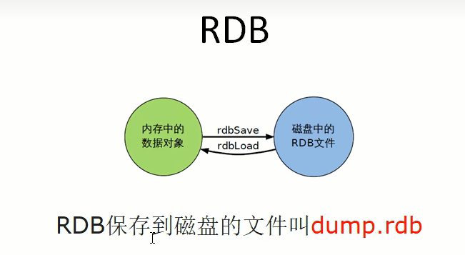
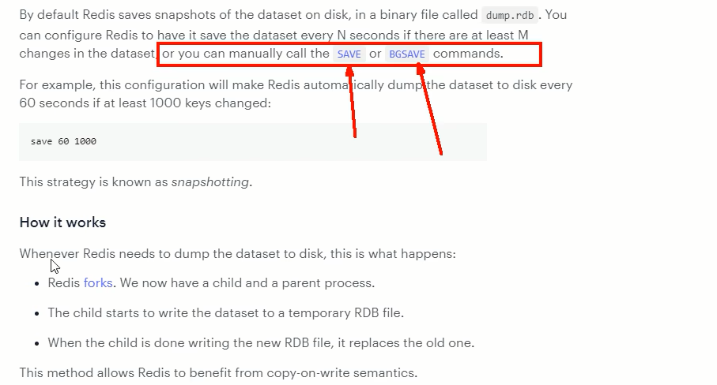
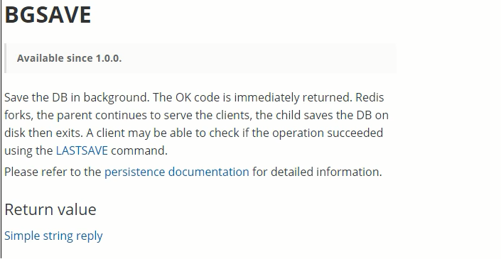

# RDB案例演示

### 需求说明

配置文件 6 VS 7

Redis6.0.16及以下

Redis6.2以及Redis-7.0.0

### 操作步骤

#### 自动触发

Redis7版本，按照redis.conf里配置的 save \<seconds> \<changes>

**本次案例5秒2次修改**

**修改dump文件保存路径**

**修改dump文件名称**

**触发备份**

第一种情况，5秒内保存2次

第二种情况，两次保存间隔超过5秒

  注：RDB 持久化是 Redis 的一种持久化机制，它会在 Redis 数据发生修改时对内存中的数据进行快照，然后保存到磁盘，以保证数据的持久性。通常情况下，RDB 保存快照的时间间隔由配置文件中的参数 save 决定，格式为 save \<seconds> \<changes>，表示在 \<seconds> 秒内，如果数据有 \<changes> 次修改，则会进行一次快照。

在题目描述的情况下，RDB 设置了每 5 秒进行一次快照，但是如果在 5 秒内修改次数超过了 2 次，也会进行快照。这是因为在 Redis 中，保存快照并不是在规定的时间到达后才进行，而是在修改数据时和时间间隔条件的双重限制下才进行的。

如果限制只按时间间隔来进行保存快照，则会出现两个问题：

如果时间间隔太大，那么 Redis 持久化的数据可能会丢失，并且故障恢复时的数据可能会受到影响。

如果时间间隔太小，那么数据的保存成本就会过高，并可能导致 Redis 运行效率下降。

因此，Redis 引入了按时间和数据修改次数双重限制的快照保存机制，以在灵活性和效率之间取得平衡。如果在 5 秒内修改的次数超过 2 次，则说明数据的变化较快，在此情况下保存快照并不会带来明显的性能问题。因此，Redis 将其纳入保存快照的范围，以保证数据的安全和一致性

**如何恢复**

将备份文件(dump.rdb)移动到 Redis 安装目录并启动服务即可

备份成功后故意用flushdb清空redis，看看是否可以恢复数据

- 执行flushall/flushdb命令也会产生dump.rdb文件，但里面是空的，无意义

物理恢复，一定要将服务产生的RDB文件备份一份，然后分机隔离，避免生产上物理损坏后备份文件也挂了。

#### 手动触发

使用save或者bgsave命令

redis提供了两个命令来生成RDB文件，分别是save和bgsave

**save**：在主程序中执行会**阻塞**当前redis服务器，直到持久化工作完成执行save命令期间，Redis不能处理其他命令，**线上禁止使用**

**bgsave(默认)**：

- redis会在后台异步进行快照操作，**不阻塞**快照同时还可以相应客户端请求，该触发方式会fork一个子进程由子进程复制持久化过程

- 官网说明

  

- Redis会使用bgsave对当前内存中的所有数据做快照，这个操作是子进程在后台完成的，这就允许主进程同时可以修改数据。

- fork是什么？
  在Linux程序中，fork()会产生一个和父进程完全相同的子进程，但子进程在此后会exec系统调用，处于效率考虑，尽量避免膨胀

- LASTSAVE

  可以通过lastsave命令获取最后一次成功执行快照的时间

