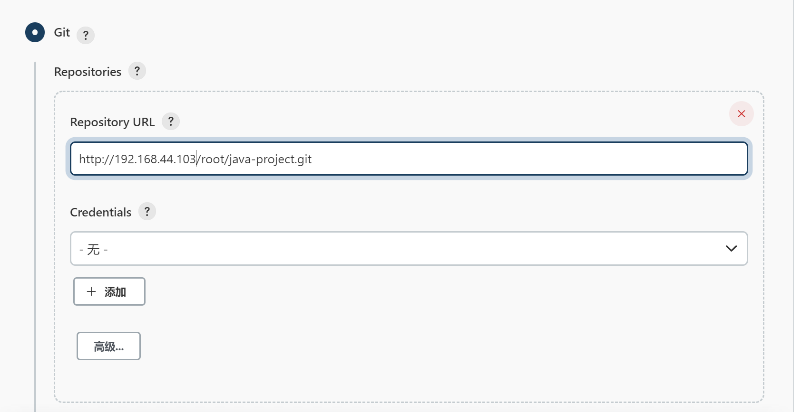
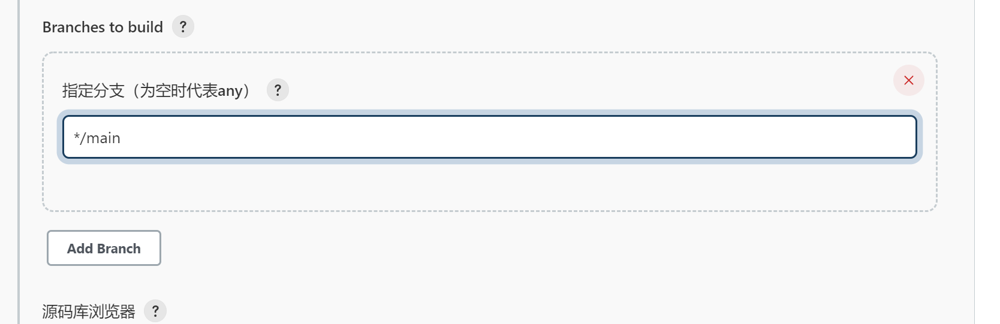
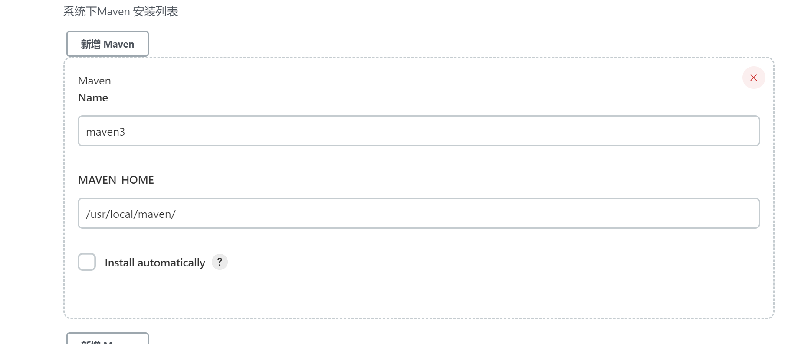
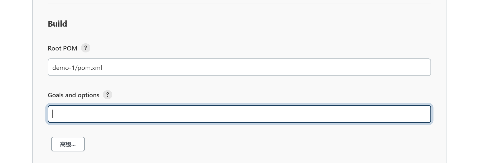
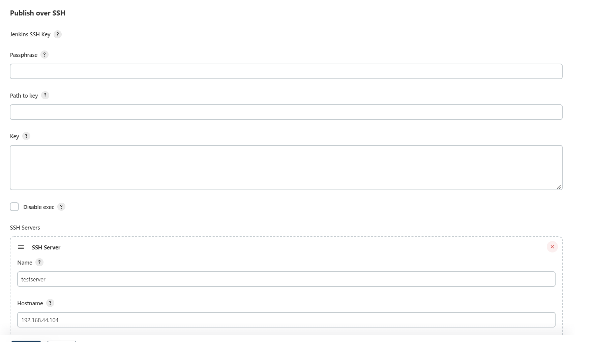
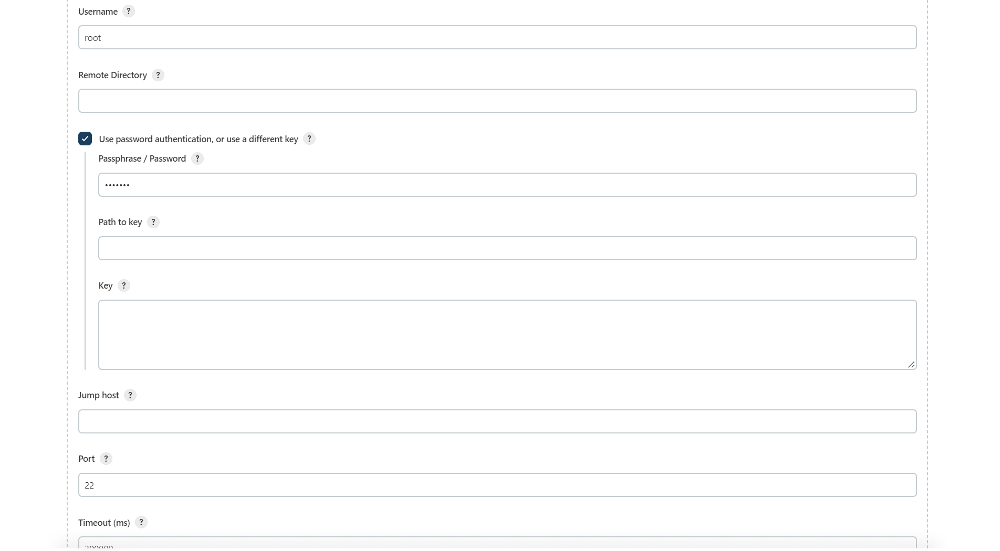
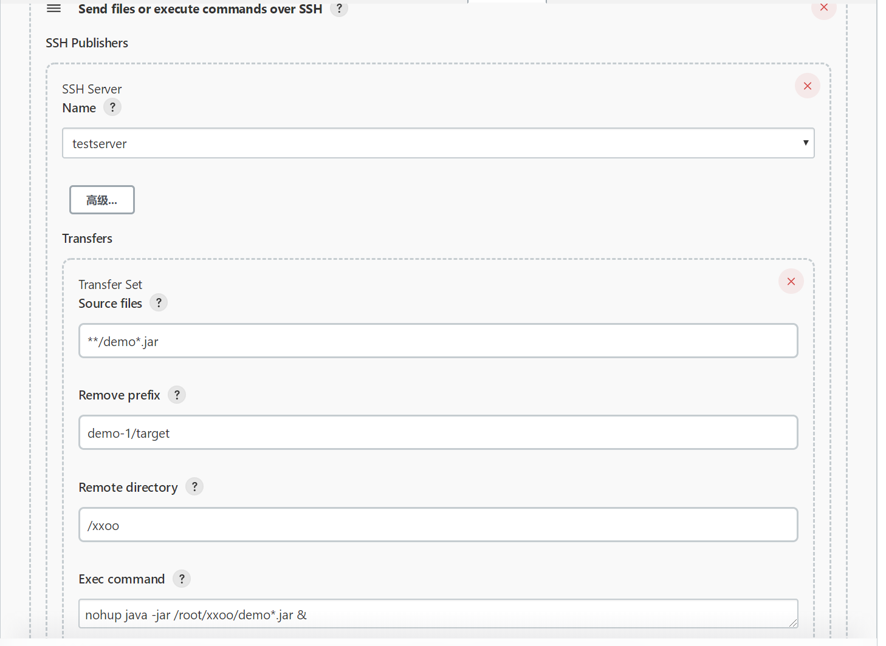
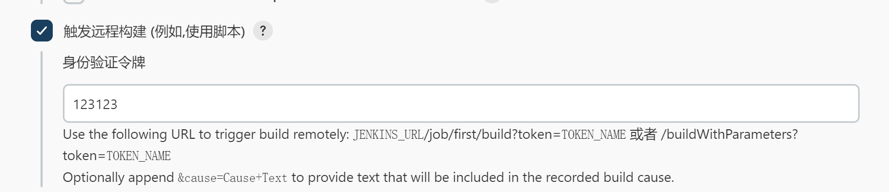

---

typora-copy-images-to: images

---

# Jenkins

Jenkins，原名 Hudson，2011 年改为现在的名字。它是一个开源的实现持续集成的软件工具。

官方网站

https://www.jenkins.io/


## GitLab安装使用

官方网站：https://about.gitlab.com/

安装所需最小配置

内存至少4G

https://docs.gitlab.cn/jh/install/requirements.html


### 在ssh下安装

官方安装文档：https://gitlab.cn/install/?version=ce

#### 1 安装依赖

```
sudo yum install -y curl policycoreutils-python openssh-server perl
sudo systemctl enable sshd
sudo systemctl start sshd
```

#### 2 配置镜像

```
curl -fsSL https://packages.gitlab.cn/repository/raw/scripts/setup.sh | /bin/bash
```

#### 3 开始安装

```
sudo EXTERNAL_URL="http://192.168.44.103" yum install -y gitlab-jh
```

除非您在安装过程中指定了自定义密码，否则将随机生成一个密码并存储在 `/etc/gitlab/initial_root_password` 文件中(出于安全原因，24 小时后，此文件会被第一次 `gitlab-ctl reconfigure` 自动删除，因此若使用随机密码登录，建议安装成功初始登录成功之后，立即修改初始密码）。使用此密码和用户名 `root` 登录。

#### gitlab常用命令

```
gitlab-ctl start                  # 启动所有 gitlab 组件；
gitlab-ctl stop                   # 停止所有 gitlab 组件；
gitlab-ctl restart                # 重启所有 gitlab 组件；
gitlab-ctl status                 # 查看服务状态；
gitlab-ctl reconfigure            # 启动服务；
vi /etc/gitlab/gitlab.rb         # 修改默认的配置文件；
gitlab-ctl tail                   # 查看日志；

```

### 在docker下安装

https://docs.gitlab.cn/jh/install/docker.html

安装所需最小配置

- 内存至少4G
- 系统内核至少在3.10以上 `uname -r` 命令可查看系统内核版本

#### 安装docker

1. 更新yum源

​	`yum update`

2. 安装依赖

​	`yum install -y yum-utils device-mapper-persistent-data lvm2`

3. 添加镜像

```
//国外镜像
yum-config-manager --add-repo https://download.docker.com/linux/centos/docker-ce.repo
//阿里镜像
https://mirrors.aliyun.com/docker-ce/linux/centos/gpg
yum-config-manager --add-repo http://mirrors.aliyun.com/docker-ce/linux/centos/docker-ce.repo
```

4. 查看源中可使用版本

```
 yum list docker-ce --showduplicates | sort -r
```

5. 安装指定版本

```
yum install docker
```

6. 配置开机启动项

```
systemctl start docker
systemctl enable docker
docker version
```

#### 使用容器安装gitlab

1.添加容器

```shell
docker run --detach \
  --hostname 192.168.44.103 \
  --publish 443:443 --publish 80:80 \
  --name gitlab \
  --restart always \
  --volume $GITLAB_HOME/config:/etc/gitlab:Z \
  --volume $GITLAB_HOME/logs:/var/log/gitlab:Z \
  --volume $GITLAB_HOME/data:/var/opt/gitlab:Z \
  --shm-size 256m \
  registry.gitlab.cn/omnibus/gitlab-jh:latest
```

2.启动容器

```shell
docker start gitlab
```


3.查看已存在的容器

```shell
docker ps -a
```

4.进入容器

```
docker exec -it  gitlab /bin/bash
```

#### 访问

http://192.168.44.101

当首次运行出现502错误的时候排查两个原因

1. 虚拟机内存至少需要4g
2. 稍微再等等刷新一下可能就好了


#### 管理员账号登录

用户名：root

密码存在下面文件中，登录后需要改密码不然24小时之后会失效

```
cat /etc/gitlab/initial_root_password
```

## Jenkins安装

官方文档介绍非常详细

https://www.jenkins.io

安装需求

```
机器要求：

256 MB 内存，建议大于 512 MB

10 GB 的硬盘空间（用于 Jenkins 和 Docker 镜像）

需要安装以下软件：

Java 8 ( JRE 或者 JDK 都可以)

Docker （导航到网站顶部的Get Docker链接以访问适合您平台的Docker下载）


```


### 安装JDK

1 检索可用包

```
yum search java|grep jdk
```

2 安装

```
yum install java-1.8.0-openjdk
```


将Jenkins安装包上传服务器,安装好后如果没法访问,就关闭防火墙

```
systemctl stop firewalld.service
```


首次启动war包会在`/root/.jenkins`生成配置文件

待完全启动成功后 访问服务器8080端口完成配置

初始化后的密码：

```
Jenkins initial setup is required. An admin user has been created and a password generated.
Please use the following password to proceed to installation:

1a8334954f324a7eab9a7bc8f0ca8b57

This may also be found at: /root/.jenkins/secrets/initialAdminPassword


```

密码文件使用后会自动删除

### Maven安装

官网

https://maven.apache.org/

下载后复制到Jenkins所在服务器解压缩即可

/usr/local/maven 路径下 


Jenkins 安装maven插件


新建任务时就会有maven任务


## Jenkins + Git + Maven 自动化部署配置


#### 1 Git配置






#### 2 Maven配置




#### 3 Pom.xml配置




### git安装

```
yum install -y git
```


#### javahome配置(可选)

```
/usr/lib/jvm/java-1.8.0-openjdk-1.8.0.322.b06-1.el7_9.x86_64


export JAVA_HOME=/usr/lib/jvm/java-1.8.0-openjdk-1.8.0.322.b06-1.el7_9.x86_64
export JRE_HOME=$JAVA_HOME/jre
PATH=$PATH:$JAVA_HOME/bin:$JRE_HOME/bin
export JAVA_HOME JRE_HOME CLASS_PATH PATH

jdk
/etc/alternatives/jre_openjdk
source /etc/profile 立即生效
```


#### 报错找不到jdk？

```
默认yum安装java的时候会显示安装的是openjdk1.8 实则实际上只安装了jre
yum install -y java-devel
```

#### Maven阿里云镜像

修改`/usr/local/maven/conf/settings.xml`

参考文章: 

https://blog.csdn.net/czc9309/article/details/108049009


```xml
<?xml version="1.0" encoding="UTF-8"?>

<!--
Licensed to the Apache Software Foundation (ASF) under one
or more contributor license agreements.  See the NOTICE file
distributed with this work for additional information
regarding copyright ownership.  The ASF licenses this file
to you under the Apache License, Version 2.0 (the
"License"); you may not use this file except in compliance
with the License.  You may obtain a copy of the License at

    http://www.apache.org/licenses/LICENSE-2.0

Unless required by applicable law or agreed to in writing,
software distributed under the License is distributed on an
"AS IS" BASIS, WITHOUT WARRANTIES OR CONDITIONS OF ANY
KIND, either express or implied.  See the License for the
specific language governing permissions and limitations
under the License.
-->

<!--
 | This is the configuration file for Maven. It can be specified at two levels:
 |
 |  1. User Level. This settings.xml file provides configuration for a single user,
 |                 and is normally provided in ${user.home}/.m2/settings.xml.
 |
 |                 NOTE: This location can be overridden with the CLI option:
 |
 |                 -s /path/to/user/settings.xml
 |
 |  2. Global Level. This settings.xml file provides configuration for all Maven
 |                 users on a machine (assuming they're all using the same Maven
 |                 installation). It's normally provided in
 |                 ${maven.conf}/settings.xml.
 |
 |                 NOTE: This location can be overridden with the CLI option:
 |
 |                 -gs /path/to/global/settings.xml
 |
 | The sections in this sample file are intended to give you a running start at
 | getting the most out of your Maven installation. Where appropriate, the default
 | values (values used when the setting is not specified) are provided.
 |
 |-->
<settings xmlns="http://maven.apache.org/SETTINGS/1.0.0"
          xmlns:xsi="http://www.w3.org/2001/XMLSchema-instance"
          xsi:schemaLocation="http://maven.apache.org/SETTINGS/1.0.0 http://maven.apache.org/xsd/settings-1.0.0.xsd">
  <!-- localRepository
   | The path to the local repository maven will use to store artifacts.
   |
   | Default: ${user.home}/.m2/repository
  <localRepository>/path/to/local/repo</localRepository>
  -->
  <localRepository>${user.home}/.m2/repository</localRepository>
  <!-- interactiveMode
   | This will determine whether maven prompts you when it needs input. If set to false,
   | maven will use a sensible default value, perhaps based on some other setting, for
   | the parameter in question.
   |
   | Default: true
  <interactiveMode>true</interactiveMode>
  -->

  <!-- offline
   | Determines whether maven should attempt to connect to the network when executing a build.
   | This will have an effect on artifact downloads, artifact deployment, and others.
   |
   | Default: false
  <offline>false</offline>
  -->

  <!-- pluginGroups
   | This is a list of additional group identifiers that will be searched when resolving plugins by their prefix, i.e.
   | when invoking a command line like "mvn prefix:goal". Maven will automatically add the group identifiers
   | "org.apache.maven.plugins" and "org.codehaus.mojo" if these are not already contained in the list.
   |-->
  <pluginGroups>
    <!-- pluginGroup
     | Specifies a further group identifier to use for plugin lookup.
    <pluginGroup>com.your.plugins</pluginGroup>
    -->
    <pluginGroup>org.mortbay.jetty</pluginGroup>
  </pluginGroups>

  <!-- proxies
   | This is a list of proxies which can be used on this machine to connect to the network.
   | Unless otherwise specified (by system property or command-line switch), the first proxy
   | specification in this list marked as active will be used.
   |-->
  <proxies>
    <!-- proxy
     | Specification for one proxy, to be used in connecting to the network.
     |
    <proxy>
      <id>optional</id>
      <active>true</active>
      <protocol>http</protocol>
      <username>proxyuser</username>
      <password>proxypass</password>
      <host>proxy.host.net</host>
      <port>80</port>
      <nonProxyHosts>local.net|some.host.com</nonProxyHosts>
    </proxy>
    -->
  </proxies>

  <!-- servers
   | This is a list of authentication profiles, keyed by the server-id used within the system.
   | Authentication profiles can be used whenever maven must make a connection to a remote server.
   |-->
  <servers>
    <!-- server
     | Specifies the authentication information to use when connecting to a particular server, identified by
     | a unique name within the system (referred to by the 'id' attribute below).
     | 
     | NOTE: You should either specify username/password OR privateKey/passphrase, since these pairings are 
     |       used together.
     |
    <server>
      <id>deploymentRepo</id>
      <username>repouser</username>
      <password>repopwd</password>
    </server>
    -->
    
    <!-- Another sample, using keys to authenticate.
    <server>
      <id>siteServer</id>
      <privateKey>/path/to/private/key</privateKey>
      <passphrase>optional; leave empty if not used.</passphrase>
    </server>
    -->
    <server>
        <id>releases</id>
        <username>ali</username>
        <password>ali</password>
      </server>
      <server>
        <id>Snapshots</id>
        <username>ali</username>
        <password>ali</password>
      </server>
  </servers>

  <!-- mirrors
   | This is a list of mirrors to be used in downloading artifacts from remote repositories.
   |
   | It works like this: a POM may declare a repository to use in resolving certain artifacts.
   | However, this repository may have problems with heavy traffic at times, so people have mirrored
   | it to several places.
   |
   | That repository definition will have a unique id, so we can create a mirror reference for that
   | repository, to be used as an alternate download site. The mirror site will be the preferred
   | server for that repository.
   |-->
  <mirrors>
    <!-- mirror
     | Specifies a repository mirror site to use instead of a given repository. The repository that
     | this mirror serves has an ID that matches the mirrorOf element of this mirror. IDs are used
     | for inheritance and direct lookup purposes, and must be unique across the set of mirrors.
     |
    <mirror>
      <id>mirrorId</id>
      <mirrorOf>repositoryId</mirrorOf>
      <name>Human Readable Name for this Mirror.</name>
      <url>http://my.repository.com/repo/path</url>
    </mirror>
     -->
    <mirror>
      <!--This sends everything else to /public -->
      <id>nexus</id>
      <mirrorOf>*</mirrorOf> 
      <url>http://maven.aliyun.com/nexus/content/groups/public/</url>
    </mirror>
    <mirror>
      <!--This is used to direct the public snapshots repo in the 
          profile below over to a different nexus group -->
      <id>nexus-public-snapshots</id>
      <mirrorOf>public-snapshots</mirrorOf> 
      <url>http://maven.aliyun.com/nexus/content/repositories/snapshots/</url>
    </mirror>
    <mirror>
      <!--This is used to direct the public snapshots repo in the 
          profile below over to a different nexus group -->
      <id>nexus-public-snapshots1</id>
      <mirrorOf>public-snapshots1</mirrorOf> 
      <url>https://artifacts.alfresco.com/nexus/content/repositories/public/</url>
    </mirror>
  </mirrors>

  <!-- profiles
   | This is a list of profiles which can be activated in a variety of ways, and which can modify
   | the build process. Profiles provided in the settings.xml are intended to provide local machine-
   | specific paths and repository locations which allow the build to work in the local environment.
   |
   | For example, if you have an integration testing plugin - like cactus - that needs to know where
   | your Tomcat instance is installed, you can provide a variable here such that the variable is
   | dereferenced during the build process to configure the cactus plugin.
   |
   | As noted above, profiles can be activated in a variety of ways. One way - the activeProfiles
   | section of this document (settings.xml) - will be discussed later. Another way essentially
   | relies on the detection of a system property, either matching a particular value for the property,
   | or merely testing its existence. Profiles can also be activated by JDK version prefix, where a
   | value of '1.4' might activate a profile when the build is executed on a JDK version of '1.4.2_07'.
   | Finally, the list of active profiles can be specified directly from the command line.
   |
   | NOTE: For profiles defined in the settings.xml, you are restricted to specifying only artifact
   |       repositories, plugin repositories, and free-form properties to be used as configuration
   |       variables for plugins in the POM.
   |
   |-->
   <profiles> 
    <profile>
      <id>development</id>
      <repositories>
        <repository>
          <id>central</id>
          <url>http://central</url>
          <releases><enabled>true</enabled><updatePolicy>always</updatePolicy></releases>
          <snapshots><enabled>true</enabled><updatePolicy>always</updatePolicy></snapshots>
        </repository>
      </repositories>
     <pluginRepositories>
        <pluginRepository>
          <id>central</id>
          <url>http://central</url>
          <releases><enabled>true</enabled><updatePolicy>always</updatePolicy></releases>
          <snapshots><enabled>true</enabled><updatePolicy>always</updatePolicy></snapshots>
        </pluginRepository>
      </pluginRepositories>
    </profile>
    <profile>
      <!--this profile will allow snapshots to be searched when activated-->
      <id>public-snapshots</id>
      <repositories>
        <repository>
          <id>public-snapshots</id>
          <url>http://public-snapshots</url>
          <releases><enabled>false</enabled></releases>
          <snapshots><enabled>true</enabled><updatePolicy>always</updatePolicy></snapshots>
        </repository>
      </repositories>
     <pluginRepositories>
        <pluginRepository>
          <id>public-snapshots</id>
          <url>http://public-snapshots</url>
          <releases><enabled>false</enabled></releases>
          <snapshots><enabled>true</enabled><updatePolicy>always</updatePolicy></snapshots>
        </pluginRepository>
      </pluginRepositories>
    </profile>
  </profiles>
 
   <activeProfiles>
    <activeProfile>development</activeProfile>
    <activeProfile>public-snapshots</activeProfile>
   </activeProfiles>

  <!-- activeProfiles
   | List of profiles that are active for all builds.
   |
  <activeProfiles>
    <activeProfile>alwaysActiveProfile</activeProfile>
    <activeProfile>anotherAlwaysActiveProfile</activeProfile>
  </activeProfiles>
  -->
</settings>

```

### publish over ssh 配置

1 安装插件

在Configure System菜单里 往下来

2 添加一台目标服务器





3 修改配置




#### 超时机制

输出命令时一定要注意不要让窗口卡主，不然Jenkins会认为认为一直没完成

#### shell的日志输出

```
nohup java -jar /root/xxoo/demo*.jar >mylog.log 2>&1 &
```


#### 数据流重定向

数据流重定向就是将某个命令执行后应该要出现在屏幕上的数据传输到其他地方

标准输入（stdin）：代码为0，使用<或<<;
标准输出（stdout）：代码为1，使用>或>>;
标准错误输出（stderr）：代码为2，使用2>或2>>

\> 覆盖写
\>> 追加写


### 运行前清理

配置杀死之前运行的进程


```shell
#!/bin/bash

#删除历史数据
rm -rf xxoo

appname=$1
#获取传入的参数
echo "arg:$1"


#获取正在运行的jar包pid
pid=`ps -ef | grep $1 | grep 'java -jar' | awk '{printf $2}'`

echo $pid

#如果pid为空，提示一下，否则，执行kill命令
if [ -z $pid ];
#使用-z 做空值判断
        then
                echo "$appname not started"

        else
               kill -9 $pid
                echo "$appname stoping...."

check=`ps -ef | grep -w $pid | grep java`
if [ -z $check ];

        then
                echo "$appname pid:$pid is stop"
        else
                echo "$appname stop failed"

fi


fi

```


### 几种构建方式

- 快照依赖构建/Build whenever a SNAPSHOT dependency is built
  - 当依赖的快照被构建时执行本job
- 触发远程构建 (例如,使用脚本)
  - 远程调用本job的restapi时执行本job
- job依赖构建/Build after other projects are built
  - 当依赖的job被构建时执行本job
- 定时构建/Build periodically
  - 使用cron表达式定时构建本job
- 向GitHub提交代码时触发Jenkins自动构建/GitHub hook trigger for GITScm polling
  - Github-WebHook出发时构建本job
- 定期检查代码变更/Poll SCM
  - 使用cron表达式定时检查代码变更，变更后构建本job

#### 触发远程构建/gitlab上改动自动构建

代码改动自动可以使用gitlab的webhook回调钩子调起Jenkins的启动任务接口

在构建触发器中配置接口和token




#### 定时构建

##### Jenkins cron表达式

标准cron

https://crontab.guru

Jenkins cron不是标准的cron表达式

```
第一个 * 表示每个小时的第几分钟，取值0~59

H * * * *
H：每小时执行一次

第二颗 * 表示小时，取值0~23

* 15 * * * 表示每天下午3点
* 1 * * *  表示每天凌晨1点

第三颗 * 表示一个月的第几天，取值1~31
* 1 5 * *  表示每月5日凌晨1点

第四颗 * 表示第几月，取值1~12
* 15 5 1 *  表示每年几月执行

第五颗 * 表示一周中的第几天，取值0~7，其中0和7代表的都是周日

```

**“/”**

表示每隔多长时间，比如 */10 * * * * 表示 每隔10分钟

**“H”**

hash散列值，以job名取值，获取到以job名为入参的唯一值，相同名称值也相同，这个偏移量会和实际时间相加，获得一个真实的运行时间

意义在于：不同的项目在不同的时间运行，即使配置的值是一样的，比如 都是`15 * * * * ` ，表示每个小时的第15分钟开始执行任务，那么会造成同一时间内在Jenkins中启动很多job，换成`H/15 * * * *`,那么在首次启动任务时，会有随机值参与进来，有的会在17分钟启动 有的会在19分钟启动，随后的启动时间也是这个值。这样就能错开相同cron值的任务执行了。

H的值也可以设置范围


`H * * * *`表示一小时内的任意时间

`*/10 * * * *`每10分钟

`H/10 * * * *`每10分钟,可能是7,17,27，起始时间hash，步长不变

`45 3 * * 1-6 ` 每个周一至周六，凌晨3点45 执行1次

`45 3-5 * * 1-6 ` 每个周一至周六，凌晨3点45 ，凌晨4点45，凌晨5点45 各执行1次

`H(40-48) 3-5 * * 1-6 ` 在40~48之间取值 其他同上

`45 3-5/2 * * 1-6 ` 每个周一至周六，凌晨3点45 ，凌晨5点45 各执行1次

` 45 0-6/2 * * 1-6 * * 1-6 ` 0点开始，每间隔2小时执行一次 0:45、2:45、4:45

#### 源码变更构建

使用Poll SCM 方式与Build periodically一样

会主动定期检查代码托管服务器上是否有变化，一旦发生变化执行job构建

### 测试报告邮件通知

使用163免费邮箱发送邮件时注意密码填认证码，也就是发送手机短信后给的那个，不要用登录邮箱的密码

类似下面。。

```
KDWJUWDQBWMOYGDC
```

### 


### 自动化部署到docker容器中

#### docker外挂目录

```
docker run -d -p 8080:8080 --name demo-out -v /root/jarfile/demo-1-0.0.1-SNAPSHOT.jar:/app.jar openjdk:11 java -jar app.jar
```


#### 打包到容器内


1. 准备一台测试服务器 docker环境
2. 准备支持jdk的镜像


```
FROM openjdk:11
COPY . /usr/src/myapp
WORKDIR /usr/src/myapp
RUN javac Main.java
CMD ["java", "Main"]
```


1. 把jar包打包到容器内

dockerfile

```dockerfile
FROM openjdk:11
EXPOSE 8080

WORKDIR /root

ADD jarfile/demo*.jar /root/app.jar
ENTRYPOINT ["java","-jar","/root/app.jar"]
```


打包镜像

```
docker build -t demo .
```


配置国内镜像

修改`/etc/docker/daemon.json`文件，没有的话创建一个

写入

```
{
    "registry-mirrors": [
        "https://ustc-edu-cn.mirror.aliyuncs.com",
        "http://hub-mirror.c.163.com",
        "https://registry.aliyuncs.com"
    ]
}
```

重启服务

```
systemctl daemon-reload
systemctl restart docker
```


## Jenkins集群/并发构建


集群化构建可以有效提升构建效率，尤其是团队项目比较多或是子项目比较多的时候，可以并发在多台机器上执行构建。


## 流水线 pipeline

流水线既能作为任务的本身，也能作为Jenkinsfile

使用流水线可以让我们的任务从ui手动操作，转换为代码化，像docker的dockerfile一样，从shell命令到配置文件，更适合大型项目，可以让团队其他开发者同时参与进来，同时也可以编辑开发Jenkinswebui不能完成的更复杂的构建逻辑，作为开发者可读性也更好。


### 完整语法

5个必备的组成部分

```
pipeline：整条流水线
agent：指定执行器
stages：所有阶段
stage：某一阶段，可有多个
steps：阶段内的每一步，可执行命令
```


### 测试脚本

#### 基础框架

```
pipeline {
    agent any

    stages {
        stage('拉取代码') {
            steps {
            
                echo '拉取代码完成'
               
            }

        }
        stage('执行构建') {
            steps {
                echo '执行构建完成'


            }

        }
    }
    
    post {
        
        always {
            
            echo "完成"
            
        }
        
        failure {
            
            echo "失败"
        }
    }
}
```

#### 阶段视图 Stage View

#### blue ocean可视化界面

全新的流水线控制ui，可重复执行某阶段代码

插件中心搜索blue ocean安装即可

#### post

流水线完成后可执行的任务

- always 无论流水线或者阶段的完成状态。
- changed 只有当流水线或者阶段完成状态与之前不同时。
- failure 只有当流水线或者阶段状态为"failure"运行。
- success 只有当流水线或者阶段状态为"success"运行。
- unstable 只有当流水线或者阶段状态为"unstable"运行。例如：测试失败。
- aborted 只有当流水线或者阶段状态为"aborted "运行。例如：手动取消。

#### agent

可以指定执行节点

label 指定运行job的节点标签

any 不指定，由Jenkins分配

```
pipeline {
    agent {
        node {
            label "jenkins-02"
        }
        
    }

    stages {
        stage('拉取代码') {
            steps {
          
                sh """
                    sleep 10
                            
                   """

                echo '拉取代码完成'
               
            }

        }
        stage('执行构建') {
            steps {
                echo '执行构建完成'


            }

        }
    }
    
    post {
        
        always {
            
            echo "完成"
            
        }
        
        failure {
            
            echo "失败"
        }
    }
}

```


### pipeline中执行自动化构建

```

pipeline {
    agent any

    tools {
        
        maven "maven3"
        
    }
    stages {
        stage("拉取代码") {
            steps {
                
                
                git branch: 'main', credentialsId: 'gitlab', url: 'http://192.168.44.103/root/java-project.git'
                echo '拉取成功'
            }
        }

        stage("执行构建") {
            steps {
                
            //    sh "mvn --version"
                sh """ 
                cd demo-1
                
                mvn clean package
                """
                
                echo '构建完成'
            }

        }
        
        
        stage("clean test server"){
            
            steps{
                
sshPublisher(publishers: [sshPublisherDesc(configName: 'testserver', transfers: [sshTransfer(cleanRemote: false, excludes: '', execCommand: '''rm -rf *

docker stop demo
docker rm demo
docker rmi demo
''', execTimeout: 120000, flatten: false, makeEmptyDirs: false, noDefaultExcludes: false, patternSeparator: '[, ]+', remoteDirectory: '', remoteDirectorySDF: false, removePrefix: '', sourceFiles: '/root')], usePromotionTimestamp: false, useWorkspaceInPromotion: false, verbose: false)])
            }
        }
        
        
        
        
        
        stage("发送jar包到测试服务器") {
            steps {
                
                sshPublisher(publishers: [sshPublisherDesc(configName: 'testserver', transfers: [sshTransfer(cleanRemote: false, excludes: '', execCommand: '', execTimeout: 120000, flatten: false, makeEmptyDirs: false, noDefaultExcludes: false, patternSeparator: '[, ]+', remoteDirectory: '/jarfile', remoteDirectorySDF: false, removePrefix: 'demo-1/target', sourceFiles: '**/demo*.jar'), sshTransfer(cleanRemote: false, excludes: '', execCommand: '''docker build -t demo .
docker run -d -p 8080:8080 --name demo demo''', execTimeout: 120000, flatten: false, makeEmptyDirs: false, noDefaultExcludes: false, patternSeparator: '[, ]+', remoteDirectory: '/', remoteDirectorySDF: false, removePrefix: 'demo-1/docker', sourceFiles: 'demo-1/docker/dockerfile')], usePromotionTimestamp: false, useWorkspaceInPromotion: false, verbose: false)])
                
                
                echo 'jar send over!'
            }

        }

    }
}

```


#### 声明式流水线

好处

- 更像是在Jenkins web ui中的操作
- 可读性比较高
- 可以使用blue ocean自动生成
- 支持语法检查

坏处

- 代码逻辑能力比脚本式弱，不能完成特别复杂的任务	


#### 脚本式流水线

好处

- 更少的代码和弱规范要求
- 更灵活的自定义代码操作
- 不受约束，可以构建特别复杂的工作流和流水线

坏处

- 读写对编程要求比较高
- 比声明式流水线代码更复杂


