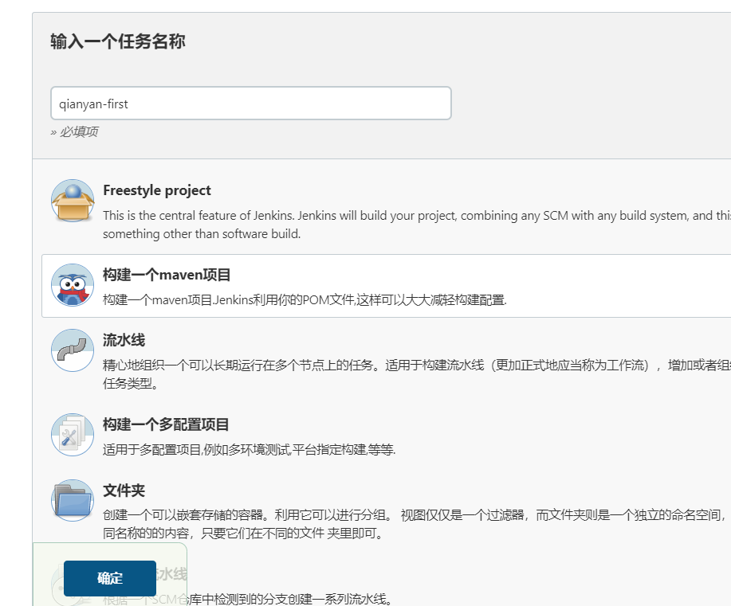
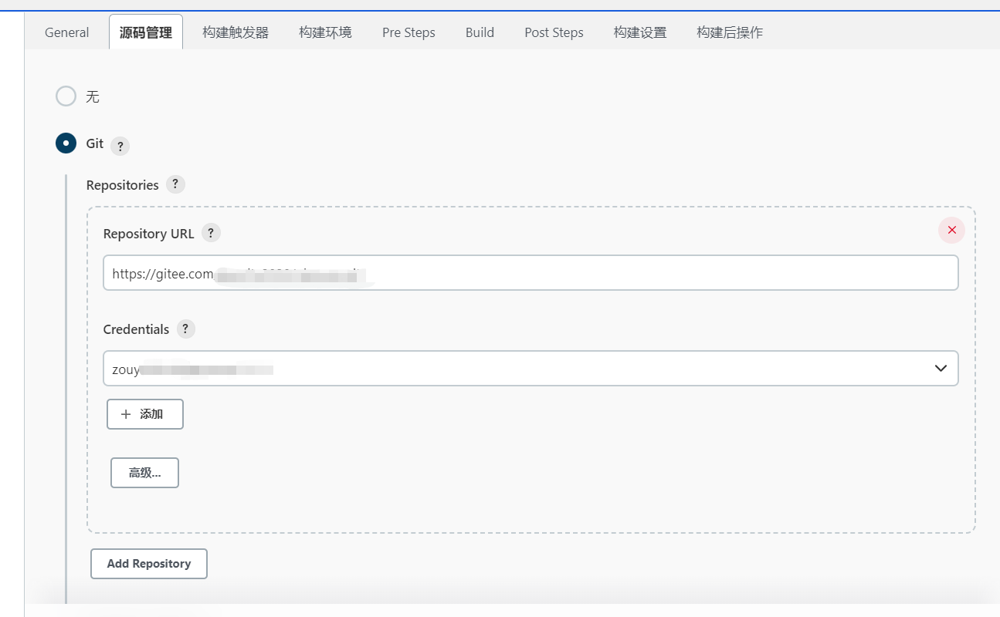
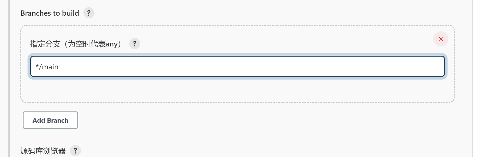
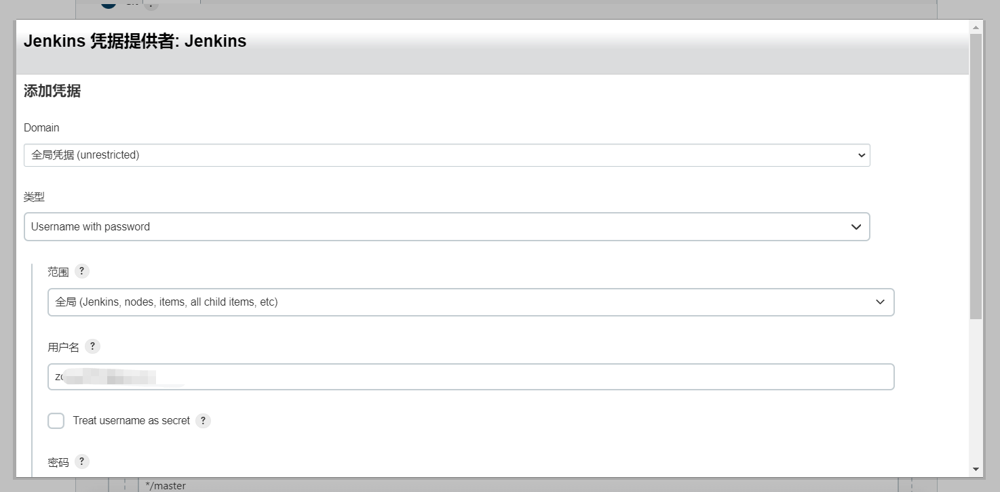
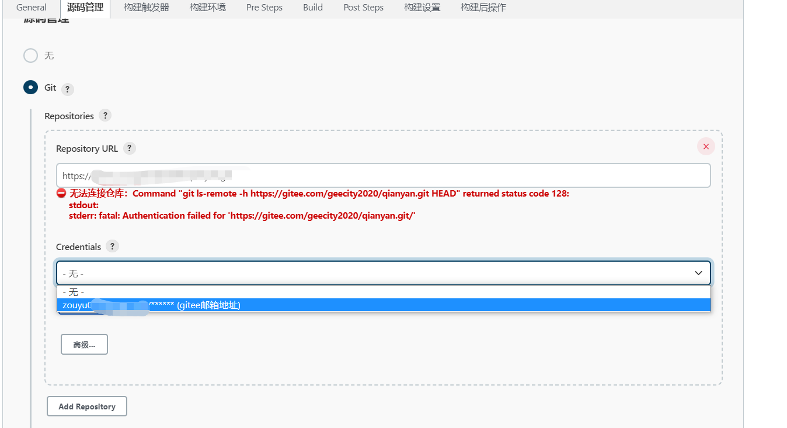
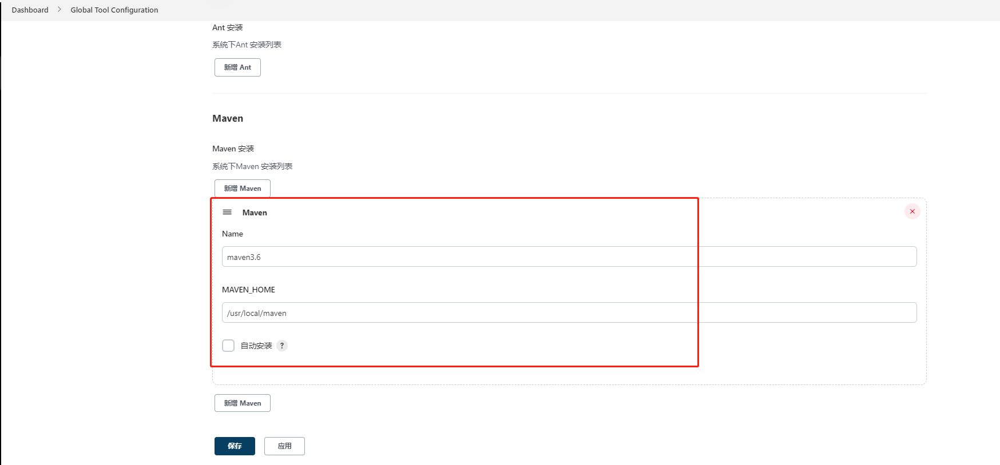
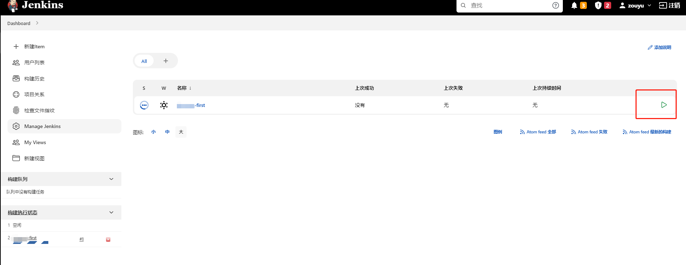
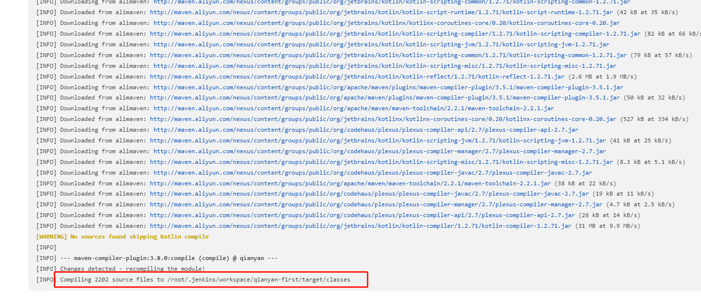
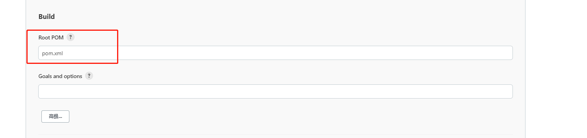

# 03Jenkins配置maven和git自动构建Jar


## 构建新建item




## 安装git

首次新增item请先安装git,拉取线上代码

```
yum install git
```


## 配置git



分支修改(默认master)




### 新增凭证







## 配置maven




选择自己安装的maven

/usr/local/maven/conf 配置国内镜像地址

```
<?xml version="1.0" encoding="UTF-8"?>

<!--
Licensed to the Apache Software Foundation (ASF) under one
or more contributor license agreements.  See the NOTICE file
distributed with this work for additional information
regarding copyright ownership.  The ASF licenses this file
to you under the Apache License, Version 2.0 (the
"License"); you may not use this file except in compliance
with the License.  You may obtain a copy of the License at

    http://www.apache.org/licenses/LICENSE-2.0

Unless required by applicable law or agreed to in writing,
software distributed under the License is distributed on an
"AS IS" BASIS, WITHOUT WARRANTIES OR CONDITIONS OF ANY
KIND, either express or implied.  See the License for the
specific language governing permissions and limitations
under the License.
-->

<!--
 | This is the configuration file for Maven. It can be specified at two levels:
 |
 |  1. User Level. This settings.xml file provides configuration for a single user,
 |                 and is normally provided in ${user.home}/.m2/settings.xml.
 |
 |                 NOTE: This location can be overridden with the CLI option:
 |
 |                 -s /path/to/user/settings.xml
 |
 |  2. Global Level. This settings.xml file provides configuration for all Maven
 |                 users on a machine (assuming they're all using the same Maven
 |                 installation). It's normally provided in
 |                 ${maven.conf}/settings.xml.
 |
 |                 NOTE: This location can be overridden with the CLI option:
 |
 |                 -gs /path/to/global/settings.xml
 |
 | The sections in this sample file are intended to give you a running start at
 | getting the most out of your Maven installation. Where appropriate, the default
 | values (values used when the setting is not specified) are provided.
 |
 |-->
<settings xmlns="http://maven.apache.org/SETTINGS/1.2.0"
          xmlns:xsi="http://www.w3.org/2001/XMLSchema-instance"
          xsi:schemaLocation="http://maven.apache.org/SETTINGS/1.2.0 https://maven.apache.org/xsd/settings-1.2.0.xsd">
  <!-- localRepository
   | The path to the local repository maven will use to store artifacts.
   |
   | Default: ${user.home}/.m2/repository
  <localRepository>/path/to/local/repo</localRepository>
  -->

  <!-- interactiveMode
   | This will determine whether maven prompts you when it needs input. If set to false,
   | maven will use a sensible default value, perhaps based on some other setting, for
   | the parameter in question.
   |
   | Default: true
  <interactiveMode>true</interactiveMode>
  -->

  <!-- offline
   | Determines whether maven should attempt to connect to the network when executing a build.
   | This will have an effect on artifact downloads, artifact deployment, and others.
   |
   | Default: false
  <offline>false</offline>
  -->

  <!-- pluginGroups
   | This is a list of additional group identifiers that will be searched when resolving plugins by their prefix, i.e.
   | when invoking a command line like "mvn prefix:goal". Maven will automatically add the group identifiers
   | "org.apache.maven.plugins" and "org.codehaus.mojo" if these are not already contained in the list.
   |-->
  <pluginGroups>
    <!-- pluginGroup
     | Specifies a further group identifier to use for plugin lookup.
    <pluginGroup>com.your.plugins</pluginGroup>
    -->
  </pluginGroups>

  <!-- proxies
   | This is a list of proxies which can be used on this machine to connect to the network.
   | Unless otherwise specified (by system property or command-line switch), the first proxy
   | specification in this list marked as active will be used.
   |-->
  <proxies>
    <!-- proxy
     | Specification for one proxy, to be used in connecting to the network.
     |
    <proxy>
      <id>optional</id>
      <active>true</active>
      <protocol>http</protocol>
      <username>proxyuser</username>
      <password>proxypass</password>
      <host>proxy.host.net</host>
      <port>80</port>
      <nonProxyHosts>local.net|some.host.com</nonProxyHosts>
    </proxy>
    -->
  </proxies>

  <!-- servers
   | This is a list of authentication profiles, keyed by the server-id used within the system.
   | Authentication profiles can be used whenever maven must make a connection to a remote server.
   |-->
  <servers>
    <!-- server
     | Specifies the authentication information to use when connecting to a particular server, identified by
     | a unique name within the system (referred to by the 'id' attribute below).
     |
     | NOTE: You should either specify username/password OR privateKey/passphrase, since these pairings are
     |       used together.
     |
    <server>
      <id>deploymentRepo</id>
      <username>repouser</username>
      <password>repopwd</password>
    </server>
    -->

    <!-- Another sample, using keys to authenticate.
    <server>
      <id>siteServer</id>
      <privateKey>/path/to/private/key</privateKey>
      <passphrase>optional; leave empty if not used.</passphrase>
    </server>
    -->
  </servers>

  <!-- mirrors
   | This is a list of mirrors to be used in downloading artifacts from remote repositories.
   |
   | It works like this: a POM may declare a repository to use in resolving certain artifacts.
   | However, this repository may have problems with heavy traffic at times, so people have mirrored
   | it to several places.
   |
   | That repository definition will have a unique id, so we can create a mirror reference for that
   | repository, to be used as an alternate download site. The mirror site will be the preferred
   | server for that repository.
   |-->
  <mirrors>
    <!-- mirror
     | Specifies a repository mirror site to use instead of a given repository. The repository that
     | this mirror serves has an ID that matches the mirrorOf element of this mirror. IDs are used
     | for inheritance and direct lookup purposes, and must be unique across the set of mirrors.
     |
    <mirror>
      <id>mirrorId</id>
      <mirrorOf>repositoryId</mirrorOf>
      <name>Human Readable Name for this Mirror.</name>
      <url>http://my.repository.com/repo/path</url>
    </mirror>
     -->
    
<mirror>
   <id>alimaven</id>
   <name>aliyun maven</name>
   <url>http://maven.aliyun.com/nexus/content/groups/public/</url>
   <mirrorOf>central</mirrorOf>    
</mirror>
  </mirrors>

  <!-- profiles
   | This is a list of profiles which can be activated in a variety of ways, and which can modify
   | the build process. Profiles provided in the settings.xml are intended to provide local machine-
   | specific paths and repository locations which allow the build to work in the local environment.
   |
   | For example, if you have an integration testing plugin - like cactus - that needs to know where
   | your Tomcat instance is installed, you can provide a variable here such that the variable is
   | dereferenced during the build process to configure the cactus plugin.
   |
   | As noted above, profiles can be activated in a variety of ways. One way - the activeProfiles
   | section of this document (settings.xml) - will be discussed later. Another way essentially
   | relies on the detection of a system property, either matching a particular value for the property,
   | or merely testing its existence. Profiles can also be activated by JDK version prefix, where a
   | value of '1.4' might activate a profile when the build is executed on a JDK version of '1.4.2_07'.
   | Finally, the list of active profiles can be specified directly from the command line.
   |
   | NOTE: For profiles defined in the settings.xml, you are restricted to specifying only artifact
   |       repositories, plugin repositories, and free-form properties to be used as configuration
   |       variables for plugins in the POM.
   |
   |-->
  <profiles>
    <!-- profile
     | Specifies a set of introductions to the build process, to be activated using one or more of the
     | mechanisms described above. For inheritance purposes, and to activate profiles via <activatedProfiles/>
     | or the command line, profiles have to have an ID that is unique.
     |
     | An encouraged best practice for profile identification is to use a consistent naming convention
     | for profiles, such as 'env-dev', 'env-test', 'env-production', 'user-jdcasey', 'user-brett', etc.
     | This will make it more intuitive to understand what the set of introduced profiles is attempting
     | to accomplish, particularly when you only have a list of profile id's for debug.
     |
     | This profile example uses the JDK version to trigger activation, and provides a JDK-specific repo.
    <profile>
      <id>jdk-1.4</id>

      <activation>
        <jdk>1.4</jdk>
      </activation>

      <repositories>
        <repository>
          <id>jdk14</id>
          <name>Repository for JDK 1.4 builds</name>
          <url>http://www.myhost.com/maven/jdk14</url>
          <layout>default</layout>
          <snapshotPolicy>always</snapshotPolicy>
        </repository>
      </repositories>
    </profile>
    -->

    <!--
     | Here is another profile, activated by the system property 'target-env' with a value of 'dev',
     | which provides a specific path to the Tomcat instance. To use this, your plugin configuration
     | might hypothetically look like:
     |
     | ...
     | <plugin>
     |   <groupId>org.myco.myplugins</groupId>
     |   <artifactId>myplugin</artifactId>
     |
     |   <configuration>
     |     <tomcatLocation>${tomcatPath}</tomcatLocation>
     |   </configuration>
     | </plugin>
     | ...
     |
     | NOTE: If you just wanted to inject this configuration whenever someone set 'target-env' to
     |       anything, you could just leave off the <value/> inside the activation-property.
     |
    <profile>
      <id>env-dev</id>

      <activation>
        <property>
          <name>target-env</name>
          <value>dev</value>
        </property>
      </activation>

      <properties>
        <tomcatPath>/path/to/tomcat/instance</tomcatPath>
      </properties>
    </profile>
    -->
  </profiles>

  <!-- activeProfiles
   | List of profiles that are active for all builds.
   |
  <activeProfiles>
    <activeProfile>alwaysActiveProfile</activeProfile>
    <activeProfile>anotherAlwaysActiveProfile</activeProfile>
  </activeProfiles>
  -->
</settings>

```


指定maven下载地址为: 

/usr/local/maven/repository

找到setting localRepository标签

```
  <localRepository>/usr/local/maven/repository</localRepository>
```


## 构建

直接在主页点击构建即可



并可查看任务的输出日志，第一次会下载所有的依赖，然后再进行构建 目标地址为 用户目录下， .jenkins为隐藏目录




构建完成

```

[INFO] ------------------------------------------------------------------------
[INFO] BUILD SUCCESS
[INFO] ------------------------------------------------------------------------
[INFO] Total time:  05:56 min
[INFO] Finished at: 2023-03-05T17:26:17+08:00
[INFO] ------------------------------------------------------------------------
Waiting for Jenkins to finish collecting data
[JENKINS] Archiving /root/.jenkins/workspace/qianyan-first/pom.xml to com.qianyan/qianyan/2.0.0/qianyan-2.0.0.pom
[JENKINS] Archiving /root/.jenkins/workspace/qianyan-first/target/XXX-2023-03-05-17-23-09259.war
channel stopped
Finished: SUCCESS

```


## 说明

**Pre Steps** 构建前的操作

**Post Steps** 构建完后的操作

pom文件是针对git地址而言，如果在文件夹内的pom 这里添加为 文件夹名/pom.xml



 jenkins中的Build，设置打包时先清除之前的

在Goals and options中，填入需要执行的mvn命令：`clean package ` 还可以加其他命令如: 

```
-DskipTests=true clean package
```

这样每次构建前就会先清理之前的构建文件
