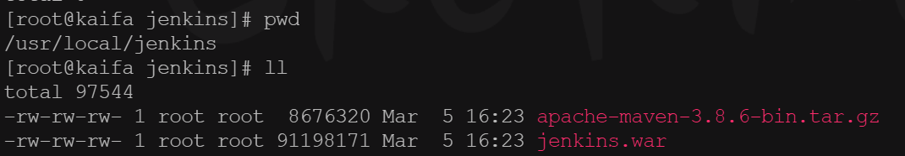
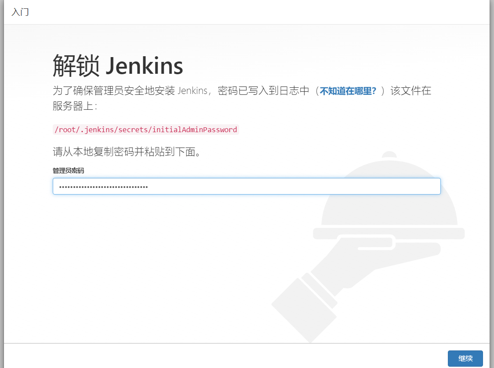
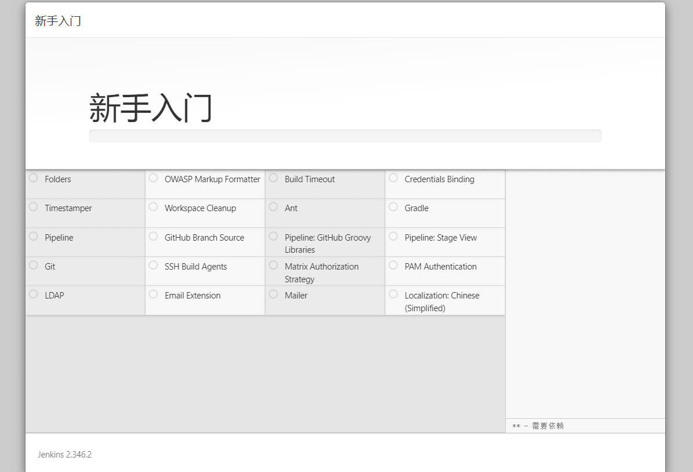
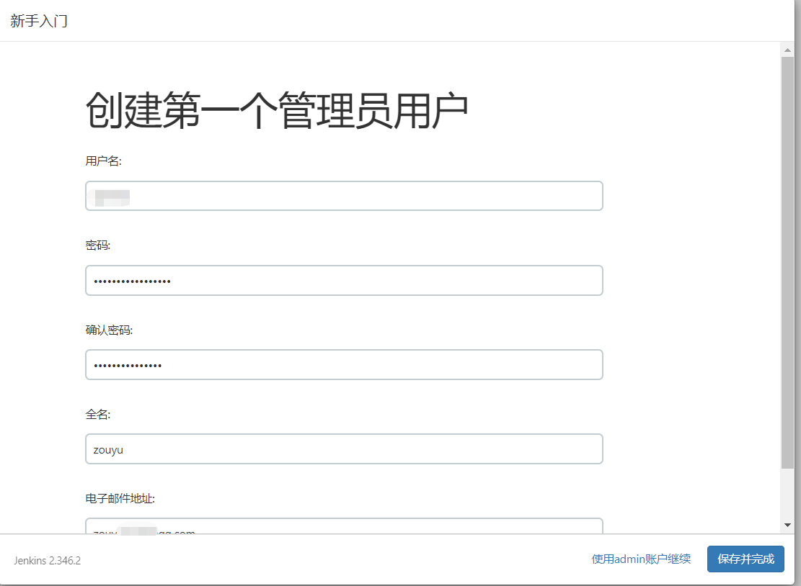
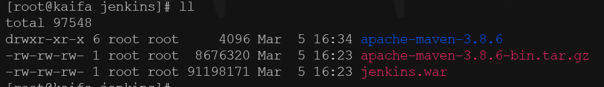
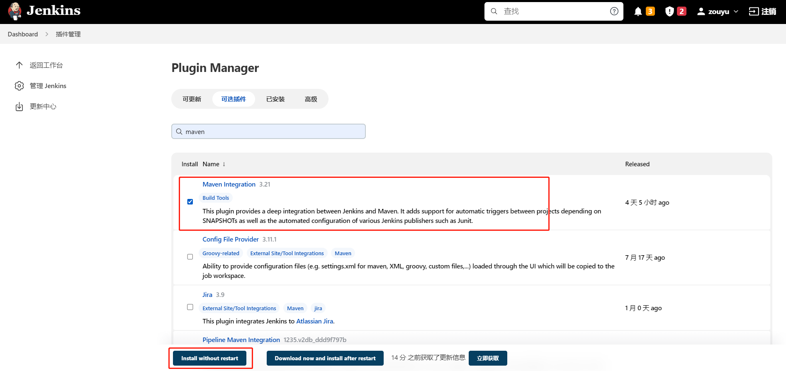

# 02 配置


## 服务器放好需要的文件




启动Jenkins

```
java -jar jenkins.war 
```


将Jenkins安装包上传服务器,安装好后如果没法访问,就关闭防火墙

```
systemctl stop firewalld.service
```

首次启动war包会在`/root/.jenkins`生成配置文件

待完全启动成功后 访问服务器8080端口完成配置

初始化后的密码，密码文件使用后会自动删除：


```
Jenkins initial setup is required. An admin user has been created and a password generated.
Please use the following password to proceed to installation:

6c02b8008780458e87764f08b5c76441

This may also be found at: /root/.jenkins/secrets/initialAdminPassword

*************************************************************
*************************************************************
*************************************************************

2023-03-05 08:27:49.231+0000 [id=31]    INFO    jenkins.InitReactorRunner$1#onAttained: Completed initialization
2023-03-05 08:27:49.250+0000 [id=21]    INFO    hudson.lifecycle.Lifecycle#onReady: Jenkins is fully up and running
```



进入后安装推荐插件



安装好后设置用户名




## maven安装

解压

```shell
tar -xvf apache-maven-3.8.6-bin.tar.gz 
```




移动到/usr/local/maven

```
mv apache-maven-3.8.6 /usr/local/maven
```


安装maven的集成插件




至此Jenkins配置和maven安装完成
