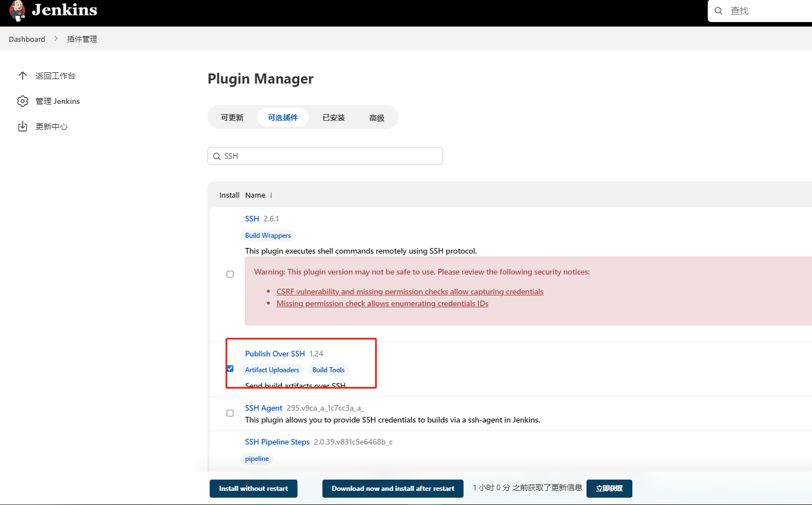
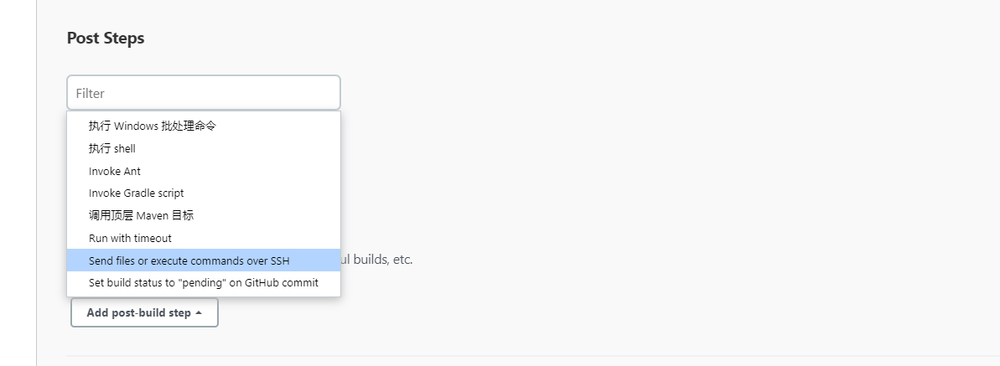
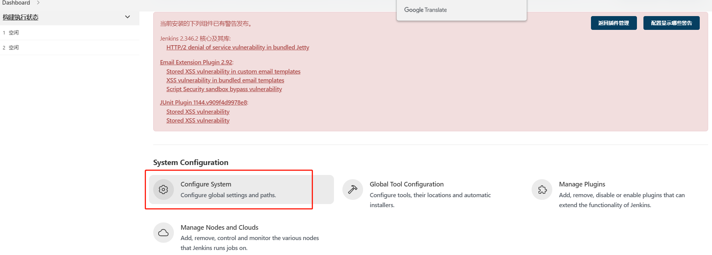
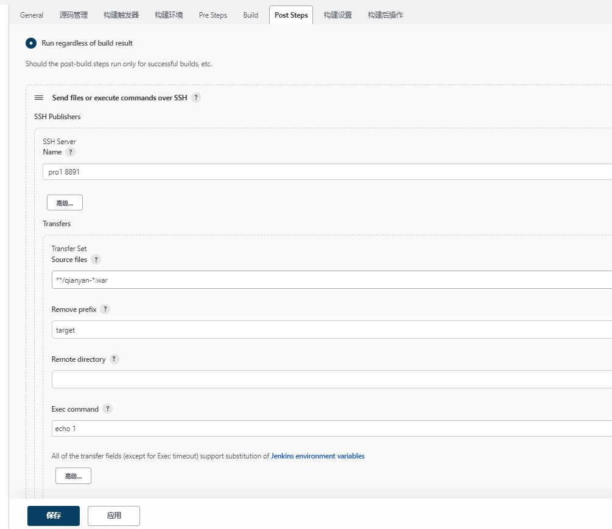

# 04自动发布到目标服务器


## 安装ssh插件





## 配置




添加服务器,使用全局设置




**Publish over SSH**


任务中添加目标服务器

Source files: 源文件,支持通配符

​	也可以使用此命令

```
**/qianyan-*.war
```


Exec command: 发送完成后,在目标服务器执行的命令




注意: 

Source files: 根目录为工作空间目录

```
**/qianyan-*.war 表示找命名空间下 qianyan开头 .war结尾的包
```

Remove prefix: 去除的前缀

Exec command不能填写 top等前台命令，会导致状态错误 整体失败
