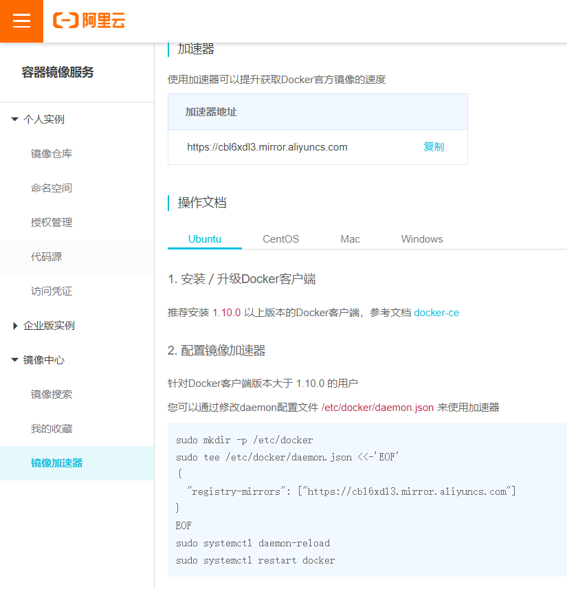
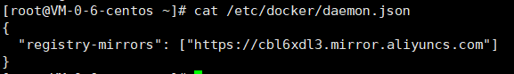
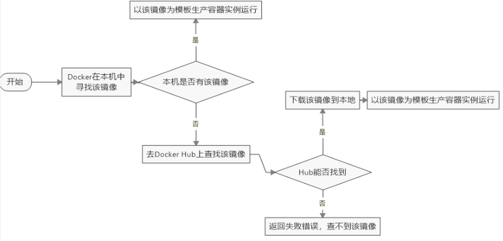

<!-- START doctoc generated TOC please keep comment here to allow auto update -->
<!-- DON'T EDIT THIS SECTION, INSTEAD RE-RUN doctoc TO UPDATE -->


- [环境说明](#%E7%8E%AF%E5%A2%83%E8%AF%B4%E6%98%8E)
- [安装步骤](#%E5%AE%89%E8%A3%85%E6%AD%A5%E9%AA%A4)
- [阿里云镜像加速](#%E9%98%BF%E9%87%8C%E4%BA%91%E9%95%9C%E5%83%8F%E5%8A%A0%E9%80%9F)

<!-- END doctoc generated TOC please keep comment here to allow auto update -->


## 环境说明

我们使用的是 CentOS 7 (64-bit)

Docker 运行在 CentOS 7 上，要求系统为64位、系统内核版本为 3.10 以上。

**查看自己的内核：** 

用于打印当前系统相关信息（内核版本号、硬件架构、主机名称和操作系统类型 等）。

```sh
uname -r
```

**查看版本信息：**

```sh
cat /etc/os-release
```


## 安装步骤

官网安装参考手册：https://docs.docker.com/engine/install/centos/

1. yum安装gcc相关环境（需要确保虚拟机可以上外网 ）

   ```sh
   yum -y install gcc
   yum -y install gcc-c++
   ```

   

2. 卸载旧版本

   ```sh
   sudo yum remove docker \
                     docker-client \
                     docker-client-latest \
                     docker-common \
                     docker-latest \
                     docker-latest-logrotate \
                     docker-logrotate \
                     docker-engine
   ```

   

3. 安装需要的软件包

   ```sh
   sudo yum install -y yum-utils
   或者
   yum -y install yum-utils device-mapper-persistent-data lvm2
   ```

   

4. 设置镜像仓库

   官网（国外）：

   ```sh
   sudo yum-config-manager \
       --add-repo \
       https://download.docker.com/linux/centos/docker-ce.repo
   ```

   阿里云（推荐）：

   ```sh
   yum-config-manager --add-repo http://mirrors.aliyun.com/docker-ce/linux/centos/docker-ce.repo
   ```
   
   

5. 更新yum软件包索引

   ```sh
   yum makecache fast
   ```

   

6. 安装 Docker CE

   ```sh
   yum install docker-ce docker-ce-cli containerd.io
   ```

   

7. 启动 Docker

   ```sh
   systemctl start docker
   ```

   至此，已经安装完


- 查看版本

  ```sh
  docker version
  ```

- 查看安装的镜像

  ```sh
  docker images
  ```

- 测试运行hello

  ```sh
  docker run hello-world
  ```


**卸载docker**

```sh
systemctl stop docker
yum -y remove docker-ce docker-ce-cli containerd.io
rm -rf /var/lib/docker
```

**补充**

```
# 启动Docker服务
systemctl start docker
# 设置开机自动启动
systemctl enable docker
```


## 阿里云镜像加速

介绍：https://www.aliyun.com/product/acr

查看自己的镜像加速器并配置




```sh
sudo mkdir -p /etc/docker
sudo tee /etc/docker/daemon.json <<-'EOF'
{
  "registry-mirrors": ["https://cbl6xdl3.mirror.aliyuncs.com"]
}
EOF
sudo systemctl daemon-reload
sudo systemctl restart docker
```

您可以通过修改daemon配置文件/etc/docker/daemon.json来使用加速器




> 测试 HelloWorld

启动hello-world

```sh
docker run hello-world
```

run干了什么？




---

# 补充安装

## 正式安装

> 1. 确定你是CentOS7及以上版本
>
> ```
> cat /etc/redhat-release
> ```
>
> 2. 卸载旧版本
>
> 3. yum安装gcc相关
>
>    ```
>    yum -y install gcc
>    yum -y install gcc-c++
>    ```
>
> 
>
> 4. 安装需要的软件包
>
>    ```
>    yum install -y yum-utils
>    ```
>
> 
>
> 5. 设置stable镜像仓库 -- 注意: 一定使用阿里云镜像
>
>    ```
>    yum-config-manager --add-repo http://mirrors.aliyun.com/docker-ce/linux/centos/docker-ce.repo
>    ```
>
> 
>
> 6. 更新yum软件包索引 -- 更新yum为最新
>
>    ```
>    yum makecache fast
>    ```
>
> 
>
> 7. 安装DOCKER CE
>
>    ```
>    yum -y install docker-ce docker-ce-cli containerd.io
>    ```
>
> 
>
> 8. 启动docker
>
>    ```
>    systemctl start docker # 启动
>    systemctl status docker # 查看docker运行状态
>    ```
>
> 9. 测试
>
>    ```
>    docker version
>    ```
>
>    ```
>    docker run hello-world #运行docker下载后自带的镜像
>    ```
>
> 10. 卸载
>
>     ```
>     systemctl stop docker 
>     yum remove docker-ce docker-ce-cli containerd.io
>     rm -rf /var/lib/docker
>     rm -rf /var/lib/containerd
>     ```
>
> 


## 阿里云镜像加速

1.  阿里云获得加速器地址连接(选择容器镜像服务)
2.  获取加速器地址 :

```
https://64l2a5bw.mirror.aliyuncs.com
```

3. 直接粘上

```
#创建docker文件夹
mkdir -p /etc/docker

#新增配置
tee /etc/docker/daemon.json <<-'EOF'
{
  "registry-mirrors": ["https://64l2a5bw.mirror.aliyuncs.com"]
}
EOF
```

4. 重启docker

```
systemctl daemon-reload

systemctl restart docker
```


以上操作完成配置后 拉取镜像会畅通无阻

