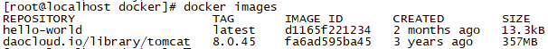
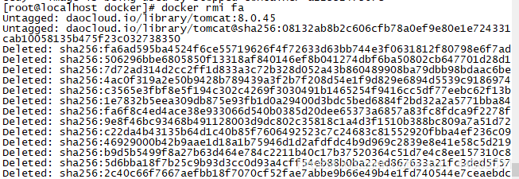
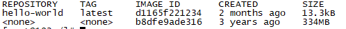
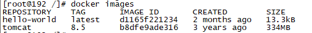
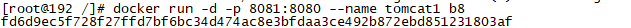
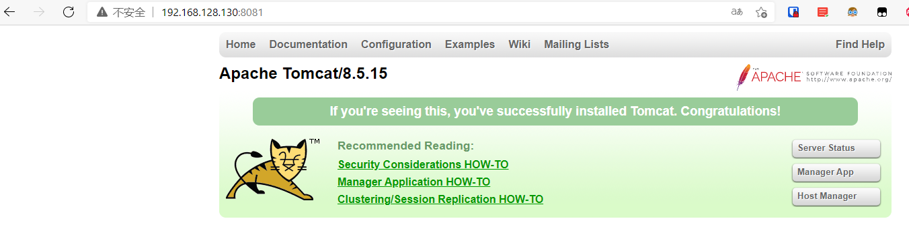
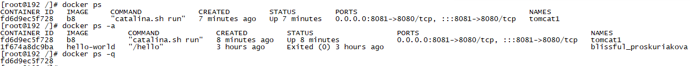
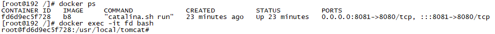
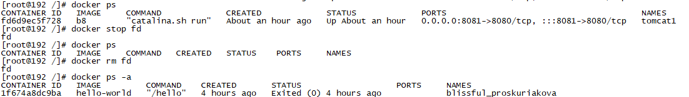

### 镜像的操作【`重点`】

----

####  拉取镜像

> 从中央仓库拉取镜像到本地

```sh
docker pull 镜像名称[:tag]

# 举个栗子：docker pull daocloud.io/library/tomcat:8.5.15-jre8
#注：上述中括号可写可不写,如果不写就把默认版本拉取下来。镜像名称可以直接从daocloud拉取，如果不写就默认从中央仓库，速度太慢。
```


####  查看本地全部镜像

> 查看本地已经安装过的镜像信息，包含标识，名称，版本，更新时间，大小

```sh
docker images
```



TAG：版本
IMAGE ID：唯一表示id
CREATED：在中央仓库的创建时间

#### 删除本地镜像

> 镜像会占用磁盘空间，可以直接手动删除，表示通过查看获取

```sh
docker rmi 镜像的标识 -->（IMAGE ID镜像标识或者CONTAINER ID镜像名称）
```

注：镜像标识只需要分辨出来就行，不用写的特别全。
出现

```
>Error response from daemon: conflict: unable to delete d1165f221234 (must be forced) - image is being used by stopped container a223324f36fe
```

说明正在运行不能删除，需要停止。



#### 镜像的导入导出

> 如果因为网络原因可以通过硬盘的方式传输镜像，虽然不规范，但是有效，但是这种方式导出的镜像名称和版本都是null，需要手动修改，方便后面操作

```sh
# 将本地的镜像导出
docker save -o 导出的路径 镜像id
# 加载本地的镜像文件
docker load -i 镜像文件
# 修改镜像名称
docker tag 镜像id 新镜像名称:版本
```

例子：

```sh
# 把tomcat镜像导出到当前文件夹下名字为tomcat_image
docker save -o ./tomcat_image b8
# 加载
docker load -i tomcat_image
# 修改镜像名称
docker tag b8 tomcat:8.5
```

发现repository名为null，可以进行修改



修改后：




### 容器操作【`重点`】

----

####  运行容器

容器就是运行起来的镜像。

> 运行容器需要制定具体镜像，如果镜像不存在，会直接下载

```sh
# 简单操作
docker run 镜像的标识|镜像名称[:tag]
（如果本地有 就写表示  如果本地没有就通过镜像名称[:tag]在仓库里拉取）
# 常用的参数
docker run -d -p 宿主机端口:容器端口 --name 容器名称 镜像的标识|镜像名称[:tag]
# -d：代表在后台运行容器（如果不需要查看日志 可以-d）
# -p 宿主机端口:容器端口--->为了映射当前Linux的端口和容器的端口
# --name 容器（容器跑在虚拟机的docker引擎上）名称：指定容器的名称
```

举例：




```
# 运行tomcat镜像,虚拟机端口8081,容器端口8080，名字标识是tomcat1
docker run -d -p 8081:8080 --name tomcat1 b8
```

访问虚拟机的8081端口，是可以被访问到的



####  查看正在运行的容器

> 查看全部正在运行的容器信息

```sh
docker ps [-qa]
# -a：查看全部的容器，包括没有运行
# -q：只查看容器的标识
```



```sh
CONTAINER ID: 容器 ID。

IMAGE: 使用的镜像。

COMMAND: 启动容器时运行的命令。

CREATED: 容器的创建时间。

STATUS: 容器状态。

PORTS: 容器的端口信息和使用的连接类型（tcp\udp),映射状态

NAMES: 自动分配的容器名称。
```


小结：

```sh
# 查看正在运行的容器
docker ps
# 查看全部容器
docker ps -a
# 查看正在运行容器的标识
docker ps -q
# 查看容器标识
docker ps -qa
```


####  查看容器日志

> 查看容器日志，以查看容器运行的信息

```sh
docker logs -f 容器id
# -f：可以滚动查看日志的最后几行
如查看tomcat容器运行log
docker logs -f fd
```


####  进入容器内容部

容器就是docker在linux内核中创建了一部分空间运行服务，也可以进入操作，但是一般不进入操作，一般用于查看容器中文件的存放路径，可使用ls -l查看文件

```sh
docker exec -it 容器id bash
```



使用exit指令退出容器，回到宿主机。

####  复制内容到容器

> 将宿主机的文件复制到容器内部的指定目录
>
> （可以把容器与宿主机看成两台不同的小电脑 实际容器是在宿主机内又运行起来的一个独立的 Linux）

```sh
docker cp 文件名称 容器id:容器内部路径
```


####  重启&启动&停止&删除容器

> 容器的启动，停止，删除等操作，后续经常会使用到

```sh
# 重新启动容器
docker restart 容器id

# 启动停止运行的容器
docker start 容器id

# 停止指定的容器（删除容器前，需要先停止容器）
docker stop 容器id
# 停止全部容器
docker stop $(docker ps -qa)

# 删除指定容器
docker rm 容器id
# 删除全部容器
docker rm $(docker ps -qa)
```



