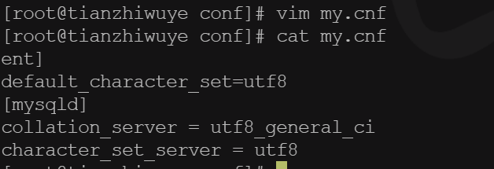
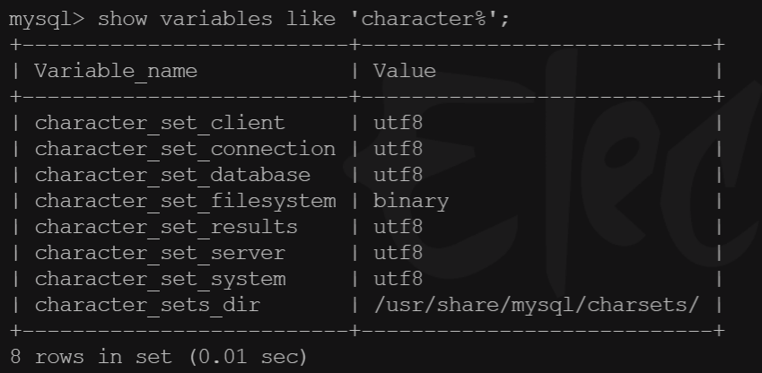
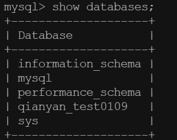

docker hub上面查找mysql镜像


从docker hub上(阿里云加速器)拉取mysql镜像到本地标签为5.7

```
docker pull mysql:5.7
```


## 使用mysql5.7镜像创建容器(也叫运行镜像)


### 先运行

```
docker run -d -p 3306:3306 --privileged=true -v /zzyyuse/mysql/log:/var/log/mysql -v /zzyyuse/mysql/data:/var/lib/mysql -v /zzyyuse/mysql/conf:/etc/mysql/conf.d -e MYSQL_ROOT_PASSWORD=123456  --name mysql5.7 mysql:5.7
```

解释:

```
--privileged=true  容器数据卷权限开启
-v  : 可以挂多个数据卷
-e MYSQL_ROOT_PASSWORD=123456  密码
```


### 新建my.cnf

通过容器卷同步给mysql容器实例




```
docker restart mysql5.7

docker exec -it mysql5.7 bash


mysql -uroot -p 123456
# 查看编码
show variables like 'character%';
```




## 删除并重新安装测试

强制删除

```
docker rm -f mysql5.7
```

再次新建并运行

```
docker run -d -p 3306:3306 --privileged=true -v /zzyyuse/mysql/log:/var/log/mysql -v /zzyyuse/mysql/data:/var/lib/mysql -v /zzyyuse/mysql/conf:/etc/mysql/conf.d -e MYSQL_ROOT_PASSWORD=123456  --name mysql5.7 mysql:5.7
```

发现数据都是在的



```
docker run -d -p 3306:3306 --privileged=true -v /data/mysql/lib/mysql:/data/mysql/lib/mysql -v /data/mysql:/data/mysql -v /data/mysql/run/mysqld:/data/mysql/run/mysqld  -v /data/mysql/tmp:/data/mysql/tmp -v /etc/my.cnf:/etc/my.cnf  -v /data/mysql/log/mysqld.log:/data/mysql/log/mysqld.log -e MYSQL_ROOT_PASSWORD=Qianyan89892528  --name mysql8.0.27  mysql
```


```
docker run -d -p 3306:3306 --privileged=true  -v /data/mysql/lib/mysql:/var/lib/mysql  -v /data/mysql/tmp:/data/mysql/tmp -v /data/mysql/log/mysqld.log:/data/mysql/log/mysqld.log  -v /etc/mysql/my.cnf:/etc/mysql/my.cnf -e MYSQL_ROOT_PASSWORD=Qianyan89892528  --name mysql8.0.27  mysql
```


```
docker run -d -p 3306:3306 --privileged=true  -v /data/mysql/lib/mysql:/var/lib/mysql  -e MYSQL_ROOT_PASSWORD=Qianyan89892528  --name mysql8.0.27  mysql
```


可运行

```
docker run --restart=always  -d    --privileged=true   -v /data/mysql/log:/data/mysql/log  -v /data/mysql/lib/mysql:/data/mysql/lib/mysql -v /data/mysql/tmp:/data/mysql/tmp  -p 3307:3306 --name mysql11 -e MYSQL_ROOT_PASSWORD=Qianyan89892528 mysql
```


```
docker run --restart=always  -d    --privileged=true  -v /data/mysql/lib/mysql:/var/lib/mysql -v /data/mysql/log:/data/mysql/log  -v /data/mysql/lib/mysql:/data/mysql/lib/mysql -v /data/mysql/tmp:/data/mysql/tmp -v /etc/mysql/my.cnf:/etc/mysql/my.cnf  -p 3307:3306 --name mysql -e MYSQL_ROOT_PASSWORD=Qianyan89892528 mysql
```

