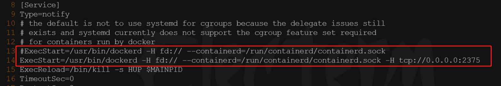
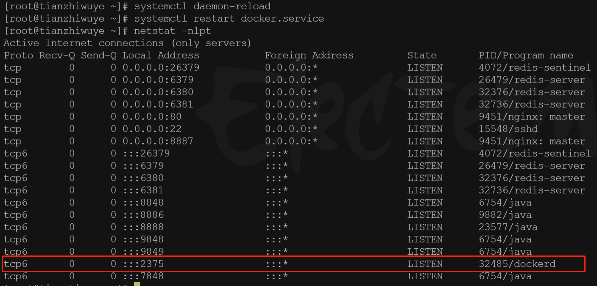
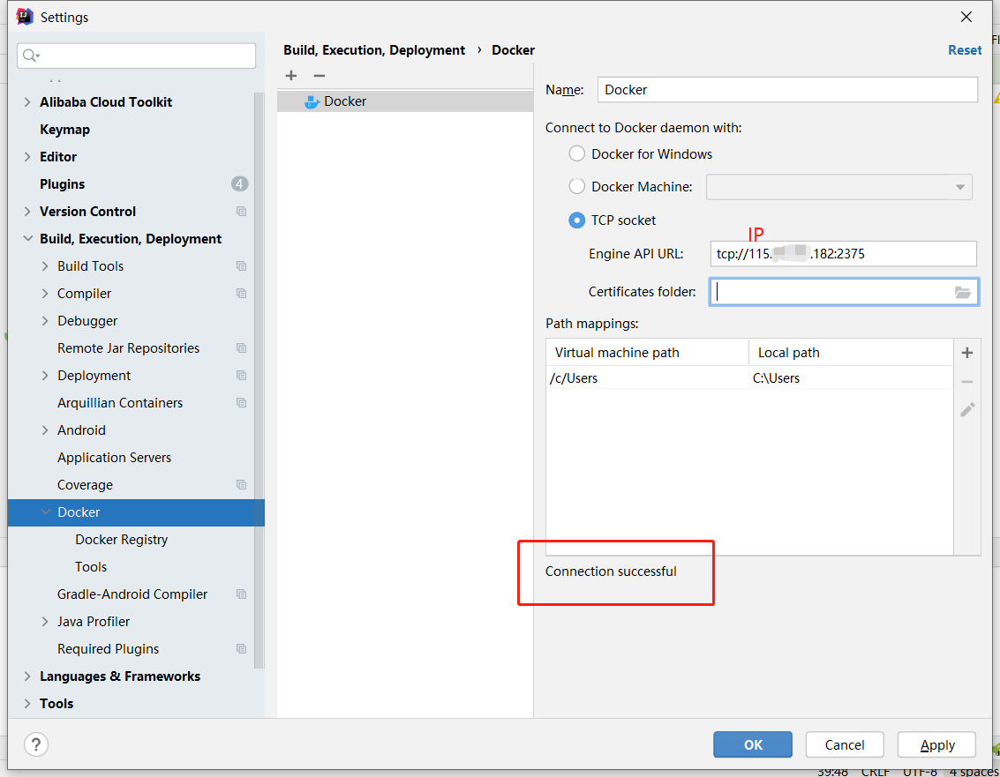
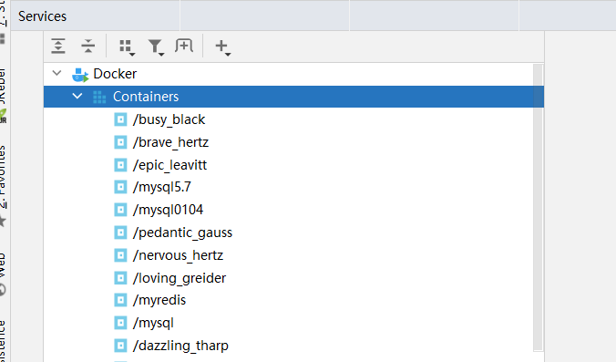

# IDEA使用Docker插件

## 一、开启Docker远程访问

如果使用idea编辑器的话，可以使用docker插件来远程使用服务器(虚拟机)上的docker,简单方便快捷的使用docker,更重要的是使用插件可以实现项目的一键部署，当然这还需要一些简单的配置。
默认的dokcer是不支持远程访问的，需要加点配置，开启Docker的远程访问


```
#修改Docker服务文件，需要先切换到root用户
vim /lib/systemd/system/docker.service
#注释掉"ExecStart"这一行，并添加下面这一行信息
ExecStart=/usr/bin/dockerd -H fd:// --containerd=/run/containerd/containerd.sock -H tcp://0.0.0.0:2375
```




重新加载配置文件

```
#重新加载配置文件
systemctl daemon-reload
#重启服务
systemctl restart docker.service
#查看配置的端口号（2375）是否开启（非必要）
netstat -nlpt  #如果找不到netstat命令，可以先安装一下这个工具，具体百度
```




# 二、连接docker

使用idea的docker插件连接docker，idea默认已经下载过docker插件了，如果没有的话，需要在idea下载docker插件




连接成功之后就可以使用服务器(虚拟机)上的docker了

