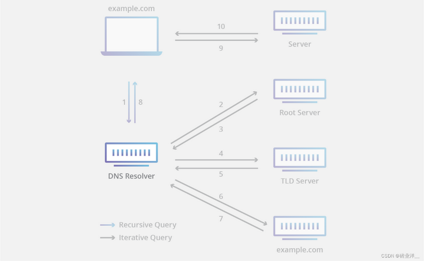
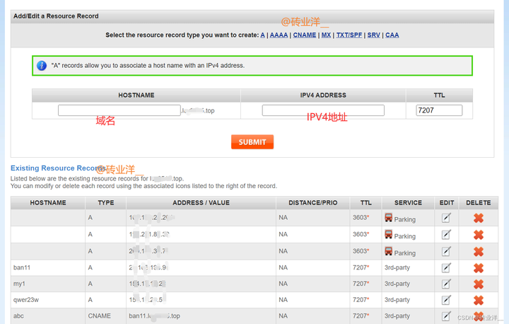

我们就从在浏览器输入域名开始分析。


## 1. DNS 服务器有哪些？

- 递归 DNS 服务器：

也称为 DNS 解析器。这种服务器是 DNS 查询的起点，它负责从根 DNS 服务器开始解析域名，一步步查询到目标域名所在的 DNS 服务器，并将解析结果返回给用户设备。递归 DNS 服务器通常由网络服务提供商（ISP）或公司网络管理员管理。

- 根域名服务器：

这些服务器负责管理域名系统的根区域，它们存储着所有顶级域名（如.com、.org、.cn 等）的 DNS 记录。根 DNS 服务器分为 13 个，分布在全球不同地点，由不同组织管理，以保证 DNS 的高可靠性和稳定性。根域名服务器由一家名为 **Internet 名称与数字地址分配机构（ICANN）** 的非营利组织进行监督。

根域名服务器由 13 组集群服务器构成 (并不是只有 13 台服务器)，每组集群服务器中包含多台服务器，共同承担服务。这些服务器被部署在全球各地的数据中心中，以确保根域名服务器的高可用性和容错能力，每个集群中都有多台服务器进行冗余备份，它们的备份和副本分布在世界各地的不同地方。

举个例子，13 个根域名服务器的 IP 地址可能是这样

```
a.root-servers.net (198.41.0.4)
b.root-servers.net (199.9.14.201)
c.root-servers.net (192.33.4.12)
d.root-servers.net (199.7.91.13)
e.root-servers.net (192.203.230.10)
f.root-servers.net (192.5.5.241)
g.root-servers.net (192.112.36.4)
h.root-servers.net (198.97.190.53)
i.root-servers.net (192.36.148.17)
j.root-servers.net (192.58.128.30)
k.root-servers.net (193.0.14.129)
l.root-servers.net (199.7.83.42)
m.root-servers.net (202.12.27.33)
```

- 顶级域名服务器：

TLD（Top Level Domain）服务器负责管理顶级域名（如.com、.org、.net、.cn 等）的 DNS 记录。当用户访问一个域名时，递归 DNS 服务器首先会向根 DNS 服务器查询顶级域名的 DNS 服务器地址，然后再向相应的 TLD 服务器查询该域名的 DNS 服务器地址。一旦找到权威 DNS 服务器，递归 DNS 服务器就会向其查询域名的 IP 地址，最终返回给用户设备。

TLD 域名服务器的管理由 **Internet 编号分配机构（IANA）** 处理，其为 ICANN 的一个分支机构，IANA 将 TLD 服务器分为几组：


1. 通用顶级域：这些是非特定国家 / 地区的域，一些最知名的通用 TLD 包括 .com (商业企业) .org .net .edu .gov (美国政府实体)，IANA 过去曾严格限制新通用顶级域 (gTLD) 的创建，但在 2010 年这些限制有所放松。现在有数百个不太知名的 gTLD，例如 “.top”、“.xyz” 和 “.loan”。
2. 国家 / 地区代码顶级域：这些包括特定于某个国家 / 地区或州的任何域。例如，.cn、.uk、.us、.ru 和 .jp 等。
3. 赞助的顶级域：这些 TLD 通常代表专业、种族或地理社区。每个赞助 TLD 都有一个代表该社区的授权赞助商。例如，“.app” 是针对开发者社区的 TLD，由 Google 赞助。同样，“.gov” 旨在供美国政府使用，由总务管理局赞助。
4. 基础设施性顶级域：此类别仅包含一个 TLD：“.arpa”。“.arpa” 以帮助开创现代互联网的美国军事研究组织 DARPA 命名，是有史以来创建的第一个 TLD，现在保留用于基础设施职责，例如促进反向 DNS 查找。
5. 保留的顶级域：一些 TLD 位于保留列表中，这意味着它们永远无法使用。例如，“.localhost” 保留用于本地计算机环境，“.example” 保留用于示例演示。


- 权威性域名服务器：

当递归解析器收到来自 TLD 域名服务器的响应时，该响应会将解析器定向到权威性域名服务器。权威性域名服务器通常是解析器查找 IP 地址过程中的最后一步。


## 从浏览器输入 https://abc13.ban2.lcy0000.top/，DNS 如何解析？



假设我们要访问 **abc13.ban2.lcy0000.top**（假设存在该网站），当浏览器输入这个网址后，查询流程如下

**1. 本地 hosts 文件**

本地计算机会首先检查本地 hosts 文件是否包含 abc13.ban2.lcy0000.top 的 IP 地址映射。如果存在，则直接返回该 IP 地址，否则继续进行 DNS 查询。

**2. 本地 DNS 缓存**

本地计算机会检查本地 DNS 缓存是否包含 abc13.ban2.lcy0000.top 的 IP 地址。如果存在，则直接返回该 IP 地址，否则继续进行 DNS 查询。

**3.ISP 的递归 DNS 服务器**（图中的 DNS Resolver）

本地计算机会向 ISP 的 DNS 服务器发起 DNS 查询请求，询问 abc13.ban2.lcy0000.top 的 IP 地址。（图中的连线 1）

ISP 是互联网服务提供商，简单理解为就是移动、联通、电信。

**4. 根 DNS 服务器**（图中的 Root Server）

ISP 的 DNS 服务器会向根 DNS 服务器查询 .top 顶级域名的 DNS 服务器的 IP 地址，根 DNS 服务器会返回 .top 顶级域名的 DNS 服务器的 IP 地址。（图中的 2、3 连线代表查询和返回）

**5. 顶级域名服务器**（图中的 TLD Server）

ISP 的 DNS 服务器会向该 DNS 服务器查询 lcy0000.top 二级域名的 DNS 服务器的 IP 地址。（图中的 4、5 连线代表查询和返回）

**6. 权威 DNS 服务器**

ISP 的 DNS 服务器会向 lcy0000.top 二级域名的 DNS 服务器查询 ban2.lcy0000.top 的 DNS 服务器的 IP 地址。（图中的连线 6）

**7. 权威 DNS 服务器**

ban2.lcy0000.top 的 DNS 服务器查询 abc13.ban2.lcy0000.top 的 IP 地址，abc13.ban2.lcy0000.top 的 IP 地址被返回。**权威服务器之间的查询过程不需要 ISP 的递归服务器参与，ISP 的 DNS 只需要查询一次权威服务器即可**（图中的连线 7）

**8.ISP 的递归 DNS 服务器**（图中的 DNS Resolver）

ISP 的 DNS 服务器会将查询结果返回给本地计算机。操作系统将使用该 IP 地址来访问对应的网站，并将该 IP 地址添加到本地 DNS 缓存中，以便下次访问同一网站时更快地获取 IP 地址。（图中的连线 8）

**9. 本地计算机**

本地计算机将使用该 IP 地址与 abc13.ban2.lcy0000.top 进行通信，浏览器使用该 IP 地址向 abc13.ban2.lcy0000.top 的服务器发起 HTTP 请求，获取相应的网页内容。（图中的 9、10 连线代表查询和返回）

从图上可以看到，从浏览器到 ISP 的递归 DNS 服务器的这个步骤是**递归查询（Recursive Query）**，从递归 DNS 服务器到根、顶级、权威域名服务器这个过程是**迭代查询（Iteractive Query）**。


## 3. hosts 文件是什么？为什么访问网站会先查找 hosts 文件？

hosts 文件中存放着 IP 地址和对域名，可以手动配置，作用是为了将特定的域名映射到特定的 IP 地址上，从而在访问这些域名时不需要进行 DNS 解析，直接使用 hosts 文件中的 IP 地址进行访问。如果访问的域名不在 hosts 文件中，则会查找 DNS 缓存或者从 DNS 服务器获取对应的 IP 地址并进行访问。**如果你在 hosts 文件配置错了 IP，那这个网站将无法访问。因为后面不会再去查找本地 DNS 缓存和 DNS 服务器解析，就根据 hosts 文件中的 IP 去访问。**

相对于本地 DNS 缓存，hosts 文件的优势在于它可以直接控制特定域名的解析结果。当你在 hosts 文件中手动添加了一个 IP 地址和域名的对应关系后，这个映射关系将会一直生效，不受 DNS 缓存的影响。而本地 DNS 缓存是由操作系统自动维护的，它会根据 DNS 服务器返回的 TTL 值来判断缓存是否过期，当缓存过期后需要重新进行 DNS 解析，如果 DNS 服务器返回了不同的 IP 地址，则会更新缓存中的记录。


hosts 文件通常位于操作系统中的一个特定目录下，比如在 Windows 系统中，hosts 文件通常位于 C:\Windows\System32\drivers\etc 目录下，它是一个以文本形式存储的文件，可以使用任何文本编辑器进行编辑。在 mac 中，位于 /etc/ 目录下。


## 4. 如何查看本地 DNS 服务器缓存的域名对应的 IP？

windows 可以用下面命令

```text
ipconfig /displaydns
```

mac 可以用下面命令

```text
// 这个是刷新本地 DNS 缓存，并清除所有缓存记录
sudo killall -HUP mDNSResponder
// 这个是显示本地 DNS 服务器缓存的所有域名和对应的 IP 地址
dscacheutil -cachedump -entries Host
```

**执行了这个命令却没看到我刚访问的域名对应的 ip，这是没缓存吗？**

如果执行了 ipconfig /displaydns 或者 dscacheutil -cachedump -entries Host 命令，但是没有看到刚访问的域名对应的 IP 地址，可能有以下几种情况：

- 本地 DNS 服务器没有缓存该域名的 IP 地址。如果你第一次访问一个域名，本地 DNS 服务器很可能没有缓存该域名的 IP 地址。在这种情况下，执行 ipconfig /displaydns 或者 dscacheutil -cachedump -entries Host 命令时，看不到该域名的缓存记录。
- 本地 DNS 服务器缓存的 TTL 时间已经过期。当你访问一个域名时，本地 DNS 服务器会将该域名的 IP 地址缓存一段时间，这个时间就是 TTL（Time To Live）时间。如果 TTL 时间已经过期，本地 DNS 服务器就会从权威 DNS 服务器重新获取该域名的 IP 地址。在这种情况下，执行 ipconfig /displaydns 或者 dscacheutil -cachedump -entries Host 命令时，可能看不到该域名的缓存记录。
- 你的电脑可能使用了其他 DNS 服务器或者代理服务器。如果你的电脑使用了其他 DNS 服务器或者代理服务器，那么执行 ipconfig /displaydns 或者 dscacheutil -cachedump -entries Host 命令时，缓存记录可能来自其他 DNS 服务器或者代理服务器，而不是本地 DNS 服务器。


## 5. DNS A 记录 / AAAA 记录 / CNAME 记录

- A 记录

A 记录是 DNS 中最基本的一种记录类型，用于将一个域名（例如 http://www.example.com）映射到一个 IPv4 地址（例如 192.168.0.1）。具体来说，A 记录将一个域名与一个 IP 地址建立映射关系。当用户输入一个域名时，DNS 服务器会返回与之对应的 IP 地址，从而使用户能够访问该域名对应的网站或服务。

举个例子，假设我们有一个网站 http://www.example.com，它的 IP 地址是 192.168.0.1。我们可以在 DNS 中添加一个 A 记录，将 http://www.example.com 指向 192.168.0.1。这样，当用户输入 http://www.example.com 时，DNS 服务器会返回 IP 地址 192.168.0.1，从而使用户能够访问我们的网站。

如下这是我买的域名配置的图：




- AAAA 记录

AAAA 记录是 A 记录的扩展，用于将一个域名（例如 http://www.example.com）映射到一个 IPv6 地址。具体来说，AAAA 记录将一个域名与一个 IPv6 地址建立映射关系。当用户输入一个域名时，DNS 服务器会返回与之对应的 IPv6 地址，从而使用户能够访问该域名对应的网站或服务。

举个例子，假设我们有一个网站 http://www.example.com，它的 IPv6 地址是 2001:0db8:85a3:0000:0000:8a2e:0370，我们访问 http://www.example.com 时，DNS 解析过程中就会查询该 AAAA 记录，返回 IPv6 地址。

图就不放了，和上面类似。

- CNAME 记录

CNAME 记录将一个域名（例如 http://www.example.com）指向另一个域名（例如 http://example.com）。这个过程类似于重定向，方便用户快速访问该域名。CNAME 记录通常用于将某个子域名指向其父域名，或将一个域名指向另一个域名（例如将 http://www.example.com 指向 http://example.com）。

举个例子，假设我们有一个网站 http://www.example.com，它的 IP 地址是 192.168.0.1，同时我们还希望用户能够通过 http://example.com 访问该网站。我们可以在 DNS 中添加一个 CNAME 记录，将 http://example.com 指向 http://www.example.com。这样，当用户输入 http://example.com 时，DNS 服务器会返回 http://www.example.com 的 IP 地址 192.168.0.1，从而使用户能够访问我们的网站。


参考文档

```
https://my.oschina.net/u/4526289/blog/8747917?_from=gitee_rec
```

