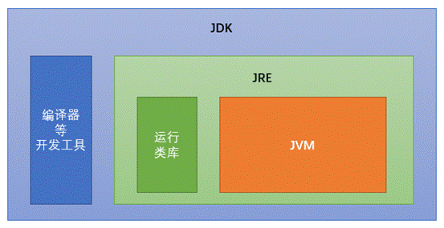
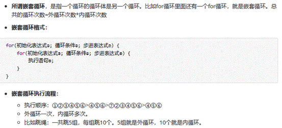
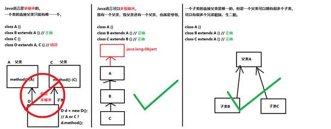
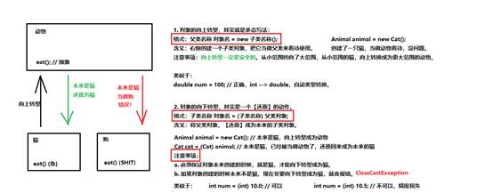

2020/3/18

重新JAVA

文档day1

 

二进制发明者：莱布尼茨


 


字节：

位（bit）：一个数字0或者一个数字1，代表一位。

字节（Byte）：每逢8位是一个字节，这是数据存储的最小单位。

 

1 Byte = 8 bit

 

1 KB = 1024 Byte

1 MB = 1024 KB

1 GB = 1024 MB

1 TB = 1024 GB

1 PB = 1024 TB

1 EB = 1024 PB

1 ZB = 1024 EB

 

JAVA虚拟机 —JVM 

JVM翻译

 

JVM（Java Virtual Machine ）：Java虚拟机，简称JVM，是运行所有Java程序的假想计算机，是Java程序的运行环境，是Java最具吸引力的特性之一。我们编写的Java代码，都运行在 JVM上

 

跨平台：任何软件的运行，都必须要运行在操作系统之上，而我们用Java编写的软件可以运行在任何的操作系统上，这个特性称为Java语言的跨平台特性。该特性是由JVM实现的，我们编写的程序运行在JVM上，而JVM 运行在操作系统上。

 

说明：每个系统都有属于自己的JVM，只有JAVA 程序具有跨平台性，（每个系统的JVM相当于当地的翻译）

JRE ( Java Runtime Environment) ：是Java程序的运行时环境，包含JVM和运行时所需要的核心类库。

JDK ( Java Development Kit)：是Java程序开发工具包，包含JRE和开发人员使用的工具。

 

我们想要运行一个已有的Java程序，那么只需安装JRE即可。

 

我们想要开发一个全新的Java程序，那么必须安装JDK。



编译和运行是两回事:

编译：是指将我们编写的Java源文件翻译成JVM认识的class文件，在这个过程中，javac 编译器会检查我们所写的程序是否有错误，有错误就会提示出来，如果没有错误就会编译成功。

运行：是指将class文件交给JVM去运行，此时JVM就会去执行我们编写的程序了。

命令提示符中javac + 名.java ->编译

java + 名 ->运行

 

关于main方法

main方法：称为主方法。写法是固定格式不可以更改。main方法是程序的入口点或起始点，无论我们编写多少程序，JVM在运行的时候，都会从main方法这里开始执行。

 

注释：

单行注释：//开头 换行结束

多行注释：/*开头  以*/结束

 

关键字：是指在程序中，Java已经定义好的单词，具有特殊含义。

常出现的有public. class . static , void等，这些单词java已经定义好了，全部是小写字母，有特殊颜色标记

 

标识符：是指在程序中，我们自己定义内容。比如类的名字、方法的名字和变量的名字等等，都是标识符。

标识符可以包含 英文字母26个，区分大小写、0-9数字、美元符号$、和下划线_ 。

标识符不能以数字开头。 标识符不能是关键字。

命名规范：

类名规范：首字母大写，后面每个单词首字母大写（大驼峰式）。

方法名规范：首字母小写，后面每个单词首字母大写

 

常量：是指在Java程序中固定不变的数据。

分类：

| **类型** | **含义**   | **数据举例**    |
| -------- | ---------- | --------------- |
| 整数常量 | 所有的整数 | 0，1， 567， -9 |
|          |            |                 |

 

变量：

变量：常量是固定不变的数据，那么在程序中可以变化的量称为变量。

Java中要求一个变量每次只能保存一个数据，必须要明确保存的数据类型。

Java的数据类型分为两大类：

 

基本数据类型：包括整数、浮点数、字符、布尔。

引用数据类型：包括 类、数组、接口

| **数据类型** | **关键字** | **内存占用** | **取值范围** |
| ------------ | ---------- | ------------ | ------------ |
| 字节型       | byte       | 1个字节      | -128~127     |
|              |            |              |              |

JAVA中整数类型是int，浮点类型是double

 

变量的定义： 数据类型、变量名、数据值

格式： 数据类型 变量名 = 数据值；

 

注意：

变量名称：在同一个大括号范围内，变量的名字不可以相同。 

变量赋值：定义的变量，不赋值不能使用。

 

2020/3/19 DAY2

数据类型转换

```
import java.util.Scanner;

 

public class Demo318 {

/*

当数据类型不一样时，将会发生数据类型转换。

 

自动类型转换（隐式）

1. 特点：代码不需要进行特殊处理，自动完成。
2. 规则：数据范围从小到大。

 

强制类型转换（显式）

*/

  public static void main(String[] args) {

​    System.out.println(1024); // 这就是一个整数，默认就是int类型

​    System.out.println(3.14); // 这就是一个浮点数，默认就是double类型

 

​    // 左边是long类型，右边是默认的int类型，左右不一样

​    // 一个等号代表赋值，将右侧的int常量，交给左侧的long变量进行存储

​    // int --> long，符合了数据范围从小到大的要求

​    // 这一行代码发生了自动类型转换。

​    long num1 = 100;

​    System.out.println(num1); // 100

 

​    // 左边是double类型，右边是float类型，左右不一样

​    // float --> double，符合从小到大的规则

​    // 也发生了自动类型转换

​    double num2 = 2.5F;

​    System.out.println(num2); // 2.5

 

​    // 左边是float类型，右边是long类型，左右不一样

​    // long --> float，范围是float更大一些，符合从小到大的规则

​    // 也发生了自动类型转换

​    float num3 = 30L;

​    System.out.println(num3); // 30.0

/*

强制类型转换

1. 特点：代码需要进行特殊的格式处理，不能自动完成。
2. 格式：范围小的类型 范围小的变量名 = (范围小的类型) 原本范围大的数据;

 

注意事项：

1. 强制类型转换一般不推荐使用，因为有可能发生精度损失、数据溢出。
2. byte/short/char这三种类型都可以发生数学运算，例如加法“+”.
3. byte/short/char这三种类型在运算的时候，都会被首先提升成为int类型，然后再计算。
4. boolean类型不能发生数据类型转换

*/

  public static void main(String[] args) {

​      // 左边是int类型，右边是long类型，不一样

​      // long --> int，不是从小到大

​      // 不能发生自动类型转换！

​      // 格式：范围小的类型 范围小的变量名 = (范围小的类型) 原本范围大的数据;

​      int num = (int) 100L;

​      System.out.println(num);

 

​      // long强制转换成为int类型

​      int num2 = (int) 6000000000L;

​      System.out.println(num2); // 1705032704

 

​      // double --> int，强制类型转换

​      int num3 = (int) 3.99;

​      System.out.println(num3); // 3，这并不是四舍五入，所有的小数位都会被舍弃掉

 

​      char zifu1 = 'A'; // 这是一个字符型变量，里面是大写字母A

​      System.out.println(zifu1 + 1); // 66，也就是大写字母A被当做65进行处理

​      // 计算机的底层会用一个数字（二进制）来代表字符A，就是65

​      // 一旦char类型进行了数学运算，那么字符就会按照一定的规则翻译成为一个数字

 

​      byte num4 = 40; // 注意！右侧的数值大小不能超过左侧的类型范围

​      byte num5 = 50;

​      // byte + byte --> int + int --> int

​      int result1 = num4 + num5;

​      System.out.println(result1); // 90

 

​      short num6 = 60;

​      // byte + short --> int + int --> int

​      // int强制转换为short：注意必须保证逻辑上真实大小本来就没有超过short范围，否则会发生数据溢出

​      short result2 = (short) (num4 + num6);

​      System.out.println(result2); // 100

 

​    }

  }
```

数据类型转换小结：

自动转换规则：


强制转换：


 

运算符：

1、算术运算符

++运算

前++和后++区别

前++：变量自己先加1，将加1后的结果赋值给b


后++：变量a先把自己的数值 赋值给b，


 


2、赋值运算符

= . += . -=. *=. /= . %=

3、比较运算符

== .< .>. <=.>=. !=

4、逻辑运算符

&& || ！


5、三元运算符

格式： 数据类型 变量名= 布尔类型表达式? 结果1：结果2


 

int a = (2 == 3 ? 4 : 6);

System.out.println(a);//返回值 6

说明：不加括号也是可以的

 

方法入门：

方法：将功能抽取出来，把代码单独定义在一个大括号，形成一个单独功能

当我们需要用这个功能的时候，就要去调用。实现在代码的复用，也解决了代码的冗余

 

方法定义：定义一个方法的格式：

```
public static void 方法名称() {

方法体

}
```

方法名称的命名规则和变量一样，使用小驼峰。

方法体：也就是大括号当中可以包含任意条语句。

```
public static void main(String[] args) {

farmer(); // 调用农民的方法

seller(); // 调用小商贩的方法

cook(); // 调用厨子的方法

me(); // 调用我自己的方法

}

 

// 厨子

public static void cook() {

System.out.println("洗菜");

System.out.println("切菜");

System.out.println("炒菜");

System.out.println("装盘");

}

 

// 我

public static void me() {

System.out.println("吃");

}

 

// 小商贩

public static void seller() {

System.out.println("运输到农贸市场");

System.out.println("抬高价格");

System.out.println("吆喝");

System.out.println("卖给厨子");

}

 

// 农民伯伯

public static void farmer() {

System.out.println("播种");

System.out.println("浇水");

System.out.println("施肥");

System.out.println("除虫");

System.out.println("收割");

System.out.println("卖给小商贩");

}
```

方法定义注意事项:

1. 方法定义的先后顺序无所谓。
2. 方法的定义不能产生嵌套包含关系。
3. 方法定义好了之后，不会执行的。如果要想执行，一定要进行方法的【调用】。

 

 

如何调用方法，格式：

方法名称();

 

DAY3

流程控制

1、判断语句 if

```java
if（关系表达式）{

语句体；

}

if...else

if（关系表达式）{

语句体1；

}else{

语句体2；

}

if...else if...else

if（关系表达式）{

语句体1；

}else if（关系表达式）{

语句体2；

}else{

  语句

}//可以是多个
```

if语句和三元运算符的互换


 

选择语句 switch

格式： 

```
  switch(表达式){//也就是满足哪一个case就执行那个case的代码

    case 常量值1；

      语句1

      break

     case 常量值2；

      语句2

      break

    ....

    

    default://就像是刚刚的else

      语句体n+1；

      break;

  }

 
```

switch语句使用的注意事项：

 

1. 多个case后面的数值不可以重复。
2. switch后面小括号当中只能是下列数据类型：

基本数据类型：byte/short/char/int

引用数据类型：String字符串、enum枚举

3. switch语句格式可以很灵活：前后顺序可以颠倒，而且break语句还可以省略。

“匹配哪一个case就从哪一个位置向下执行，直到遇到了break或者整体结束为止。”

case的穿透性：在switch语句中，如果case后面不写break，将出现穿透现象，也就是不会判断下一个case的值，往后运行，直到遇到break，或者整体switch结束。


 

循环语句：

```
/*

循环结构的基本组成部分，一般可以分成四部分：

1. 初始化语句：在循环开始最初执行，而且只做唯一一次。
2. 条件判断：如果成立，则循环继续；如果不成立，则循环退出。
3. 循环体：重复要做的事情内容，若干行语句。
4. 步进语句：每次循环之后都要进行的扫尾工作，每次循环结束之后都要执行一次。

*/

for循环

for(初始化表达式1;布尔表达式2;步进表达式3){

​    循环体4；

} //顺序 1-4-2-3

 

public static void main(String[] args) {

for (int i = 1; i <= 100; i++) {

System.out.println("我错啦！原谅我吧！" + i);

}

System.out.println("程序停止");

}

while循环

初始化表达式1

  while(布尔表达式2){

​    循环体3;

​    步进表达式4;

  }//步骤 1-2-3-4

 

​      for (int i = 1; i <= 10; i++) {

System.out.println("我错啦！" + i);

}

System.out.println("=================");

 

int i = 1; // 1. 初始化语句

while (i <= 10) { // 2. 条件判断

System.out.println("我错啦！" + i); // 3. 循环体

i++; // 4. 步进语句

}

do...while循环

do-while循环的标准格式：

 

do {

循环体

} while (条件判断);

 

扩展格式：

 

初始化语句

do {

循环体

步进语句

} while (条件判断);

 

​      for (int i = 1; i <= 10; i++) {

System.out.println("原谅你啦！起来吧！地上怪凉！" + i);

}

System.out.println("===============");

 

int i = 1; // 1. 初始化语句

do {

System.out.println("原谅你啦！起来吧！地上怪凉！" + i); // 3. 循环体

i++; // 4. 步进语句

} while (i <= 10); // 2. 条件判断

注意：do...while循环无论如何都要把循环体循环一遍
```


 


补充：


 


 



 

 

2020/3/20 DAY4

IDEA所有源代码要写到src中，包也在其中，

层次：项目-模块-src 包（小写，可以加.形成多层文件夹）-类

psvm 


sout


声明一点：idea是不需要保存的，自动保存。


 


 

 

方法：

方法其实就是若干语句的功能集合。

 

方法好比是一个工厂。

蒙牛工厂   原料：奶牛、饲料、水

​      产出物：奶制品

钢铁工厂   原料：铁矿石、煤炭

​      产出物：钢铁建材

 

参数（原料）：就是进入方法的数据。

返回值（产出物）：就是从方法中出来的数据。

 

定义方法的完整格式：

修饰符 返回值类型 方法名称(参数类型 参数名称, ...) {

  方法体

  return 返回值;

}

 

修饰符：现阶段的固定写法，public static

返回值类型：也就是方法最终产生的数据结果是什么类型

方法名称：方法的名字，规则和变量一样，小驼峰

参数类型：进入方法的数据是什么类型

参数名称：进入方法的数据对应的变量名称

PS：参数如果有多个，使用逗号进行分隔

方法体：方法需要做的事情，若干行代码

return：两个作用，第一停止当前方法，第二将后面的返回值还给调用处

返回值：也就是方法执行后最终产生的数据结果

注意：return后面的“返回值”，必须和方法名称前面的“返回值类型”，保持对应。

定义一个两个int数字相加的方法。三要素：

返回值类型：int

方法名称：sum

参数列表：int a, int b

 

方法的三种调用格式。

1. 单独调用：方法名称(参数);
2. 打印调用：System.out.println(方法名称(参数));
3. 赋值调用：数据类型 变量名称 = 方法名称(参数);

 

注意：此前学习的方法，返回值类型固定写为void，这种方法只能够单独调用，不能进行打印调用或者赋值调用。

 

public static void main(String[] args) {

 

// 单独调用

  sum(10, 20);

  System.out.println("===========");

 

// 打印调用

  System.out.println(sum(10, 20)); // 30

  System.out.println("===========");

 

// 赋值调用

  int number = sum(15, 25);

  number += 100;

  System.out.println("变量的值：" + number); // 140

}

 

 

public static int sum(int a, int b) {

  System.out.println("方法执行啦！");

  int result = a + b;

  return result;

}

idea中会显示灰色a,b提示，


 


 

在不同的应用场景下可能会出现要返回参数和没有参数的情况

有参数：例如相加，就要给出参数，方法参数列表要给出定义

无参数：打印字符串，方法参数列表就可以为空

有参数：小括号当中有内容，当一个方法需要一些数据条件，才能完成任务的时候，就是有参数。

例如两个数字相加，必须知道两个数字是各自多少，才能相加。

 

无参数：小括号当中留空。一个方法不需要任何数据条件，自己就能独立完成任务，就是无参数。

例如定义一个方法，打印固定10次HelloWorld。

 

题目要求：定义一个方法，用来【求出】两个数字之和。（你帮我算，算完之后把结果告诉我。）

题目变形：定义一个方法，用来【打印】两个数字之和。（你来计算，算完之后你自己负责显示结果，不用告诉我。）

 

注意事项：

对于有返回值的方法，可以使用单独调用、打印调用或者赋值调用。

但是对于无返回值的方法，只能使用单独调用，不能使用打印调用或者赋值调用。

  public static void main(String[] args) {

​    // 我是main方法，我来调用你。

​    // 我调用你，你来帮我计算一下，算完了之后，把结果告诉我的num变量

​    int num = getSum(10, 20);

​    System.out.println("返回值是：" + num);

​    System.out.println("==============");

 

​    printSum(100, 200);

​    System.out.println("==============");

 

​    System.out.println(getSum(2, 3)); // 正确写法

​    getSum(3, 5); // 正确写法，但是返回值没有用到

​    System.out.println("==============");

 

​    // 对于void没有返回值的方法，只能单独，不能打印或者赋值

//    System.out.println(printSum(2, 3)); // 错误写法！

//    System.out.println(void);

 

//    int num2 = printSum(10, 20); // 错误写法！

//     int num3 = void;

//    void num4 = void;

  }

 

  // 我是一个方法，我负责两个数字相加。

  // 我有返回值int，谁调用我，我就把计算结果告诉谁

  public static int getSum(int a, int b) {

​    int result = a + b;

​    return result;

  }

 

  // 我是一个方法，我负责两个数字相加。

  // 我没有返回值，不会把结果告诉任何人，而是我自己进行打印输出。

  public static void printSum(int a, int b) {

​    int result = a + b;

​    System.out.println("结果是：" + result);

  }

 

使用方法的时候，注意事项：

 

1. 方法应该定义在类当中，但是不能在方法当中再定义方法。不能嵌套。
2. 方法定义的前后顺序无所谓。
3. 方法定义之后不会执行，如果希望执行，一定要调用：单独调用、打印调用、赋值调用。
4. 如果方法有返回值，那么必须写上“return 返回值;”，不能没有。
5. return后面的返回值数据，必须和方法的返回值类型，对应起来。
6. 对于一个void没有返回值的方法，不能写return后面的返回值，只能写return自己。

也就是说此时是标志着方法的结束，

return两个作用：

返回被方法处理过的值

作为方法结束的标志

7. 对于void方法当中最后一行的return可以省略不写。有返回值就一定要写！
8. 一个方法当中可以有多个return语句，但是必须保证同时只有一个会被执行到，两个return不能连写。

 /*

  题目要求：

  定义一个方法，用来判断两个数字是否相同。

   */

 

​    public static void main(String[] args) {

​      System.out.println(isSame(10, 20)); // false

​      System.out.println(isSame(20, 20)); // true

​    }

 

​    /*

​    三要素：

​    返回值类型：boolean

​    方法名称：isSame

​    参数列表：int a, int b

​     */

​    public static boolean isSame(int a, int b) {

//      boolean same;

//       if (a == b) {

//        same = true;

//      } else {

//        same = false;

//      }

 

​       boolean same = a == b ? true : false;

 

​      // boolean same = a == b;

​      return same;//有返回值boolean类型，return一定要写

​    }

 

 

方法的重载 overload

对于功能类似的方法来说，因为参数列表不一样，却需要记住那么多不同的方法名称，太麻烦。

 

方法的重载（Overload）：多个方法的名称一样，但是参数列表不一样。

好处：只需要记住唯一一个方法名称，就可以实现类似的多个功能。

 

方法重载与下列因素相关：

1. 参数个数不同
2. 参数类型不同
3. 参数的多类型顺序不同

 

方法重载与下列因素无关：

1. 与参数的名称无关
2. 与方法的返回值类型无关

  public static void main(String[] args) {

​    System.out.println(sum(10, 20)); // 两个参数的方法

​    System.out.println(sum(10, 20, 30)); // 三个参数的方法

​    System.out.println(sum(10, 20, 30, 40)); // 四个参数的方法

//    System.out.println(sum(10, 20, 30, 40, 50)); // 找不到任何方法来匹配，所以错误！

 

​    sum(10, 20);

  }

 

  public static int sum(int a, double b) {

​    return (int) (a + b);

  }

 

  public static int sum(double a, int b) {

​    return (int) (a + b);

  }//上面两个方法的参数类型进行了颠倒，是方法的重载

 

  public static int sum(int a, int b) {

​    System.out.println("有2个参数的方法执行！");

​    return a + b;

  }

 

  public static int sum(double a, double b) {

​    return (int) (a + b);

  }

  // 错误写法！与方法的返回值类型无关

//  public static double sum(int a, int b) {

//    return a + b + 0.0;

//  }

 

  // 错误写法！与参数的名称无关

//  public static int sum(int x, int y) {

//    return x + y;

//  }

 

 

  public static int sum(int a, int b, int c) {

​    System.out.println("有3个参数的方法执行！");

​    return a + b + c;

  }

 

  public static int sum(int a, int b, int c, int d) {

​    System.out.println("有4个参数的方法执行！");

​    return a + b + c + d;

  }

 

题目要求：

比较两个数据是否相等。

参数类型分别为两个byte类型，两个short类型，两个int类型，两个long类型，

并在main方法中进行测试。

public static void main(String[] args) {

  byte a = 10;

  byte b = 20;

  System.out.println(isSame(a, b));

 

  System.out.println(isSame((short) 20, (short) 20));//强制类型转换，

 

  System.out.println(isSame(11, 12));//自动转换成int类型，调用含有int参数的方法

 

  System.out.println(isSame(10L, 10L));//两个都是long类型，调用含有long参数的方法

}

 

public static boolean isSame(byte a, byte b) {

  System.out.println("两个byte参数的方法执行！");

  boolean same;

  if (a == b) {

​    same = true;

  } else {

​    same = false;

  }

  return same;

}

 

public static boolean isSame(short a, short b) {

  System.out.println("两个short参数的方法执行！");

  boolean same = a == b ? true : false;

  return same;

}

 

public static boolean isSame(int a, int b) {

  System.out.println("两个int参数的方法执行！");

  return a == b;

}

 

public static boolean isSame(long a, long b) {

  System.out.println("两个long参数的方法执行！");

  if (a == b) {

​    return true;

  } else {

​    return false;

  }

}

判断方法的重载：

public static void open(){} // 正确重载

public static void open(int a){} // 正确重载

static void open(int a,int b){} // 代码错误：和第8行冲突。

public static void open(double a,int b){} // 正确重载

public static void open(int a,double b){} // 代码错误：和第6行冲突

public void open(int i,double d){} // 代码错误：和第5行冲突

public static void OPEN(){} // 代码正确不会报错，但是并不是有效重载

public static void open(int i,int j){} // 代码错误：和第3行冲突

说明：第三行，和前面的饰符无关

  代码严格区分大小写

 

练习：模拟println

// byte short int long float double char boolean

// String

// 在调用输出语句的时候，println方法其实就是进行了多种数据类型的重载形式。

   public static void main(String[] args) {

​    myPrint(100); // int

​    myPrint("Hello"); // String

  }

 

  public static void myPrint(byte num) {

​    System.out.println(num);

  }

 

  public static void myPrint(short num) {

​    System.out.println(num);

  }

 

  public static void myPrint(int num) {

​    System.out.println(num);

  }

 

  public static void myPrint(long num) {

​     System.out.println(num);

  }

 

  public static void myPrint(float num) {

​    System.out.println(num);

  }

 

  public static void myPrint(double num) {

​    System.out.println(num);

  }

 

  public static void myPrint(char zifu) {

​    System.out.println(zifu);

  }

 

  public static void myPrint(boolean is) {

​    System.out.println(is);

  }

 

  public static void myPrint(String str) {

​    System.out.println(str);

  }

快捷键说明：shift + F6 选中一个量，代码中的这个量都会发生改变

 

DAY05

数组：存储数据长度固定的容器，保证多个数据的数据类型要一致。

数组的概念：是一种容器，可以同时存放多个数据值。

 

数组的特点：

1. 数组是一种引用数据类型
2. 数组当中的多个数据，类型必须统一
3. 数组的长度在程序运行期间不可改变

 

数组的初始化：在内存当中创建一个数组，并且向其中赋予一些默认值。

 

两种常见的初始化方式：

1. 动态初始化（指定长度）
2. 静态初始化（指定内容）

 

动态初始化数组的格式：

数据类型[] 数组名称 = new 数据类型[数组长度];

 

解析含义：

左侧数据类型：也就是数组当中保存的数据，全都是统一的什么类型

左侧的中括号：代表我是一个数组

左侧数组名称：给数组取一个名字

右侧的new：代表创建数组的动作

右侧数据类型：必须和左边的数据类型保持一致

右侧中括号的长度：也就是数组当中，到底可以保存多少个数据，是一个int数字

 

定义：

格式一：动态初始化：

数组存储数据类型[] 数组名 = new 数组存储数据类型[长度]；

如 int[] arr = new int[5];存储五个整数的数组容器。

格式二: 注意是大括号

动态初始化（指定长度）：在创建数组的时候，直接指定数组当中的数据元素个数。

静态初始化（指定内容）：在创建数组的时候，不直接指定数据个数多少，而是直接将具体的数据内容进行指定。

 

静态初始化基本格式：

数据类型[] 数组名称 = new 数据类型[] { 元素1, 元素2, ... };

 

注意事项：

虽然静态初始化没有直接告诉长度，但是根据大括号里面的元素具体内容，也可以自动推算出来长度。

数组存储数据类型[] 数组名 = new 数组存储数据类型[]{元素1,元素2...}；

如 int[] arr = new int[]{1,5,6,4,8};存储五个整数的数组容器。

格式三：

使用静态初始化数组的时候，格式还可以省略一下。

 

标准格式：

数据类型[] 数组名称 = new 数据类型[] { 元素1, 元素2, ... };

 

省略格式：

数据类型[] 数组名称 = { 元素1, 元素2, ... };

 

注意事项：

1. 静态初始化没有直接指定长度，但是仍然会自动推算得到长度。
2. 静态初始化标准格式可以拆分成为两个步骤。
3. 动态初始化也可以拆分成为两个步骤。
4. 静态初始化一旦使用省略格式，就不能拆分成为两个步骤了。

 

使用建议：

如果不确定数组当中的具体内容，用动态初始化；否则，已经确定了具体的内容，用静态初始化。

数组存储数据类型[] 数组名 = {元素1,元素2...}；

如 int[] arr = {1,2.3,5,6};存储五个整数的数组容器。

 

数组的访问:

int[] arrayE = {1,2,3};

System.out.println(arrayE);//[I@75412c2f

返回一串字符，是数组在内存中的地址，new出来的东西都是在堆内存中存储的，方法中的array保存的是数组的地址。

直接打印数组名称，得到的是数组对应的：内存地址哈希值。

二进制：01

十进制：0123456789

16进制：0123456789abcdef

 

访问数组元素的格式：数组名称[索引值]

索引值：就是一个int数字，代表数组当中元素的编号。

【注意】索引值从0开始，一直到“数组的长度-1”为止。

 

来看刚刚定义的数组，int类型，系统会自动初始化为0

int[] arrayH = new int[3];

System.out.println(arrayH[0]);//0

System.out.println(arrayH[2]);//0

 

使用动态初始化数组的时候，其中的元素将会自动拥有一个默认值。规则如下：

如果是整数类型，那么默认为0；

如果是浮点类型，那么默认为0.0；

如果是字符类型，那么默认为'\u0000'；

如果是布尔类型，那么默认为false；

如果是引用类型，那么默认为null。

 

注意事项：

静态初始化其实也有默认值的过程，只不过系统自动马上将默认值替换成为了大括号当中的具体数值。

 

 

JVM内存划分


 


 


按照左侧代码进行分析：

运行后，main方法进入到方法区存储，明确main方法需要的信息加载到stack中，并且为main开辟内存空间（进栈）。

下一行把是数组名称，也就是局部变量拿过来。

int[3]是我们new出来的对象，进到堆Heap，划分为三个格子，每一个格子都有索引编号，同时创建完会初始化为0，地址值都是16进制，0x代表16进制。

例如0x666会被发到array

注意:我们定义的数组在Heap中，而名称相当于局部变量，放在Stack中，存储一个地址值，genuine地址就能找到数组

 

下一行

根据索引array[0]就能找到0x666地址

 

 

两个数组情况：arrayB = arrayA


自己理解：

最后两个数组输出结果是一样的，表示数组A,B两者都是内存上的管理者，并非真正拥有者

 

数组常见问题：

数组越界异常

数组的索引编号从0开始，一直到“数组的长度-1”为止。

 

如果访问数组元素的时候，索引编号并不存在，那么将会发生

数组索引越界异常

ArrayIndexOutOfBoundsException

 

原因：索引编号写错了。

解决：修改成为存在的正确索引编号。

数组空指针异常

所有的引用类型变量，都可以赋值为一个null值。但是代表其中什么都没有。

 

数组必须进行new初始化才能使用其中的元素。

如果只是赋值了一个null，没有进行new创建，

那么将会发生：

空指针异常 NullPointerException

 

原因：忘了new

解决：补上new

 

  public static void main(String[] args) {

​    int[] array = null;

//    array = new int[3];//成心指向null

​    System.out.println(array[0]);

  }

 

如何获取数组的长度，格式：

数组名称.length

 

这将会得到一个int数字，代表数组的长度。

数组一旦创建，程序运行期间，长度不可改变

 

int[] arrayH = new int[3];

int a = arrayH.length;

System.out.println(a);//3

arrayH = new int[]{1,2,1,2,1,2,1};

System.out.println(arrayH.length);//7

 


 

数组遍历：重点

数组遍历：数组中的每个元素分别获取出来，就是遍历。遍历是数组操作中的基石

public static void main(String[] args) {

  int[] array = new int[]{1, 2, 3, 5, 2, 6, 8, 5, 1, 55, 4};

  //遍历数组

  for (int i = 0; i <= array.length - 1; i++) {

​    System.out.println(array[i]);

  }

 

}

数组中获取最大值元素


  public static void main(String[] args) {

​    int[] array = new int[]{1, 2, 3, 5, 2, 6, 8, 5, 1, 55, 4};

 

//         数组获取最大数值

​    int max = array[0];

​    for (int i = 0; i <= array.length - 1; i++) {

​      if(max <=array[i]){

​        max = array[i];

​      }

​    }

​      System.out.println("最大值是"+max);

  }

 

数组反转：

数组元素的反转：

本来的样子：[1, 2, 3, 4]

之后的样子：[4, 3, 2, 1]

 

要求不能使用新数组，就用原来的唯一一个数组。


 

  public static void main(String[] args) {

​    int[] array = new int[]{1, 2, 3, 5, 2, 6, 8, 5, 1, 55, 4};

​    //要实现数组的反转，也就是其中的数值进行交换。

​    //要找一个中间体

//    初始化语句：int min = 0, max = array.length - 1

//    条件判断：min < max

//    步进表达式：min++, max--

//    循环体：用第三个变量倒手

​    for(int min = 0,max = array.length-1;min<max;min++,max--){

​      int temp = array[min];

​      array[min] = array[max];

​      array[max] = temp;

​    }

 

​    for (int i = 0; i <=array.length-1 ; i++) {

​      System.out.println(array[i]);

​    }

 

  }  

 

数组作为方法参数：


 

数组可以作为方法的参数。

当调用方法的时候，向方法的小括号进行传参，传递进去的其实是数组的地址值。

 

public static void main(String[] args) {

  int[] array = { 10, 20, 30, 40, 50 };

 

  System.out.println(array); // 地址值[I@75412c2f

 

  printArray(array); // 传递进去的就是array当中保存的地址值

}

/*

三要素

返回值类型：只是进行打印而已，不需要进行计算，也没有结果，用void

方法名称：printArray

参数列表：必须给我数组，我才能打印其中的元素。int[] array

 */

public static void printArray(int[] array) {

  System.out.println("printArray方法收到的参数是：");

  System.out.println(array); // 地址值

  for (int i = 0; i < array.length; i++) {

​    System.out.println(array[i]);

  }

}

我们要明确一点就是，方法的参数值可以是0，1，2等个参数，但是返回值只能是0，1个

一个方法可以有0、1、多个参数；但是只能有0或者1个返回值，不能有多个返回值。

如果希望一个方法当中产生了多个结果数据进行返回，怎么办？

解决方案：使用一个数组作为返回值类型即可。

 

任何数据类型都能作为方法的参数类型，或者返回值类型。

 

数组作为方法的参数，传递进去的其实是数组的地址值。

数组作为方法的返回值，返回的其实也是数组的地址值。

public static void main(String[] args) {

  int[] result = calculate(10, 20, 30);

 

  System.out.println("main方法接收到的返回值数组是：");

  System.out.println(result); // 地址值

 

  System.out.println("总和：" + result[0]);

  System.out.println("平均数：" + result[1]);

}

 

public static int[] calculate(int a, int b, int c) {

  int sum = a + b + c; // 总和

  int avg = sum / 3; // 平均数

  // 两个结果都希望进行返回

 

  // 需要一个数组，也就是一个塑料兜，数组可以保存多个结果

  /*

  int[] array = new int[2];

  array[0] = sum; // 总和

  array[1] = avg; // 平均数

  */

 

  int[] array = { sum, avg };

  System.out.println("calculate方法内部数组是：");

  System.out.println(array); // 地址值

  return array;//方法结束的标志

}

 

面向对象思想：

面向过程：当需要实现一个功能的时候，每一个具体的步骤都要亲力亲为，详细处理每一个细节。

面向对象：当需要实现一个功能的时候，不关心具体的步骤，而是找一个已经具有该功能的人，来帮我做事儿。

public static void main(String[] args) {

  int[] array = { 10, 20, 30, 40, 50, 60 };

 

  // 要求打印格式为：[10, 20, 30, 40, 50]

  // 使用面向过程，每一个步骤细节都要亲力亲为。

  System.out.print("[");

  for (int i = 0; i < array.length; i++) {

​    if (i == array.length - 1) { // 如果是最后一个元素

​      System.out.println(array[i] + "]");

​    } else { // 如果不是最后一个元素

​      System.out.print(array[i] + ", ");

​    }

  }

  System.out.println("==============");

 

  // 使用面向对象

  // 找一个JDK给我们提供好的Arrays类，

  // 其中有一个toString方法，直接就能把数组变成想要的格式的字符串

  System.out.println(Arrays.toString(array));

}

 

类：属性和行为的集合

对象：一类事物的具体表现，是类的实例


 


 

 

定义一个类，用来模拟“学生”事物。其中就有两个组成部分：

 

属性（是什么）：

  姓名

  年龄

行为（能做什么）：

  吃饭

  睡觉

  学习

 

对应到Java的类当中：

 

成员变量（属性）：

  String name; // 姓名

  int age; // 年龄

成员方法（行为）：//没有static

  public void eat() {} // 吃饭

  public void sleep() {} // 睡觉

  public void study() {} // 学习

 

public class Student {

  注意事项：

1. 成员变量是直接定义在类当中的，在方法外边。
2. 成员方法不要写static关键字。

  

  

public class Student {

 

​    //习惯：先写成员变量后写成员方法

​    // 成员变量 注意:之前写的在方法里面的都是局部变量，现在在类中直接定义变量是成员变量。

​    String name; // 姓名 初始化null

​    int age; // 姓名  初始化 0

 

​    // 成员方法 注意：此处没有static

​    public void eat() {

​      System.out.println("吃饭饭！");

​    }

 

​    public void sleep() {

​      System.out.println("睡觉觉！");

​    }

 

​    public void study() {

​      System.out.println("学习！");

​    }

}

通常情况下，一个类并不能直接使用，需要根据类创建一个对象，才能使用。

1. 导包：也就是指出需要使用的类，在什么位置。

import 包名称.类名称;

import cn.itcast.day06.demo01.Student;

对于和当前类属于同一个包的情况，可以省略导包语句不写。

 

2. 创建，格式：

类名称 对象名 = new 类名称();

Student stu = new Student();

 

3. 使用，分为两种情况：

使用成员变量：对象名.成员变量名

使用成员方法：对象名.成员方法名(参数)

（也就是，想用谁，就用对象名点儿谁。）

注意事项：

如果成员变量没有进行赋值，那么将会有一个默认值，规则和数组一样。

 

public static void main(String[] args) {

  // 1. 导包。

  // 我需要使用的Student类，和我自己Demo02Student位于同一个包下，所以省略导包语句不写

 

  // 2. 创建，格式：

  // 类名称 对象名 = new 类名称();

  // 根据Student类，创建了一个名为stu的对象

  Student stu = new Student();

 

  // 3. 使用其中的成员变量，格式：

  // 对象名.成员变量名

  System.out.println(stu.name); // null，此时是初始值

  System.out.println(stu.age); // 0

  System.out.println("=============");

 

  // 改变对象当中的成员变量数值内容

  // 将右侧的字符串，赋值交给stu对象当中的name成员变量

  stu.name = "赵丽颖";

  stu.age = 18;

  System.out.println(stu.name); // 赵丽颖

  System.out.println(stu.age); // 18

  System.out.println("=============");

 

  // 4. 使用对象的成员方法，格式：

  // 对象名.成员方法名()

  stu.eat();//输出相应的字符串

  stu.sleep();

  stu.study();

}

 


 只有一个对象的内存图，认真分析其过程


 

成员变量和局部变量:


局部变量和成员变量

 

1. 定义的位置不一样【重点】

局部变量：在方法的内部

成员变量：在方法的外部，直接写在类当中

 

2. 作用范围不一样【重点】

局部变量：只有方法当中才可以使用，出了方法就不能再用

成员变量：整个类全都可以通用。

 

3. 默认值不一样【重点】

局部变量：没有默认值，如果要想使用，必须手动进行赋值

成员变量：如果没有赋值，会有默认值，规则和数组一样

 

4. 内存的位置不一样（了解）

局部变量：位于栈内存

成员变量：位于堆内存

 

5. 生命周期不一样（了解）

局部变量：随着方法进栈而诞生，随着方法出栈而消失

成员变量：随着对象创建而诞生，随着对象被垃圾回收而消失

 

public class PhoneOne {

 

  String name; // 成员变量

 

  public void methodA() {

​    int num = 20; // 局部变量

​    System.out.println(num);

​    System.out.println(name);

  }

 

  public void methodB(int param) { // 方法的参数就是局部变量,此时不能赋值

​    // 参数在方法调用的时候，必然会被赋值的。

​    System.out.println(param);

 

​    int age; // 局部变量

//    System.out.println(age); // 没赋值不能用

 

//    System.out.println(num); // 错误写法！

​    System.out.println(name);

  }

 

}

 

 

面向对象三大特征：封装、继承、多态。

 

封装性在Java当中的体现：

1. 方法就是一种封装
2. 关键字private也是一种封装

 

封装就是将一些细节信息隐藏起来，对于外界不可见。

在main中调用了下面写的找最大值的方法：

public static void main(String[] args) {

  int[] array = {5, 15, 25, 20, 100};

 

  int max = getMax(array);

  System.out.println("最大值：" + max);

}

 

// 给我一个数组，我还给你一个最大值

public static int getMax(int[] array) {

  int max = array[0];

  for (int i = 1; i < array.length; i++) {

​    if (array[i] > max) {

​      max = array[i];

​    }

  }

  return max;

}

 

 

问题描述：定义Person的年龄时，无法阻止不合理的数值被设置进来。

解决方案：用private关键字将需要保护的成员变量进行修饰。

 

一旦使用了private进行修饰，那么本类当中仍然可以随意访问。

但是！超出了本类范围之外就不能再直接访问了。

 

间接访问private成员变量，就是定义一对儿Getter/Setter方法

 

必须叫setXxx或者是getXxx命名规则。

对于Getter来说，不能有参数，返回值类型和成员变量对应；

对于Setter来说，不能有返回值，参数类型和成员变量对应。

public class Person {

 

  String name; // 姓名

  private int age; // 年龄

 

  public void show() {

​    System.out.println("我叫：" + name + "，年龄：" + age);

  }

 

  // 这个成员方法，专门用于向age设置数据

  public void setAge(int num) {

​    if (num < 100 && num >= 9) { // 如果是合理情况

​      age = num;

​    } else {

​      System.out.println("数据不合理！");

​    }

  }

 

  // 这个成员方法，专门私语获取age的数据

  public int getAge() {

​    return age;

  }

}

上面代码中，使用private私有化age成员变量。间接访问时需要设置一对get和set

 

一定注意：对于基本类型当中的boolean值，Getter方法一定要写成isXxx的形式，而setXxx规则不变。

public boolean isMale() {

  return male;

}

 

封装优化1-this

 

当方法的局部变量和类的成员变量重名的时候，根据“就近原则”，优先使用局部变量。

如果需要访问本类当中的成员变量，需要使用格式：

this.成员变量名

 

“通过谁调用的方法，谁就是this。” this一定是写在方法里面的

public class Person {

 

  String name; // 我自己的名字

 

  // 参数name是对方的名字

  // 成员变量name是自己的名字

  public void sayHello(String name) {

​    System.out.println(name + "，你好。我是" + this.name);

​    System.out.println(this);

  }

 

}

 

public class Demo01Person {

 

  public static void main(String[] args) {

​    Person person = new Person();

​    // 设置我自己的名字

​    person.name = "王健林";

​    person.sayHello("王思聪");

 

​    System.out.println(person); // 地址值

  }

 

}

通过person调用了sayHello，sayHello里面有this，所以这个this表示的是person的name

 

this主要是在重名的状态下起到区分的作用 this.成员变量名

 

封装优化2-构造方法

初始化对象，给对象的成员变量赋值

构造方法就是来创造对象，比如

Student stu = new Student();

用new来调用构造函数，创建stu对象

构造方法是专门用来创建对象的方法，当我们通过关键字new来创建对象时，

其实就是在调用构造方法。

 

格式：

public 类名称(参数类型 参数名称) {

  方法体

}

 

注意事项：

1. 构造方法的名称必须和所在的类名称完全一样，就连大小写也要一样
2. 构造方法不要写返回值类型，连void都不写
3. 构造方法不能return一个具体的返回值
4. 如果没有编写任何构造方法，那么编译器将会默认赠送一个构造方法，

  没有参数、方法体什么事情都不做。

public Student() {}

5. 一旦编写了至少一个构造方法，那么编译器将不再赠送。
6. 构造方法也是可以进行重载的。

重载：方法名称相同，参数列表不同。

public class Student {

  private String name;

  private int age;

 

  public Student(){

​    System.out.println("无参数构造函数运行");

  };

 

  public Student(String name,int age){

​    System.out.println("参数构造函数运行");

​    this.name = name;

​    this.age = age;

  }

  //get和set

  public void setName(String name){

​    this.name = name;

  }

  public String getName(){

​    return name;

  }

  public void setAge(int age){

​    this.age = age;

  }

  public int getAge(){

​    return age;

  }

 

}

 

public static void main(String[] args) {

  Student stu = new Student();//无参构造函数运行

 

  stu.setAge(18);

  stu.setName("张三");

  System.out.println(stu.getAge());

  System.out.println("=============");

 

  Student stu01 = new Student("李四",17);//李四构造完成,可直接通过构造方法进行传值不需要set

  stu.setAge(22);//当然我们还能传值

  System.out.println("参数构造函数"+stu01.getName()+stu01.getAge());

 

}

 

用快捷键也可以生成setter和getter以及有无参数的构造方法

代码--生成，

 

API（Application Programming Interface）应用程序编程接口


也就是JDK给我们的说明书

下面介绍几个类：

Scanner类的功能：可以实现键盘输入数据，到程序当中。

 

引用类型的一般使用步骤：

 

1. 导包

import 包路径.类名称;

如果需要使用的目标类，和当前类位于同一个包下，则可以省略导包语句不写。

只有java.lang包下的内容不需要导包，其他的包都需要import语句。

 

2. 创建

类名称 对象名 = new 类名称();

 

3. 使用

对象名.成员方法名()

 

获取键盘输入的一个int数字：int num = sc.nextInt();

获取键盘输入的一个字符串：String str = sc.next();

public static void main(String[] args) {

  // 2. 创建

  // 备注：System.in代表从键盘进行输入

  Scanner sc = new Scanner(System.in);

 

  // 3. 获取键盘输入的int数字

  int num = sc.nextInt();

  System.out.println("输入的int数字是：" + num);

 

  // 4. 获取键盘输入的字符串

  String str = sc.next();

  System.out.println("输入的字符串是：" + str);

}

next是字符串，nextInt是将字符创转化成int数字

 

练习：

题目：

键盘输入三个int数字，然后求出其中的最大值。

 

思路：

1. 既然是键盘输入，肯定需要用到Scanner
2. Scanner三个步骤：导包、创建、使用nextInt()方法
3. 既然是三个数字，那么调用三次nextInt()方法，得到三个int变量
4. 无法同时判断三个数字谁最大，应该转换成为两个步骤：

  4.1 首先判断前两个当中谁最大，拿到前两个的最大值

  4.2 拿着前两个中的最大值，再和第三个数字比较，得到三个数字当中的最大值

5. 打印最终结果

public static void main(String[] args) {

  Scanner i = new Scanner(System.in);

  System.out.println("请输入第一个数值：");

  int a = i.nextInt();

  System.out.println("请输入第二个数值：");

  int b = i.nextInt();

  System.out.println("请输入第三个数值：");

  int c = i.nextInt();

  int max = a;

  //做判断

 

  int temp = a > b ? a : b;

  int max = temp > c ? temp : c;

  System.out.println("最大值是:"+max);

}

 

匿名对象：

创建对象的标准格式：

类名称 对象名 = new 类名称();

 

匿名对象就是只有右边的对象，没有左边的名字和赋值运算符。

new 类名称();

 

注意事项：匿名对象只能使用唯一的一次，下次再用不得不再创建一个新对象。

使用建议：如果确定有一个对象只需要使用唯一的一次，就可以用匿名对象。

 

public class Person {

  String name;

 

  public void showName() {

​    System.out.println("我叫：" + name);

  }

 

}

 

public static void main(String[] args) {

  // 左边的one就是对象的名字

  Person one = new Person();

  one.name = "高圆圆";

  one.showName(); // 我叫高圆圆

  System.out.println("===============");

 

  // 匿名对象

  new Person().name = "赵又廷";

  new Person().showName(); // 我叫：null

}

 

任何数据类型都能是方法的参数返回值类型，匿名对象也可以是参数和返回值

  public static void main(String[] args) {

​    // 普通使用方式

//    Scanner sc = new Scanner(System.in);

//    int num = sc.nextInt();

 

​    // 匿名对象的方式

//    int num = new Scanner(System.in).nextInt();

//    System.out.println("输入的是：" + num);

 

​    // 使用一般写法传入参数

//    Scanner sc = new Scanner(System.in);

//    methodParam(sc);

 

​    // 使用匿名对象来进行传参

//    methodParam(new Scanner(System.in));

 

​    Scanner sc = methodReturn();

​    int num = sc.nextInt();

​    System.out.println("输入的是：" + num);

  }

 

  public static void methodParam(Scanner sc) {

​    int num = sc.nextInt();

​    System.out.println("输入的是：" + num);

  }

 

  public static Scanner methodReturn() {

//    Scanner sc = new Scanner(System.in);

//    return sc;

​    return new Scanner(System.in);

  }

 

Random类:

Random类用来生成随机数字。使用起来也是三个步骤：

 

1. 导包

import java.util.Random;

 

2. 创建

Random r = new Random(); // 小括号当中留空即可

 

3. 使用

获取一个随机的int数字（范围是int所有范围，有正负两种）：int num = r.nextInt()

获取一个随机的int数字（参数代表了范围，左闭右开区间）：int num = r.nextInt(3)

实际上代表的含义是：[0,3)，也就是0~2

package apiRandom;

 

import java.util.Random;

import java.util.Scanner;

 

public class demo01Random {

  public static void main(String[] args) {

​    Random ra = new Random();

​    int num = ra.nextInt();

 

​    System.out.println("随机生成数："+num);

   //生成了一百个0-9之间的随机数

​    Random r = new Random();//只用来创建对象。 r.nextInt()调用

 

​    for (int i = 0; i < 100; i++) {

​      int num01 = r.nextInt(10); // 范围实际上是0~9

​      System.out.println(num01);

​    }

 

 /*

题目要求：

根据int变量n的值，来获取随机数字，范围是[1,n]，可以取到1也可以取到n。

 

思路：

1. 定义一个int变量n，随意赋值
2. 要使用Random：三个步骤，导包、创建、使用
3. 如果写10，那么就是0~9，然而想要的是1~10，可以发现：整体+1即可。
4. 打印随机数字

 */

​    Scanner sc = new Scanner(System.in);

​    int n = sc.nextInt();

 

​    //开始上面目标

​    Random ra02 = new Random();

​    int a = ra02.nextInt(n)+1;

​    System.out.println("随机数："+a);

//重点在random的取值范围。

  }

 

}

 

ArrayList类

 

定义一个数组，用来存储3个Person对象。

 public static void main(String[] args) {

​    // 首先创建一个长度为3的数组，里面用来存放Person类型的对象

​    Person[] array = new Person[3];

 

​    Person one = new Person("迪丽热巴", 18);

​    Person two = new Person("古力娜扎", 28);

​    Person three = new Person("玛尔扎哈", 38);

 

​    // 将one当中的地址值赋值到数组的0号元素位置

​    array[0] = one;

​    array[1] = two;

​    array[2] = three;

 

​    System.out.println(array[0]); // 地址值

​    System.out.println(array[1]); // 地址值

​    System.out.println(array[2]); // 地址值

 

​    System.out.println(array[1].getName()); // 古力娜扎

  }

  数组有一个缺点：一旦创建，程序运行期间长度不可以发生改变。

 

数组的长度不可以发生改变。

但是ArrayList集合的长度是可以随意变化的。

 

对于ArrayList来说，有一个尖括号<E>代表泛型。

泛型：也就是装在集合当中的所有元素，全都是统一的什么类型。

注意：泛型只能是引用类型，不能是基本类型。

 

注意事项：

对于ArrayList集合来说，直接打印得到的不是地址值，而是内容。

如果内容是空，得到的是空的中括号：[]

​    // 创建了一个ArrayList集合，集合的名称是list，里面装的全都是String字符串类型的数据

​    // 备注：从JDK 1.7+开始，右侧的尖括号内部可以不写内容，但是<>本身还是要写的。

​      ArrayList<String> list = new ArrayList<>();

​      System.out,println(list);

 

// []

 

​    // 向集合当中添加一些数据，需要用到add方法。

​    list.add("赵丽颖");

​    System.out.println(list); // [赵丽颖]

 

​    list.add("迪丽热巴");

​    list.add("古力娜扎");

​    list.add("玛尔扎哈");

​    System.out.println(list); // [赵丽颖, 迪丽热巴, 古力娜扎, 玛尔扎哈]

 

//    list.add(100); // 错误写法！因为创建的时候尖括号泛型已经说了是字符串，添加进去的元素就必须都是字符串才行

ArrayList 大小可变的数组

向集合添加元素时，用到add方法

ArrayList当中的常用方法有：

 

public boolean add(E e)：向集合当中添加元素，参数的类型和泛型一致。返回值代表添加是否成功。

备注：对于ArrayList集合来说，add添加动作一定是成功的，所以返回值可用可不用。

但是对于其他集合（今后学习）来说，add添加动作不一定成功。

 

public E get(int index)：从集合当中获取元素，参数是索引编号，返回值就是对应位置的元素。

 

public E remove(int index)：从集合当中删除元素，参数是索引编号，返回值就是被删除掉的元素。

 

public int size()：获取集合的尺寸长度，返回值是集合中包含的元素个数。

 


  public static void main(String[] args) {

​    ArrayList<String> list = new ArrayList<>();

​    System.out.println(list); // []

 

​    // 向集合中添加元素：add

​    boolean success = list.add("柳岩");

​    System.out.println(list); // [柳岩]

​    System.out.println("添加的动作是否成功：" + success); // true

 

​    list.add("高圆圆");

​    list.add("赵又廷");

​    list.add("李小璐");

​    list.add("贾乃亮");

​    System.out.println(list); // [柳岩, 高圆圆, 赵又廷, 李小璐, 贾乃亮]

 

​    // 从集合中获取元素：get。索引值从0开始

​    String name = list.get(2);

​    System.out.println("第2号索引位置：" + name); // 赵又廷

 

​    // 从集合中删除元素：remove。索引值从0开始。

​    String whoRemoved = list.remove(3);

​    System.out.println("被删除的人是：" + whoRemoved); // 李小璐

​    System.out.println(list); // [柳岩, 高圆圆, 赵又廷, 贾乃亮]

 

​    // 获取集合的长度尺寸，也就是其中元素的个数

​    int size = list.size();

​    System.out.println("集合的长度是：" + size);

  }

小结：删除元素时，remove的索引值一定是从0号开始

 

 

泛型只能是引用类型，不能是基本类型，集合里面保存的都是地址值，基本类型没有地址值

解决：

如果希望向集合ArrayList当中存储基本类型数据，必须使用基本类型对应的“包装类”。

包装类都是引用类型

基本类型  包装类（引用类型，包装类都位于java.lang包下）

byte    Byte

short    Short

int     Integer   【特殊】

long    Long

float    Float

double   Double

char    Character  【特殊】

boolean   Boolean

 

从JDK 1.5+开始，支持自动装箱、自动拆箱。

 

自动装箱：基本类型 --> 包装类型

自动拆箱：包装类型 --> 基本类型

 

  public static void main(String[] args) {

​    ArrayList<String> listA = new ArrayList<>();

​    // 错误写法！泛型只能是引用类型，不能是基本类型

//    ArrayList<int> listB = new ArrayList<>();

 

​    ArrayList<Integer> listC = new ArrayList<>();

​    listC.add(100);

​    listC.add(200);

​    System.out.println(listC); // [100, 200]

 

​    int num = listC.get(1);

​    System.out.println("第1号元素是：" + num);

  }

 

练习：

*//**生成**6**个**1~33**之间的随机整数，添加到集合，并遍历集合。*public static void main(String[] args) {

  *思**路**：*

*1.* *需**要**存**储6个数**字，创建一个集合，<Integer>*

*2.* *产**生**随**机数，需**要用到Random*

*3.* *用**循**环**6**次，来**产生6个随机数字：for循环*

*4.* *循**环**内**调用r.**nextInt(int n)**，参数是33*，0~32，整体+1才是1~33

*5.* *把**数**字**添加到集**合中：add*

*6.* *遍**历**集**合：fo**r**、size、get*

 

   *R**ando**m ra = new Random();*

  *A**r**rayL**ist<Integer> list =* new ArrayList<>();

 

  *f**o**r(in**t i = 0;i<6;i++){*

​    *in**t a = ra.nextInt(33)*+1;

​    *li**st.add(a);*

  *}*

 

  *f**o**r(in**t j = 0; j<list.size*();j++){

​    *Sy**stem.out.println(lis*t.get(j));

  *}*

*}*

 

String类

java.lang.String类代表字符串。

API当中说：Java 程序中的所有字符串字面值（如 "abc" ）都作为此类的实例实现。

其实就是说：程序当中所有的双引号字符串，都是String类的对象。（就算没有new，也照样是。）

 

特点：

1、字符串内容永不改变。【重点】

2、字符串不可改变，所以字符串是可以共享的。

3、字符串效果上相当于char[]字符数组，但是底层原理是byte[]字节数组。

 

创建字符串的常见3+1种方式。

三种构造方法：

public String()：创建一个空白字符串，不含有任何内容。

public String(char[] array)：根据字符数组的内容，来创建对应的字符串。

public String(byte[] array)：根据字节数组的内容，来创建对应的字符串。

一种直接创建：

String str = "Hello"; // 右边直接用双引号

 

注意：直接写上双引号，就是字符串对象。

  public static void main(String[] args) {

​    // 使用空参构造

​    String str1 = new String(); // 小括号留空，说明字符串什么内容都没有。

​    System.out.println("第1个字符串：" + str1);

 

​    // 根据字符数组创建字符串

​    char[] charArray = { 'A', 'B', 'C' };

​    String str2 = new String(charArray);

​    System.out.println("第2个字符串：" + str2);

 

​    // 根据字节数组创建字符串

​     byte[] byteArray = { 97, 98, 99 };

​    String str3 = new String(byteArray);

​    System.out.println("第3个字符串：" + str3);

 

​    // 直接创建

​    String str4 = "Hello";

​    System.out.println("第4个字符串：" + str4);

  }

 

字符串常量池：程序当中直接写上的双引号字符串，就在字符串常量池中。

 

对于基本类型来说，==是进行数值的比较。

对于引用类型来说，==是进行【地址值】的比较。

public static void main(String[] args) {

  String str1 = "abc";

  String str2 = "abc";

 

  char[] charArray = {'a', 'b', 'c'};

  String str3 = new String(charArray);

 

  System.out.println(str1 == str2); // true

  System.out.println(str1 == str3); // false

  System.out.println(str2 == str3); // false

}

 

 


解释：

堆中有字符串常量池，代码时直接创建的字符串，是在常量池中，（str1是直接双引号写出的字符串所以保存在常量池中。）代码中abc底层用byte字节数组来表示，（参考ASCII，对应97.98.99）也就是字节数组的地址保存在常量池中的字符串对象中，

 

但是字符串对象也要有地址（0x666），str1保存了对象地址，创建str2，就把池子中的对象再用一遍，也就是str1和str2都保存了该字符串对象

 

然后创建了char型数组charArray，保存在堆中，后面紧接创建str3对象，（new出来的str3不在常量池）把char类型数组放了进来，

过程是：把原本char类型数组，转换成byte类型数组并且创建字符串对象保存了byte数组的地址，然后把字符串对象地址交给了str3。

 

String类的功能方法：

判断，比较：

==是进行对象的地址值比较，如果确实需要字符串的内容比较，可以使用两个方法：

 

public boolean equals(Object obj)：参数可以是任何对象，只有参数是一个字符串并且内容相同的才会给true；否则返回false。

 

注意事项：

1. 任何对象都能用Object进行接收。
2. equals方法具有对称性，也就是a.equals(b)和b.equals(a)效果一样。
3. 如果比较双方一个常量一个变量，推荐把常量字符串写在前面。

推荐："abc".equals(str)  不推荐：str.equals("abc")

 

 

public boolean equalsIgnoreCase(String str)：忽略大小写，进行内容比较。

 public static void main(String[] args) {

​    String str1 = "Hello";

​    String str2 = "Hello";

​    char[] charArray = {'H', 'e', 'l', 'l', 'o'};

​    String str3 = new String(charArray);

 

​    System.out.println(str1.equals(str2)); // true

​    System.out.println(str2.equals(str3)); // true

​    System.out.println(str3.equals("Hello")); // true

​    System.out.println("Hello".equals(str1)); // true

 

​    String str4 = "hello";

​    System.out.println(str1.equals(str4)); // false

​    System.out.println("=================");

 

​    String str5 = null;

​    System.out.println("abc".equals(str5)); // 推荐：false

//    System.out.println(str5.equals("abc")); // 不推荐：报错，空指针异常NullPointerException

​    System.out.println("=================");

 

​    String strA = "Java";

​    String strB = "java";

​    System.out.println(strA.equals(strB)); // false，严格区分大小写

​    System.out.println(strA.equalsIgnoreCase(strB)); // true，忽略大小写

 

​    // 注意，只有英文字母区分大小写，其他都不区分大小写

​    System.out.println("abc一123".equalsIgnoreCase("abc壹123")); // false

  }

String当中与获取相关的常用方法有：

 

public int length()：获取字符串当中含有的字符个数，拿到字符串长度。

public String concat(String str)：将当前字符串和参数字符串拼接成为返回值新的字符串。

public char charAt(int index)：获取指定索引位置的单个字符。（索引从0开始。）

public int indexOf(String str)：查找参数字符串在本字符串当中首次出现的索引位置，如果没有返回-1值。

public static void main(String[] args) {

  // 获取字符串的长度

  int length = "hahahah".length();

  System.out.println("字符串的长度是：" + length);

 

  // 拼接字符串

  String str1 = "Hello";

  String str2 = "World";

  String str3 = str1.concat(str2);//和sql类似

  System.out.println(str1); // Hello，原封不动

  System.out.println(str2); // World，原封不动

  System.out.println(str3); // HelloWorld，新的字符串

  System.out.println("==============");

 

  // 获取指定索引位置的单个字符

  char ch = "你好啊".charAt(1);

  System.out.println("在1号索引位置的字符是：" + ch);

  System.out.println("==============");//好

 

  // 查找参数字符串在本来字符串当中出现的第一次索引位置

  // 如果根本没有，返回-1值

  String original = "nihaoaxixi";

  int index = original.indexOf("xi");

  System.out.println("第一次索引值是：" + index); // 6

 

  System.out.println("HelloWorld".indexOf("abc")); // -1

}

 

字符串的截取方法：

 

public String substring(int index)：截取从参数位置一直到字符串末尾，返回新字符串。

public String substring(int begin, int end)：截取从begin开始，一直到end结束，中间的字符串。

备注：[begin,end)，包含左边，不包含右边。

public static void main(String[] args) {

  String str1 = "HelloWorld";

  String str2 = str1.substring(5);

  //z只读取world，一定要搞清楚w是几号元素

  // 用键盘和光标光标处于H左边，敲几下键盘右键就是几号

  System.out.println(str1); // HelloWorld，原本字符串不变,一定要清楚

  // 字符串创建了就不会发生改变,每当变化了就是创建了新的字符串

  System.out.println(str2); // World，新字符串

  System.out.println("================");

 

  String str3 = str1.substring(4,7);

  System.out.println(str3); // oWo

  System.out.println("================");

 

  // 下面这种写法，字符串的内容仍然是没有改变的

  // 下面有两个字符串："Hello"，"Java"

  // strA当中保存的是地址值。

  // 本来地址值是Hello的0x666，

  // 后来地址值变成了Java的0x999

  String strA = "Hello";

  System.out.println(strA); // Hello

  strA = "Java";//此时strA所管理的东西发生了改变

  System.out.println(strA); // Java

}

 

String当中与转换相关的常用方法有：

 

public char[] toCharArray()：将当前字符串拆分成为字符数组作为返回值。

public byte[] getBytes()：获得当前字符串底层的字节数组 。

public String replace(CharSequence oldString, CharSequence newString)：

将所有出现的老字符串替换成为新的字符串，返回替换之后的结果新字符串。

备注：CharSequence意思就是说可以接受字符串类型。

public static void main(String[] args) {

  // 转换成为字符数组

  char[] chars = "Hello".toCharArray();

  System.out.println(chars[0]); // H

  System.out.println(chars.length); // 5

  System.out.println("==============");

 

  // 转换成为字节数组

  byte[] bytes = "abc".getBytes();

  for (int i = 0; i < bytes.length; i++) {

​    System.out.println(bytes[i]);//97 98 99

  }

  System.out.println("==============");

 

  // 字符串的内容替换

  String str1 = "How do you do?";

  String str2 = str1.replace("o","*");

  System.out.println(str1); // How do you do?

  System.out.println(str2); // H*w d* y*u d*?

  System.out.println("==============");

 

  String lang1 = "会不会玩儿呀！你大爷的！你大爷的！你大爷的！！！";

  String lang2 = lang1.replace("你大爷的", "****");

  System.out.println(lang2); // 会不会玩儿呀！****！****！****！！！

}

 

字符串分割：

一定注意和字符串的截取不一样。

分割字符串的方法：

public String[] split(String regex)：按照参数的规则，将字符串切分成为若干部分。

 

注意事项：

split方法的参数其实是一个“正则表达式”，今后学习。

今天要注意：如果按照英文句点“.”进行切分，必须写"\\."（两个反斜杠）

public static void main(String[] args) {

  String str1 = "aaa,bbb,ccc";

  String[] array1 = str1.split(",");

  for (int i = 0; i < array1.length; i++) {

​    System.out.println(array1[i]);

  }//aaa bbb ccc

 

  String str2 = "aaa bbb ccc";

  String[] array2 = str2.split(" ");

  for (int i = 0; i < array2.length; i++) {

​    System.out.println(array2[i]);

  }//aaa bbb ccc

  System.out.println("===============");

 

  String str3 = "XXX.YYY.ZZZ";

  String[] array3 = str3.split("\\.");//注意加\\反斜杠

  System.out.println(array3.length); //3

  for (int i = 0; i < array3.length; i++) {

​    System.out.println(array3[i]);

  }

}

 

static关键字：

如果一个成员变量使用了static关键字，那么这个变量不再属于对象自己，而是属于所在的类。多个对象共享同一份数据。


 

/*

一旦使用static修饰成员方法，那么这就成为了静态方法。静态方法不属于对象，而是属于类的。

 

如果没有static关键字，那么必须首先创建对象，然后通过对象才能使用它。

如果有了static关键字，那么不需要创建对象，直接就能通过类名称来使用它。

 

无论是成员变量，还是成员方法。如果有了static，都推荐使用类名称进行调用。

静态变量：类名称.静态变量

静态方法：类名称.静态方法()

 

注意事项：

1. 静态不能直接访问非静态。

原因：因为在内存当中是【先】有的静态内容，【后】有的非静态内容。

“先人不知道后人，但是后人知道先人。”

2. 静态方法当中不能用this。

原因：this代表当前对象，通过谁调用的方法，谁就是当前对象。

静态和对象没关系。

 */

 public class Demo02StaticMethod {

 

  public static void main(String[] args) {

​    MyClass obj = new MyClass(); // 首先创建对象

​    // 然后才能使用没有static关键字的内容

​    obj.method();

 

​    // 对于静态方法来说，可以通过对象名进行调用，也可以直接通过类名称来调用。

​    obj.methodStatic(); // 正确，不推荐，这种写法在编译之后也会被javac翻译成为“类名称.静态方法名”

​    MyClass.methodStatic(); // 正确，推荐

 

​    // 对于本来当中的静态方法，可以省略类名称

​    myMethod();

​    Demo02StaticMethod.myMethod(); // 完全等效

  }

 

  public static void myMethod() {

​    System.out.println("自己的方法！");

  }

 

}

 

public class MyClass {

 

  int num; // 成员变量

  static int numStatic; // 静态变量

 

  // 成员方法

  public void method() {

​    System.out.println("这是一个成员方法。");

​    // 成员方法可以访问成员变量

​    System.out.println(num);

​    // 成员方法可以访问静态变量z

​    System.out.println(numStatic);

  }

 

  // 静态方法

  public static void methodStatic() {

​    System.out.println("这是一个静态方法。");

​    // 静态方法可以访问静态变量

​    System.out.println(numStatic);

​    // 静态不能直接访问非静态【重点】

//    System.out.println(num); // 错误写法！

 

​    // 静态方法中不能使用this关键字。

//    System.out.println(this); // 错误写法！

  }

 

}

 


方法区有一块独特的静态区，堆中创建了one，two 对象实体，其中有成员变量，

地址分别放到栈中。栈中根据类名称访问静态成员变量时候，全程和对象没关系，

只和类有关系。

 

静态代码块：

/*

静态代码块的格式是：

 

public class 类名称 {

 

   static {

​    // 静态代码块的内容

  }

}

 

特点：当第一次用到本类时，静态代码块执行唯一的一次。

静态内容总是优先于非静态，所以静态代码块比构造方法先执行。

 

静态代码块的典型用途：

用来一次性地对静态成员变量进行赋值。

 */

public class Demo04Static {

 

  public static void main(String[] args) {

​    Person one = new Person();

​    Person two = new Person();

  }

 

}

/*

静态代码块执行！

构造方法执行！

构造方法执行！

*/

 

 

public class Person {

 

  static {

​    System.out.println("静态代码块执行！");

  }

 

  public Person() {

​    System.out.println("构造方法执行！");

  }

 

}

 

Arrays类

操作数组的各种方法，其所有方法都是静态方法。也就是说不需要new对象就可以进行调用

/*

java.util.Arrays是一个与数组相关的工具类，里面提供了大量静态方法，用来实现数组常见的操作。

 

public static String toString(数组)：将参数数组变成字符串（按照默认格式：[元素1, 元素2, 元素3...]）

public static void sort(数组)：按照默认升序（从小到大）对数组的元素进行排序。

 

备注：

1. 如果是数值，sort默认按照升序从小到大
2. 如果是字符串，sort默认按照字母升序
3. 如果是自定义的类型，那么这个自定义的类需要有Comparable或者Comparator接口的支持。（今后学习）

 */

public class Demo01Arrays {

 

  public static void main(String[] args) {

​    int[] intArray = {10, 20, 30};

​    // 将int[]数组按照默认格式变成字符串

​    String intStr = Arrays.toString(intArray);

​    System.out.println(intStr); // [10, 20, 30]

 

​    int[] array1 = {2, 1, 3, 10, 6};

​    Arrays.sort(array1);

​    System.out.println(Arrays.toString(array1)); // [1, 2, 3, 6, 10]

 

​    String[] array2 = {"bbb","ccc","aaa"};//sort默认按照字母升序

​    Arrays.sort(array2);

​    System.out.println(Arrays.toString(array2));

/*

java.util.Arrays是一个与数组相关的工具类，里面提供了大量静态方法，用来实现数组常见的操作。

 

public static String toString(数组)：将参数数组变成字符串（按照默认格式：[元素1, 元素2, 元素3...]）

public static void sort(数组)：按照默认升序（从小到大）对数组的元素进行排序。

 

备注：

1. 如果是数值，sort默认按照升序从小到大
2. 如果是字符串，sort默认按照字母升序
3. 如果是自定义的类型，那么这个自定义的类需要有Comparable或者Comparator接口的支持。（今后学习）

 */

public class Demo01Arrays {

 

  public static void main(String[] args) {

​    int[] intArray = {10, 20, 30};

​    // 将int[]数组按照默认格式变成字符串

​    String intStr = Arrays.toString(intArray);

​    System.out.println(intStr); // [10, 20, 30]

 

​    int[] array1 = {2, 1, 3, 10, 6};

​    Arrays.sort(array1);

​    System.out.println(Arrays.toString(array1)); // [1, 2, 3, 6, 10]

 

​    String[] array2 = {"bbb","ccc","aaa"};//sort默认按照字母升序

​    Arrays.sort(array2);

​    System.out.println(Arrays.toString(array2));

 

​     // [aaa, bbb, ccc]

  }

 

}

​     // [aaa, bbb, ccc]

  }

 

}

 

练习：

import java.util.Arrays;

 

/*

题目：

请使用Arrays相关的API，将一个随机字符串中的所有字符升序排列，并倒序打印。

 */

public class Demo02ArraysPractise {

 

  public static void main(String[] args) {

 

​    String str = "sd1a5ndqwiodjwpojdqwwq659w5";

 

​    //升序sort

​    //必须是数组才能用Arrays.sort方法

​    //String -->数组，用tocharArray

​    char[] chars = str.toCharArray();

​    Arrays.sort(chars);

​    //倒序打印

​    for(int i = chars.length - 1; i >= 0 ; i--){//for循环可千万别越界，别忘了长度减1

​      System.out.println(chars[i]);

​    }

 

 

  }

 

}

 

Math类：

基本数学运算方法，方法均为静态方法，并且不创建对象，直接调用

绝对值：abs   Math.abs()

向上取整：ceil

向下取整：floor

四舍五入：round 

/*

java.util.Math类是数学相关的工具类，里面提供了大量的静态方法，完成与数学运算相关的操作。

 

public static double abs(double num)：获取绝对值。有多种重载。

public static double ceil(double num)：向上取整。

public static double floor(double num)：向下取整。

public static long round(double num)：四舍五入。

 

Math.PI代表近似的圆周率常量（double）。

 */

public class Demo03Math {

 

  public static void main(String[] args) {

​    // 获取绝对值 abs

​    System.out.println(Math.abs(3.14)); // 3.14

​     System.out.println(Math.abs(0)); // 0

​    System.out.println(Math.abs(-2.5)); // 2.5

​    System.out.println("================");

 

​    // 向上取整 ceil

​    System.out.println(Math.ceil(3.9)); // 4.0

​    System.out.println(Math.ceil(3.1)); // 4.0

​    System.out.println(Math.ceil(3.0)); // 3.0

​    System.out.println("================");

 

​    // 向下取整，抹零 floor

​    System.out.println(Math.floor(30.1)); // 30.0

​    System.out.println(Math.floor(30.9)); // 30.0

​    System.out.println(Math.floor(31.0)); // 31.0

​    System.out.println("================");

​    //四舍五入 round 

​    System.out.println(Math.round(20.4)); // 20

​    System.out.println(Math.round(10.5)); // 11

  }

 

}

 

/*

题目：

计算在-10.8到5.9之间，绝对值大于6或者小于2.1的整数有多少个？

 

分析：

1. 既然已经确定了范围，for循环
2. 起点位置-10.8应该转换成为-10，两种办法：

  2.1 可以使用Math.ceil方法，向上（向正方向）取整

  2.2 强转成为int，自动舍弃所有小数位

3. 每一个数字都是整数，所以步进表达式应该是num++，这样每次都是+1的。
4. 如何拿到绝对值：Math.abs方法。
5. 一旦发现了一个数字，需要让计数器++进行统计。

 

备注：如果使用Math.ceil方法，-10.8可以变成-10.0。注意double也是可以进行++的。

 */

public class Demo04MathPractise {

 

  public static void main(String[] args) {

​    //-10.8-->5.9

​    int count = 0;

​    double min = -10.8;

​    double max = 5.9;

​    for (int i = (int)(min); i < max; i++) {

​      int abs = Math.abs(i);

​      if (abs > 6 || abs < 2.1) {

​        count++;

 

​      }

​    }

​    System.out.println("满足要求的个数：" + count);

  }

}

 

继承


*在继承的关系中，“子类就是一个父类”。也就是说，子类可以被当做父类看待。*

*例如父类是员工，子类是讲师，那么“讲师就是一个员工”。关系：is-a。 teacher is a employee*

 

*定义父类的格式：（一个普通的类定义）*

*public class* *父类名称 {*

  *// ...*

*}*

 

*定义子类的格式：*

*public class* *子类名称 e*x*tends* *父类名称* *{*

  *// ...*

*}*

 

*在父子类的继承关系当中，如果成员变量重名，则创建子类对象时，访问有两种方式：*

 

*直接通过子类对象访问成员变量：也就是* *对象.成员变量*

  *等号**左边是谁，就优先用谁**，没有则向上找。*

*间接通过成员方法访问成员变量：*

  *该**方法属于谁，就优先用谁**，没有则向上找。*

public class Fu {

 

  int numFu = 10;

 

  int num = 100;

 

  public void methodFu() {

​    // 使用的是本类当中的，不会向下找子类的

​    System.out.println(num);

  }

 

}

public class Zi extends Fu {

 

  int numZi = 20;

 

  int num = 200;

 

  public void methodZi() {

​    // 因为本类当中有num，所以这里用的是本类的num

​    System.out.println(num);

  }

 

}

public class Demo01ExtendsField {

 

  public static void main(String[] args) {

​    Fu fu = new Fu(); // 创建父类对象

​    System.out.println(fu.numFu); // 只能使用父类的东西，没有任何子类内容

​    System.out.println("===========");

 

​    Zi zi = new Zi();

 

​    System.out.println(zi.numFu); // 10

​    System.out.println(zi.numZi); // 20

​    System.out.println("===========");

 

​    // 等号左边是谁，就优先用谁

​    System.out.println(zi.num); // 优先子类，200

//    System.out.println(zi.abc); // 到处都没有，编译报错！

​    System.out.println("===========");

 

​    // 这个方法是子类的，优先用子类的，没有再向上找

​    zi.methodZi(); // 200

​    // 这个方法是在父类当中定义的，

​    zi.methodFu(); // 100

  }

 

}

 

super（）

局部变量：     直接写成员变量名

本类的成员变量：  this.成员变量名

父类的成员变量：  super.成员变量名

public class Fu {

 

  int num = 10;

 

}

public class Zi extends Fu {

 

  int num = 20;

 

  public  void method() {

​    int num = 30;

​    System.out.println(num); // 30，局部变量

​    System.out.println(this.num); // 20，本类的成员变量

​    System.out.println(super.num); // 10，父类的成员变量

  }

 

}

 

public class Demo01ExtendsField {

 

  public static void main(String[] args) {

​    Zi zi = new Zi();

 

​    zi.method();

  }

 

}

 

*在父子类的继承关系当中，创建子类对象，访问成员方法的规则：*

  *创建的对象是谁，就优先用谁，如果没有则向上找。*

 

*注意事项：*

*无论是成员方法还是成员变量，如果没有都是向上找父类，绝对不会向下找子类的。*

 

 

 

public class Fu {

 

  public void methodFu() {

​    System.out.println("父类方法执行！");

  }

 

  public void method() {

​    System.out.println("父类重名方法执行！");

  }

}

public class Zi extends Fu {

 

  public void methodZi() {

​    System.out.println("子类方法执行！");

  }

 

  public void method() {

​    System.out.println("子类重名方法执行！");

  }

 

}

public class Demo01ExtendsMethod {

 

  public static void main(String[] args) {

​    Zi zi = new Zi();

 

​    zi.methodFu();//父类方法执行！

​    

​    zi.methodZi();//子类方法执行！

 

​    // 创建的是new了子类对象，所以优先用子类方法

​    zi.method();//子类重名方法执行！

  }

 

}

*重写（Override）*

*概念：在继承关系当中，方法的名称一样，参数列表也一样。*

 

*重写（Override）：方法的名称一样，参数列表【也一样】。也叫 覆盖、覆写。*

*重载（Overload）：方法的名称一样，参数列表【不一样】。*

 

*方法的覆盖重写特点：创建的是子类对象，则优先用子类方法。*

 

方法覆盖重写的注意事项：

 

1. 必须保证父子类之间方法的名称相同，参数列表也相同。

@Override：写在方法前面，用来检测是不是有效的正确覆盖重写。如果后面的方法写错或者不满足覆盖重写的要求，就会报错。也就是可选的安全措施！

这个注解就算不写，只要满足要求，也是正确的方法覆盖重写。

 

2. 子类方法的返回值必须【小于等于】父类方法的返回值范围。

小扩展提示：java.lang.Object类是所有类的公共最高父类（祖宗类），java.lang.String就是Object的子类。

 

3. 子类方法的权限必须【大于等于】父类方法的权限修饰符。

小扩展提示：public > protected > (default) > private

备注：(default)不是关键字default，而是什么都不写，留空。

覆盖重写，方法相同，参数列表也相同

public class Fu {

 

  public String method() {

​    return null;

  }

 

}

public class Zi extends Fu {

 

  @Override //安全措施，检测覆盖重写

  public String method() {//返回值类型小于等于父类

​    return null;

  }

 

}

 

方法覆盖


 

// 本来的老款手机

public class Phone {

 

  public void call() {

​    System.out.println("打电话");

  }

 

  public void send() {

​    System.out.println("发短信");

  }

 

  public void show() {

​    System.out.println("显示号码");

  }

​    //要对show方法进行更新

}

// 定义一个新手机，使用老手机作为父类

public class NewPhone extends Phone {

 

  @Override

  public void show() {

​    super.show(); // 把父类的show方法拿过来重复利用

​    // 自己子类再来添加更多内容

​    System.out.println("显示姓名");

​    System.out.println("显示头像");

  }

}

  public static void main(String[] args) {

​    Phone phone = new Phone();

​    phone.call();

​    phone.send();

​    phone.show();

​    System.out.println("==========");

 

​    NewPhone newPhone = new NewPhone();

​    newPhone.call();

​    newPhone.send();

​    newPhone.show();

  }

 

}

 

继承中构造方法的访问特点：

继承关系中，父子类构造方法的访问特点：

 

1. 子类构造方法当中有一个默认隐含的“super()”调用，

  所以一定是先调用的父类构造，后执行的子类构造。

2. 子类构造可以通过super关键字来调用父类重载构造。
3. super的父类构造调用，必须是子类构造方法的第一个语句。

不能一个子类构造调用多次super构造。

总结：

子类必须调用父类构造方法，不写则赠送super()；写了则用写的指定的super调用，

  super只能有一个，还必须是第一个。

 

public class Fu {

​    //构造方法：当一个对象被创建时候，构造方法用来初始化该对象，给对象

​    //的成员变量赋初始值

  public Fu() {

​    System.out.println("父类无参构造");

  }

 

  public Fu(int num) {

​    System.out.println("父类有参构造！");

  }

 

}

public class Zi extends Fu {

 

  public Zi() {

​    super(); // 在调用父类无参构造方法

//    super(20); // 在调用父类重载的构造方法

​    System.out.println("子类构造方法！");

  }

 

  public void method() {

//    super(); // 错误写法！只有子类构造方法，才能调用父类构造方法。

  }

 

}

public class Demo01Constructor {

 

  public static void main(String[] args) {

 

​    Zi zi = new Zi();

  }

 

}

super的三种用法：

*super**关键字的用法有三种：*

*1.* *在子类的成员方法中，访问父类的成员变量。*

*2.* *在子类的成员方法中，访问父类的成员方法。*

*3.* *在子类的构造方法中，访问父类的构造方法。*

public class Fu {

 

  int num = 10;

 

  public void method() {

​    System.out.println("父类方法");

  }

 

}

public class Zi extends Fu {

 

  int num = 20;

 

  public Zi() {

​    super();//子类构造函数访问父类构造函数

  }

 

  public void methodZi() {

​    System.out.println(super.num); // 父类中的num

  }

 

  public void method() {

​    super.method(); // 访问父类中的method

​    System.out.println("子类方法");

  }

 

}

 

super关键字用来访问父类内容，而this关键字用来访问本类内容。用法也有三种：

this：

1. 在本类的成员方法中，访问本类的成员变量。
2. 在本类的成员方法中，访问本类的另一个成员方法。
3. 在本类的构造方法中，访问本类的另一个构造方法。

在第三种用法当中要注意：

A. this(...)调用也必须是构造方法的第一个语句，唯一一个。

B. super和this两种构造调用，不能同时使用。

public class Fu {

 

  int num = 30;

 

}

public class Zi extends Fu {

 

  int num = 20;

 

  public Zi() {

//    super(); // 这一行不再赠送

​    this(123); // 本类的无参构造，调用本类的有参构造

//    this(1, 2); // 错误写法！ 上述A

  }

 

  public Zi(int n) {

​    this(1, 2);

  }//上述用法3

 

  public Zi(int n, int m) {

  }

 

  public void showNum() {

​    int num = 10;

​    System.out.println(num); // 局部变量

​    System.out.println(this.num); // 本类中的成员变量

​    System.out.println(super.num); // 父类中的成员变量

  }

 

  public void methodA() {

​    System.out.println("AAA");

  }

 

  public void methodB() {

​    this.methodA();//上述用法2

​    System.out.println("BBB");

  }

 

}


步骤：方法区中先有Fu类以及成员变量和方法。子类除了有的方法外还有super标记，指向父类

。还有Demo类

栈中先是main方法，创建子类对象，在堆中创建，父类内容先有，再有子类内容。此时zi类对象

地址0x666保存在zi类中

接下来是show方法的调用，堆中的show进栈，定义局部变量然后输出，

后面的this和super输出：this是子类变量也就是外围空间的num，super找到父类里面的num输出

接下来是method，方法区先找到子类的method进栈，里面包含super.method，让父类的method进栈

public class Fu {

 

  int num = 10;

 

  public void method() {

​    System.out.println("父类方法");

  }

 

}

public class Zi extends Fu {

 

  int num = 20;

 

  @Override

  public void method() {

​    super.method(); // 调用了父类方法

​    System.out.println("子类方法");

  }

 

  public void show() {

​    int num = 30;

​    System.out.println(num); // 30

​    System.out.println(this.num); // 20

​    System.out.println(super.num); // 10

  }

 

}

public class Demo {

 

  public static void main(String[] args) {

​    Zi zi = new Zi();

 

​    zi.show();

​    zi.method();

  }

 

}

 

Java继承的三个特点：



 

 

抽象类：


抽象方法：就是加上abstract关键字，然后去掉大括号，直接分号结束。

抽象类：抽象方法所在的类，必须是抽象类才行。在class之前写上abstract即可。

 

如何使用抽象类和抽象方法：

1. 不能直接创建new抽象类对象。
2. 必须用一个子类来继承抽象父类。
3. 子类必须覆盖重写抽象父类当中所有的抽象方法。

覆盖重写（实现）：子类去掉抽象方法的abstract关键字，然后补上方法体大括号。

4. 创建子类对象进行使用。一定是具体化之后new对象，总不能new一个抽象的动物，要new一个具体的鱼儿

//抽象类例子就是动物吃东西，猫吃鱼狗吃骨头但是动物吃啥？

  还真不知道吃啥，就不太确定

public abstract class Animal {

 

  // 这是一个抽象方法，代表吃东西，但是具体吃什么（大括号的内容）不确定。

  public abstract void eat();

 

  // 这是普通的成员方法

//  public void normalMethod() {

//

//  }

 

}

public class Cat extends Animal {

 

  @Override

  public void eat() {

​    System.out.println("猫吃鱼");

  }

 

}

 

public class DemoMain {

 

  public static void main(String[] args) {

//    Animal animal = new Animal(); // 错误写法！不能直接创建抽象类对象

 

​    Cat cat = new Cat();

​    cat.eat();

  }

 

}

 


 


 

public abstract class Fu {

 

  public Fu() {

​    System.out.println("抽象父类构造方法执行！");

  }

 

  public abstract void eat();

 

}

public class Zi extends Fu {

 

  public Zi() {

​    // super();

​    System.out.println("子类构造方法执行");

  }

 

  @Override

  public void eat() {

​    System.out.println("吃饭饭");

  }

}

public class DemoMain {

 

  public static void main(String[] args) {

​    Zi zi = new Zi();

​    zi.eat();

  }

 

}

抽象父类构造方法执行！

子类构造方法执行

吃饭饭

上述3：也就是说父类的构造方法要想执行，要用子类中赠送的super去调用。

一个抽象类不一定含有抽象方法，

只要保证抽象方法所在的类是抽象类，即可。

 

这样没有抽象方法的抽象类，也不能直接创建对象，在一些特殊场景下有用途。

设计模式中的适配器模式可以用到

 

public abstract class MyAbstract {

}

上述4：

// 最高的抽象父类

public abstract class Animal {

 

  public abstract void eat();

 

  public abstract void sleep();

 

}

// 子类也是一个抽象类

public abstract class Dog extends Animal {

 

  @Override

  public void eat() {

​    System.out.println("狗吃骨头");

  }

 

//   public abstract void sleep();

}

public class Dog2Ha extends Dog {

  @Override

  public void sleep() {

​    System.out.println("嘿嘿嘿……");

  }

}

public class DogGolden extends Dog {

  @Override

  public void sleep() {

​    System.out.println("呼呼呼……");

  }

}

 

 

public class DemoMain {

 

  public static void main(String[] args) {

//    Animal animal = new Animal(); // 错误！

 

//    Dog dog = new Dog(); // 错误，这也是抽象类

 

​    Dog2Ha ha = new Dog2Ha(); // 这是普通类，可以直接new对象。

​    ha.eat();

​    ha.sleep();

​    System.out.println("==========");

 

​    DogGolden golden = new DogGolden();

​    golden.eat();

​    golden.sleep();

  }

}

 

狗吃骨头

嘿嘿嘿……

==========

狗吃骨头

呼呼呼……

 

练习：发红包


 


 

public class User {

 

  private String name; // 姓名

  private int money; // 余额，也就是当前用户拥有的钱数

 

  public User() {

  }

 

  public User(String name, int money) {

​    this.name = name;

​    this.money = money;

  }

 

  // 展示一下当前用户有多少钱

  public void show() {

​    System.out.println("我叫：" + name + "，我有多少钱：" + money);

  }

 

  public String getName() {

​    return name;

  }

 

  public void setName(String name) {

​    this.name = name;

  }

 

  public int getMoney() {

​    return money;

  }

 

  public void setMoney(int money) {

​    this.money = money;

  }

}

*//* *群主的类*

public class Manager extends User {

 

  public Manager() {

  }

 

  public Manager(String name, int money) {

​    super(name, money);

  }

 

  public ArrayList<Integer> send(int totalMoney, int count) {

​    // 首先需要一个集合，用来存储若干个红包的金额

​    ArrayList<Integer> redList = new ArrayList<>();

 

​    // 首先看一下群主自己有多少钱

​    int leftMoney = super.getMoney(); // 群主当前余额

​    if (totalMoney > leftMoney) {

​      System.out.println("余额不足");

​      return redList; // 返回空集合

​    }

 

​    // 扣钱，其实就是重新设置余额

​    super.setMoney(leftMoney - totalMoney);

 

​    // 发红包需要平均拆分成为count份

​    int avg = totalMoney / count;

​    int mod = totalMoney % count; // 余数，也就是甩下的零头

 

​    // 除不开的零头，包在最后一个红包当中

​    // 下面把红包一个一个放到集合当中

​    for (int i = 0; i < count - 1; i++) {

​      redList.add(avg);

​    }

 

​    // 最后一个红包

​    int last = avg + mod;

​    redList.add(last);

 

​    return redList;

  }

}

 

*//* *普通成员*

*pub**lic* class Member extends User {

 

   *pub*lic Member() {

   *}*

 

   *pub*lic Member(String name, int money) {

​     super(name, money);

   *}*

 

   *pub*lic void receive(ArrayList<Integer> list) {

​     // 从多个红包当中随便抽取一个，给我自己。

​     // 随机获取一个集合当中的索引编号

​     int index = new Random().nextInt(list.size());

​     // 根据索引，从集合当中删除，并且得到被删除的红包，给我自己

​     int delta = list.remove(index);

​     // 当前成员自己本来有多少钱：

​     int money = super.getMoney();

​     // 加法，并且重新设置回去

​     super.setMoney(money + delta);

   *}*

*}*

 

import java.util.ArrayList;

 

public class MainRedPacket {

 

  public static void main(String[] args) {

​    Manager manager = new Manager("群主", 100);

 

​    Member one = new Member("成员A", 0);

​    Member two = new Member("成员B", 0);

​    Member three = new Member("成员C", 0);

 

​    manager.show(); // 100

​    one.show(); // 0

​    two.show(); // 0

​    three.show(); // 0

​    System.out.println("===============");

 

​    // 群主总共发20块钱，分成3个红包

​    ArrayList<Integer> redList = manager.send(20, 3);

​    // 三个普通成员收红包

​    one.receive(redList);

​    two.receive(redList);

​    three.receive(redList);

 

​    manager.show(); // 100-20=80

​    // 6、6、8，随机分给三个人

​    one.show();

​    two.show();

​    three.show();

  }

 

}

 

 

3.27DAY10

 接口：


接口就是多个类的公共规范。

接口是一种引用数据类型，最重要的内容就是其中的：抽象方法。

 

如何定义一个接口的格式：

public interface 接口名称 {

  // 接口内容

}

public后面不是class

 

备注：换成了关键字interface之后，编译生成的字节码文件仍然是：.java --> .class。

 

如果是Java 7，那么接口中可以包含的内容有：

1. 常量
2. 抽象方法

 

如果是Java 8，还可以额外包含有：

3. 默认方法
4. 静态方法

 

如果是Java 9，还可以额外包含有：

5. 私有方法

 

补充：

关于Java的8种基本数据类型，其名称、位数、默认值、取值范围及示例如下表所示：


定义接口：

在任何版本的Java中，接口都能定义抽象方法。

格式：

public abstract 返回值类型 方法名称(参数列表);

 

注意事项：

1. 接口当中的抽象方法，修饰符必须是两个固定的关键字：public abstract
2. 这两个关键字修饰符，可以选择性地省略。（今天刚学，所以不推荐。）
3. 方法的三要素，可以随意定义。

public interface MyInterfaceAbstract {

 

  // 这是一个抽象方法

  public abstract void methodAbs1();

 

  // 这也是抽象方法

  abstract void methodAbs2();

 

  // 这也是抽象方法

  public void methodAbs3();

 

  // 这也是抽象方法 都省略

  void methodAbs4();

 

}

接口使用步骤：

1. 接口不能直接使用，必须有一个“实现类”来“实现”该接口。

格式：

public class 实现类名称 implements 接口名称 {

  // ...

}

2. 接口的实现类必须覆盖重写（实现）接口中所有的抽象方法。

实现：去掉abstract关键字，加上方法体大括号。

3. 创建实现类的对象，进行使用。

明确一点：使用接口时用的实现类名字最好是 接口名+类名+Impl

定义好进行步骤二：全部重写接口中的抽象方法，Alt+enter 选第一项 implement method

 

public class MyInterfaceAbstractImpl implements MyInterfaceAbstract {

  @Override

  public void methodAbs1() {

​    System.out.println("这是第一个方法！");

  }

 

  @Override

  public void methodAbs2() {

​    System.out.println("这是第二个方法！");

  }

 

  @Override

  public void methodAbs3() {

​    System.out.println("这是第三个方法！");

  }

 

  @Override

  public void methodAbs4() {

​    System.out.println("这是第四个方法！");

  }

}

 

步骤三：

public class Demo01Interface {

 

  public static void main(String[] args) {

​    // 错误写法！不能直接new接口对象使用。

//    MyInterfaceAbstract inter = new MyInterfaceAbstract();

 

​    // 创建实现类的对象使用

​    MyInterfaceAbstractImpl impl = new MyInterfaceAbstractImpl();

​    impl.methodAbs1();

​    impl.methodAbs2();

  }

 

}

注意事项：

如果实现类并没有覆盖重写接口中所有的抽象方法，那么这个实现类自己就必须是抽象类。

从Java 8开始，接口里允许定义默认方法。

格式：

public default 返回值类型 方法名称(参数列表) {

  方法体

}

 

备注：接口当中的默认方法，可以解决接口升级的问题。

默认方法使用和定义：

public interface MyInterfaceDefault {

 

  // 抽象方法

  public abstract void methodAbs();

 

  // 新添加了一个抽象方法

//  public abstract void methodAbs2();

 

  // 新添加的方法，改成默认方法

  public default void methodDefault() {

​    System.out.println("这是新添加的默认方法");

  }

}

 

public class MyInterfaceDefaultA implements MyInterfaceDefault {

  @Override

  public void methodAbs() {

​    System.out.println("实现了抽象方法，AAA");

  }

}

public class MyInterfaceDefaultB implements MyInterfaceDefault {

  @Override

  public void methodAbs() {

​    System.out.println("实现了抽象方法，BBB");

  }

 

  @Override

  public void methodDefault() {

​    System.out.println("实现类B覆盖重写了接口的默认方法");

  }

}

1. 接口的默认方法，可以通过接口实现类对象，直接调用。
2. 接口的默认方法，也可以被接口实现类进行覆盖重写。

public class Demo02Interface {

 

  public static void main(String[] args) {

​    // 创建了实现类对象

​    MyInterfaceDefaultA a = new MyInterfaceDefaultA();

​    a.methodAbs(); // 调用抽象方法，实际运行的是右侧实现类。

 

​    // 调用默认方法，如果实现类当中没有，会向上找接口

​    a.methodDefault(); // 这是新添加的默认方法

​    System.out.println("==========");

 

​    MyInterfaceDefaultB b = new MyInterfaceDefaultB();

​    b.methodAbs();

​    b.methodDefault(); // 实现类B覆盖重写了接口的默认方法

  }

上面的问题在于：接口定义好了，里面的抽象方法就要子类进行重写，但是如果在接口中要添加方法，就会导致需要修改很多类。上面的默认方法就可以解决这个问题。

 

接口静态方法：

*从Java 8开始，接口当中允许定义静态方法。*

*格式：*

*public static* *返回值类型 方法名称(参数列表) {*

  *方法体*

*}*

*提示：就是将abstract或者default换成static即可，带上方法体。*

public interface MyInterfaceStatic {

 

  public static void methodStatic() {

​    System.out.println("这是接口的静态方法！");

  }

 

}

public class MyInterfaceStaticImpl implements MyInterfaceStatic {

}

注意事项：不能通过接口实现类的对象来调用接口当中的静态方法。

正确用法：通过接口名称，直接调用其中的静态方法。

格式：

接口名称.静态方法名(参数);

public class Demo03Interface {

 

  public static void main(String[] args) {

​    // 创建了实现类对象

​    MyInterfaceStaticImpl impl = new MyInterfaceStaticImpl();

​    //不需要创建对象

​    // 错误写法！

//    impl.methodStatic();

 

​    // 直接通过接口名称调用静态方法

​    MyInterfaceStatic.methodStatic();

  }

 

}

接口的私有方法：

问题描述：

我们需要抽取一个共有方法，用来解决两个默认方法之间重复代码的问题。

但是这个共有方法不应该让实现类使用，应该是私有化的。

 

解决方案：

从Java 9开始，接口当中允许定义私有方法。

1. 普通私有方法，解决多个默认方法之间重复代码问题

格式：

private 返回值类型 方法名称(参数列表) {

  方法体

}

 

2. 静态私有方法，解决多个静态方法之间重复代码问题

格式：

private static 返回值类型 方法名称(参数列表) {

  方法体

}

//默认方法：

public interface MyInterfacePrivateA {

 

  public default void methodDefault1() {

​    System.out.println("默认方法1");

​    methodCommon();

  }

 

  public default void methodDefault2() {

​    System.out.println("默认方法2");

​    methodCommon();

  }

  //创建一个私有默认方法，只能被同类中的方法调用，

  // 解决多个默认方法之间重复代码问题

  private void methodCommon() {

​    System.out.println("AAA");

​    System.out.println("BBB");

​    System.out.println("CCC");

  }

 

}

//注意不要被其他类调用方法

public class MyInterfacePrivateAImpl implements MyInterfacePrivateA {

 

  public void methodAnother() {

​    // 直接访问到了接口中的默认方法，这样是错误的！

​    // methodCommon方法为了接口中的两个重复内容编写的

//     methodCommon();

  }

 

}

//静态方法：

public interface MyInterfacePrivateB {

 

  public static void methodStatic1() {

​    System.out.println("静态方法1");

​    methodStaticCommon();

  }

 

  public static void methodStatic2() {

​    System.out.println("静态方法2");

​    methodStaticCommon();

  }

  //创建被上述方法调用的静态方法用关键字private

  private static void methodStaticCommon() {

​    System.out.println("AAA");

​    System.out.println("BBB");

​    System.out.println("CCC");

  }

 

}

 

接口常量：

接口当中也可以定义“成员变量”，但是必须使用public static final三个关键字进行修饰。

从效果上看，这其实就是接口的【常量】。

格式：

public static final 数据类型 常量名称 = 数据值;

备注：

一旦使用final关键字进行修饰，说明不可改变。

 

注意事项：

1. 接口当中的常量，可以省略public static final，注意：不写也照样是这样。
2. 接口当中的常量，必须进行赋值；不能不赋值。
3. 接口中常量的名称，使用完全大写的字母，用下划线进行分隔。（推荐命名规则）

public interface MyInterfaceConst {

 

  // 这其实就是一个常量，一旦赋值，不可以修改

  public static final int NUM_OF_MY_CLASS = 12;

 

}

  //解释：public谁都可以访问，

  // static静态，和对象没关系，用接口名称. 就可以调用

  //final 也就是不可以修改

  //必须赋值，对于int来说默认是0，final关键字不能改变那么始终是0

 

接口内容小结：

在Java 9+版本中，接口的内容可以有：

 

1. 成员变量其实是常量，格式：

[public] [static] [final] 数据类型 常量名称 = 数据值;

注意：

常量必须进行赋值，而且一旦赋值不能改变。

常量名称完全大写，用下划线进行分隔。

 

2. 接口中最重要的就是抽象方法，格式：

[public] [abstract] 返回值类型 方法名称(参数列表); 没有方括号！

注意：实现类必须覆盖重写接口所有的抽象方法，除非实现类是抽象类。

 

3. 从Java 8开始，接口里允许定义默认方法，格式：

[public] default 返回值类型 方法名称(参数列表) { 方法体 }

注意：默认方法也可以被覆盖重写

 

4. 从Java 8开始，接口里允许定义静态方法，格式：

[public] static 返回值类型 方法名称(参数列表) { 方法体 }

注意：应该通过接口名称进行调用，不能通过实现类对象调用接口静态方法

 

5. 从Java 9开始，接口里允许定义私有方法，格式：

普通私有方法：private 返回值类型 方法名称(参数列表) { 方法体 }

静态私有方法：private static 返回值类型 方法名称(参数列表) { 方法体 }

注意：private的方法只有接口自己才能调用，不能被实现类或别人使用。

 

**基础02**

也就是

使用接口的时候，需要注意：

 

1. 接口是没有静态代码块或者构造方法的。

public interface MyInterfaceA {

 

  // 错误写法！接口不能有静态代码块

//  static {

//

//  }

 

  // 错误写法！接口不能有构造方法

//  public MyInterfaceA() {

//

//  }

}

 

2. 一个类的直接父类是唯一的，但是一个类可以同时实现多个接口。

格式：

public class MyInterfaceImpl implements MyInterfaceA, MyInterfaceB {

  // 覆盖重写所有抽象方法

}

public class MyInterfaceImpl /*extends Object*/ implements MyInterfaceA, MyInterfaceB {

​    //新建时如果报错，需要重写抽象方法 Alt+enter

  @Override

  public void methodA() {

​    System.out.println("覆盖重写了A方法");

  }

 

 

  @Override

  public void methodB() {

​    System.out.println("覆盖重写了B方法");

  }

 

  @Override

  public void methodAbs() {

​    System.out.println("覆盖重写了AB接口都有的抽象方法");

  }

 

  @Override

  public void methodDefault() {

​    System.out.println("对多个接口当中冲突的默认方法进行了覆盖重写");

  }

}

3. 如果实现类所实现的多个接口当中，存在重复的抽象方法，那么只需要覆盖重写一次即可。

（上述methodAbs是两个接口中重复的抽象方法，只重写了一次）

4. 如果实现类没有覆盖重写所有接口当中的所有抽象方法，那么实现类就必须是一个抽象类。

注意抽象类和抽象方法的写法

public abstract class MyInterfaceAbstract implements MyInterfaceA, MyInterfaceB {

/*

  public abstract 返回值类型 方法名（参数）；

  public abstract class 类名{}

*/  

  

  //没有覆盖重写methodB()

  @Override

  public void methodA() {

 

  }

 

  @Override

  public void methodAbs() {

 

  }

 

  @Override

  public void methodDefault() {

 

  }

 

 

}

5. 如果实现类锁实现的多个接口当中，存在重复的默认方法，那么实现类一定要对冲突的默认方法进行覆盖重写。

public interface MyInterfaceA {

 

  public abstract void methodA();

 

  public abstract void methodAbs();

 

  public default void methodDefault() {

​     System.out.println("默认方法AAA");

  }

 

}

public interface MyInterfaceB {

 

  public abstract void methodB();

 

  public abstract void methodAbs();

 

  public default void methodDefault() {

​    System.out.println("默认方法BBB"); 

​    

  }

 

}

//上述A,B有重复冲突方法，一定要对其进行覆盖重写。

public class MyInterfaceImpl /*extends Object*/ implements MyInterfaceA, MyInterfaceB

​    public void methodDefault() {

​      System.out.println("对多个接口当中冲突的默认方法进行了覆盖重写");

​    }

6. 一个类如果有父类当中的方法，和接口当中的默认方法产生了冲突，优先用父类当中的方法。

public class Zi extends Fu implements MyInterface {

}

 

接口之间的多继承：

1. 类与类之间是单继承的。直接父类只有一个。
2. 类与接口之间是多实现的。一个类可以实现多个接口。
3. 接口与接口之间是多继承的。

public interface MyInterfaceA {

 

  public abstract void methodA();

 

  public abstract void methodCommon();

 

  public default void methodDefault() {

​    System.out.println("AAA");

  }

 

}

public interface MyInterfaceB {

 

  public abstract void methodB();

 

  public abstract void methodCommon();

 

  public default void methodDefault() {

​    System.out.println("BBB");

  }

 

}

这个子接口当中有几个方法？答：4个。

methodA 来源于接口A

methodB 来源于接口B

methodCommon 同时来源于接口A和B

method 来源于我自己

public interface MyInterface extends MyInterfaceA, MyInterfaceB {

 

  public abstract void method();

 

  @Override

  public default void methodDefault() {

 

  }

}

注意事项：

1. 多个父接口当中的抽象方法如果重复，没关系。他们都没有方法体，冲突也没问题

也就是上述： public abstract void methodCommon();

2. 多个父接口当中的默认方法如果重复，那么子接口必须进行默认方法的覆盖重写，【而且带着default关键字】接口的default不能省

也就是上面的 methodDefault（）

 @Override

​    public default void methodDefault() {

 

多态：


也就是说一个对象拥有多种形态。


multi 英['mʌlti]多种; 多数;

*代码当中体现多态性，其实就是一句话：**父类引用指向子类对象。*

*格式：*

*父类名*称 *对象名 = new 子类名称();*

*或者：*

*接口名*称 *对象名 = new 实现类名称();*

 

public class Fu {

 

  public void method() {

​    System.out.println("父类方法");

  }

 

  public void methodFu() {

​    System.out.println("父类特有方法");

  }

 

}

public class Zi extends Fu {

 

  @Override

  public void method() {

​    System.out.println("子类方法");

  }

}

public class Demo01Multi {

 

  public static void main(String[] args) {

​    // 使用多态的写法

​    // 左侧父类的引用，指向了右侧子类的对象

​    Fu obj = new Zi();

 

​    obj.method();

​    obj.methodFu();

  }

}

多态中成员变量使用特点：

访问成员变量的两种方式：

 

1. 直接通过对象名称访问成员变量：看等号左边是谁，优先用谁，没有则向上找。
2. 间接通过成员方法访问成员变量：看该方法属于谁，优先用谁，没有则向上找。

注意：只有方法才能覆盖重写，成员变量不能被覆盖重写。

public class Fu /*extends Object*/ {

 

  int num = 10;

 

  public void showNum() {

​    System.out.println(num);

  }

 

  public void method() {

​    System.out.println("父类方法");

  }

 

  public void methodFu() {

​    System.out.println("父类特有方法");

  }

 

}

public class Zi extends Fu {

 

  int num = 20;

 

  int age = 16;

 

  @Override

  public void showNum() {

​    System.out.println(num);

  }

 

  @Override

  public void method() {

​    System.out.println("子类方法");

  }

 

  public void methodZi() {

​    System.out.println("子类特有方法");

  }

}

 

public class Demo01MultiField {

 

  public static void main(String[] args) {

​    // 使用多态的写法，父类引用指向子类对象

​    Fu obj = new Zi();

​    //直接访问 ： obj.num,左边是Fu类，优先使用。

​    // obj.age是Zi类中成员变量，因为Fu类中没有所以往上找就是extends Object.找不到会出错

​    System.out.println(obj.num); // 父：10

//    System.out.println(obj.age); // 错误写法！也即是说找不到Zi类中的方法

​    System.out.println("=============");

 

​    //间接通过成员方法访问成员变量

​    // 子类没有覆盖重写，就是父：10

​    // 子类如果覆盖重写，就是子：20

​    obj.showNum();

  }

 

}

//上述代码表示新创建的obj对象本质上还是一个属于Fu类型的对象，

//只不过Zi类中重写了一些Fu类的方法 跑到了obj身上，但是本质还是没变属于Fu类型

技巧：Ctrl点到方法上点选找到该方法

多态中成员方法：

在多态的代码当中，成员方法的访问规则是：

   看new的是谁，就优先用谁，没有则向上找。

 

口诀：编译看左边，运行看右边。

idea自动编译，不出红线就是编译通过了

 

对比一下：

成员变量：编译看左边，运行还看左边。

成员方法：编译看左边，运行看右边。

 

解释一下：

“成员变量，静态方法看左边；非静态方法：编译看左边，运行看右边。”意思是：当父类变量引用子类对象时（Fu f = new Zi();），在这个引用变量f指向的对象中，他的成员变量和静态方法与父类是一致的，他的非静态方法，在编译时是与父类一致的，运行时却与子类一致（发生了复写）。

 

个人分析：

 

Fu f = new Zi();----------首先了解变量F到底是什么，把这句子分2段：

Fu f;这是声明一个对象f为Fu这个类，那么知道了f肯定是Fu类。

然后我们f=newZi();中建立一个子类对象赋值给了f，结果是什么？？

结果是，拥有了被Zi类函数覆盖后的Fu类对象----f

-也就是说：

只有子类的函数覆盖了父类的函数这一个变化，但是f肯定是Fu这个类，也就是说f不可能变成其他比如Zi这个类等等(突然f拥有了Zi类特有函数，成员变量等都是不可能的）。所以f所代表的是函数被复写后（多态的意义）的一个Fu类，而Fu类原来有的成员变量（不是成员函数不可能被复写）没有任何变化----------------获得结论：

A：成员变量：编译和运行都看Fu。但是f的Fu类函数被复写了。--------------获得结论：

B：非静态方法：编译看Fu，运行看Zi

对于静态方法：编译和运行都看Fu！！

 

其实很简单，首先我们要理解静态情况下发生了什么？----------------当静态时，Fu类的所有函数跟随Fu类加载而加载了。也就是Fu类的函数(是先于对象建立之前就存在了，无法被后出现的Zi类对象所复写的，所以没发生复写，那么获得：

C：静态方法：编译和运行都看Fu。

public class Demo02MultiMethod {

 

  public static void main(String[] args) {

​    Fu obj = new Zi(); // 多态

 

​    obj.method(); // 父子都有，优先用子 ,new的子先用子

​    obj.methodFu(); // 子类没有，父类有，向上找到父类

 

​    // 编译看左边，左边是Fu，Fu当中没有methodZi方法，所以编译报错。

//    obj.methodZi(); // 错误写法！

  }

 

}

 

使用多态的好处：


上述好处：等号左边不用发生改变，one和two都是其左边的类型，父类引导到子类中进行加工。

 

对象的向上转型：



 

public abstract class Animal {

 

  public void eat(){};

 

}

public class Cat extends Animal{

  @Override

  public void eat() {

​    System.out.println("猫吃鱼");

  }

 

  // 子类特有方法

  public void catchMouse() {

​    System.out.println("猫抓老鼠");

  }

}

 

向上转型一定是安全的，没有问题的，正确的。但是也有一个弊端：

  对象一旦向上转型为父类，那么就无法调用子类原本特有的内容。

 

解决方案：用对象的向下转型【还原】。

public class Demo01Main {

 

  public static void main(String[] args) {

​    // 对象的向上转型，就是：父类引用指向之类对象。

​    Animal animal = new Cat(); // 本来创建的时候是一只猫

​    animal.eat(); // 猫吃鱼

 

//    animal.catchMouse(); // 错误写法！

 

​    // 向下转型，进行“还原”动作

​    Cat cat = (Cat) animal;

​    cat.catchMouse(); // 猫抓老鼠

 

​    // 下面是错误的向下转型

​    // 本来new的时候是一只猫，现在非要当做狗

​    // 错误写法！编译不会报错，但是运行会出现异常：

​    // java.lang.ClassCastException，类转换异常

​    Dog dog = (Dog) animal;//错误，此处animal原本是Cat

  }

 

}

如何才能知道一个父类引用的对象，本来是什么子类？

格式：

   对象 instanceof 类名称

这将会得到一个boolean值结果，也就是判断前面的对象能不能当做后面类型的实例。

public class Demo02Instanceof {

 

  public static void main(String[] args) {

​    Animal animal = new Dog(); // 本来是一只狗

​    animal.eat(); // 狗吃SHIT

 

​    // 如果希望掉用子类特有方法，需要向下转型

​    // 判断一下父类引用animal本来是不是Dog

​    if (animal instanceof Dog) {

​       Dog dog = (Dog) animal;

​      dog.watchHouse();

​    }

​    // 判断一下animal本来是不是Cat

​    if (animal instanceof Cat) {

​      Cat cat = (Cat) animal;

​      cat.catchMouse();

​    }

 

​    giveMeAPet(new Dog());

  }

 

  public static void giveMeAPet(Animal animal) {

​    if (animal instanceof Dog) {

​      Dog dog = (Dog) animal;

​      dog.watchHouse();

​    }

​    if (animal instanceof Cat) {

​      Cat cat = (Cat) animal;

​      cat.catchMouse();

​    }

  }

 

}

也就是说向下转型的时候要进行 instanceof 判断！

 

接口和多态的练习：


 


 

public interface USB {

​    //不一定打开什么设备，所以用抽象方法

  public abstract void open(); // 打开设备

 

  public abstract void close(); // 关闭设备

 

}

public class Mouse implements USB {

  @Override

  public void open() {

​    System.out.println("打开鼠标");

  }

 

  @Override

  public void close() {

​    System.out.println("关闭鼠标");

  }

 

  public void click() {

​    System.out.println("鼠标点击");

  }

}

public class Keyboard implements USB {

  @Override

  public void open() {

​    System.out.println("打开键盘");

  }

 

  @Override

  public void close() {

​    System.out.println("关闭键盘");

  }

 

  public void type() {

​    System.out.println("键盘输入");

  }

}

public class Computer {

 

  public void powerOn() {

​    System.out.println("笔记本电脑开机");

  }

 

  public void powerOff() {

​    System.out.println("笔记本电脑关机");

  }

 

  // 使用USB设备的方法，使用接口作为方法的参数

  public void useDevice(USB usb) {

​    usb.open(); // 打开设备

​    if (usb instanceof Mouse) { // 一定要先判断

​      Mouse mouse = (Mouse) usb; // 向下转型，进行操作

​      mouse.click();

​    } else if (usb instanceof Keyboard) { // 先判断

​      Keyboard keyboard = (Keyboard) usb; // 向下转型

​      keyboard.type();

​    }

​    usb.close(); // 关闭设备

  }

 

}

 

public class DemoMain {

 

  public static void main(String[] args) {

​    // 首先创建一个笔记本电脑

​    Computer computer = new Computer();

​    computer.powerOn();//开机

 

​    // 准备一个鼠标，供电脑使用

//    Mouse mouse = new Mouse();

​    // 首先进行向上转型

​    USB usbMouse = new Mouse(); // 多态写法 左父右子即多态

​    // 参数是USB类型，我正好传递进去的就是USB鼠标

​    computer.useDevice(usbMouse);

 

​    // 创建一个USB键盘

​    Keyboard keyboard = new Keyboard(); // 没有使用多态写法

​    // 方法参数是USB类型，传递进去的是实现类对象

​    computer.useDevice(keyboard); // 正确写法！也发生了向上转型：

​                    // 实现类向上转型成为接口类型

​    // 使用子类对象，匿名对象，也可以

//    computer.useDevice(new Keyboard()); // 也是正确写法

 

​    computer.powerOff();

​    System.out.println("==================");

 

​    //理解自动转型

​    method(10.0); // 正确写法，double --> double

​    method(20); // 正确写法，int --> double

 

​    int a = 30;

​    method(a); // 正确写法，int --> double

  }

 

  public static void method(double num) {

​    System.out.println(num);

  }

 

}

/*笔记本电脑开机

打开鼠标

鼠标点击

关闭鼠标

打开键盘

键盘输入

关闭键盘

笔记本电脑关机

==================

10.0

20.0

30.0

*/

 

 

 

final关键字:

*final**关键字代表最终、不可改变的。*

 

*常见四种用法：*

1、当final关键字用来修饰一个类的时候，格式：

public final class 类名称 {

  // ...

}

含义：当前这个类不能有任何的子类。（太监类） 不能被继承。

注意：一个类如果是final的，那么其中所有的成员方法都无法进行覆盖重写（因为没儿子。）

2、当final关键字用来修饰一个方法的时候，这个方法就是最终方法，也就是不能被覆盖重写。

格式：

修饰符 final 返回值类型 方法名称(参数列表) {

  // 方法体

}

注意事项：

对于类、方法来说，abstract关键字和final关键字不能同时使用，因为矛盾。

abstract抽象的，需要被覆盖重写，final不可以改变，不能被重写

public abstract class Fu {

 

  public final void method() {

​    System.out.println("父类方法执行！");

  }

 

  public abstract /*final*/ void methodAbs() ;

 

}

public class Zi extends Fu {

  @Override

  public void methodAbs() {

 

  }

 

  // 错误写法！不能覆盖重写父类当中final的方法

//  @Override

//  public void method() {

//    System.out.println("子类覆盖重写父类的方法！");

//  }

}

 

3、对于修饰局部变量：

public class Demo01Final {

 

  public static void main(String[] args) {

​      //基本类型

​      int num1 = 10;

​      System.out.println(num1); // 10

​      num1 = 20;

​      System.out.println(num1); // 20

 

​      // 一旦使用final用来修饰局部变量，那么这个变量就不能进行更改。

​      // “一次赋值，终生不变”

​      final int num2 = 200;

​      System.out.println(num2); // 200

 

//    num2 = 250; // 错误写法！不能改变！

//    num2 = 200; // 错误写法！

 

​      // 正确写法！只要保证有唯一一次赋值即可

​      final int num3;

​      num3 = 30;

​    //什么是不可变？

​    // 对于基本类型来说，不可变说的是变量当中的数据不可改变

​    // 对于引用类型来说，不可变说的是变量当中的地址值不可改变，内容可以修改

​    Student stu1 = new Student("赵丽颖");

​    System.out.println(stu1);

​    System.out.println(stu1.getName()); // 赵丽颖

​    stu1 = new Student("霍建华");

​    System.out.println(stu1);//和第一次输出的地址值不一样

​    System.out.println(stu1.getName()); // 霍建华

​    System.out.println("===============");

 

​    final Student stu2 = new Student("高圆圆");

​    System.out.println(stu1);

​    // 错误写法！final的引用类型变量，其中的地址不可改变

//    stu2 = new Student("赵又廷");

​    //地址值不可以发生改变，但是其中的内容可以发生改变

​    System.out.println(stu2.getName()); // 高圆圆

 

​    stu2.setName("高圆圆圆圆圆圆");

​    System.out.println(stu2);

​    System.out.println(stu2.getName()); // 高圆圆圆圆圆圆

  }

 

}

4、成员变量

*对于成员变量来说，如果使用final关键字修饰，那么这个变量也照样是不可变。*

 

*1.* *由于成员变量具有默认值，所以**用了final之后必须手动赋值，**不会再给默认值了。*

*2.* *对于final的成员变量，**要么使用直接赋值，要么通过构造方法赋值。二者选其一**。*

*3.* *必须保证类当中所有重载的构造方法，都最终会对final的成员变量进行赋值。*

public class Person {

 

  private final String name/* = "鹿晗"*/;//直接赋值

 

  public Person() {

​    name = "关晓彤";

  }//通过构造方法

 

  public Person(String name) {

​    this.name = name;

  }

 

  public String getName() {

​    return name;

  }

 

//  public void setName(String name) {

//    this.name = name;

//  }

}

 

总结四种权限修饰符：

*Java**中有四种权限修饰符：*

​          *public >  protected  >  (default)**什么也不写*  *>  private*

*同一个类（我自己）*    *YES     YES       YES       YES*

*同一个包（我邻居）*    *YES     YES       YES       NO*

*不同包子类（我儿子）*    *YES     YES       NO       NO*

*不同包非子类（陌生人）*   *YES     NO       NO       NO*

 

*注意事项：**(default)**并不是关键字**“default”**，而是根本不写。*

protected :对于子女、朋友来说就是public，可以自由使用，没有限制，但是对于外部class没法访问


 

内部类

成员内部类：

定义：

*如果一个事物的内部包含另一个事物，那么这就是一个类内部包含另一个类。*

*例如：身体和心脏的关系。又如：汽车和发动机的关系。*

 

*分类：*

*1.* *成员内部类*

*2.* *局部内部类（包含匿名内部类）*

 

*成员内部类的定义格式：*

*修饰符 class 外部类名称 {*

  *修饰符 class 内部类*名*称 {*

​    *// ...*

  *}*

  *// ...*

*}*

 

*注意：**内用外，随意访问；外用内，需要内部类对象。*

public class Body { // 外部类

 

  public class Heart { // 成员内部类

 

​    // 内部类的方法

​    public void beat() {

​      System.out.println("心脏跳动：蹦蹦蹦！");

​      System.out.println("我叫：" + name); // 正确写法！

​    }

 

  }

 

  // 外部类的成员变量

  private String name;

 

 

 

  public String getName() {

​    return name;

  }

 

  public void setName(String name) {

​    this.name = name;

  }

}

使用成员内部类

*如何使用成员内部类？有两种方式：*

*1.* *间接方式：在外部类的方法当中，使用内部类；然后main只是调用外部类的方法。*

*2.* *直接方式，公式：*

*类名称 对象名 = new 类名称();*

*【外部类名称.内部类名称 对象名 = new 外部类名称().new 内部类名称();】*

 

上述类中Body是外部类，Heart是内部类，间接调用 在外部方法中使用内部类

  // 外部类的方法

  public void methodBody() {

​    System.out.println("外部类的方法");

​    new Heart().beat();

  }

 

public static void main(String[] args) {

  Body body = new Body();

  // 通过外部类的对象，调用外部类的方法，里面间接在使用内部类Heart

  body.methodBody();

  }

  // 按照公式写：

  Body.Heart heart = new Body().new Heart();

  heart.beat();

 

内部类重名变量的访问：

// 如果出现了重名现象，那么格式是：外部类名称.this.外部类成员变量名

public class Outer {

 

  int num = 10; // 外部类的成员变量

 

  public class Inner /*extends Object*/ {

 

​    int num = 20; // 内部类的成员变量

 

​    public void methodInner() {

​      int num = 30; // 内部类方法的局部变量

​      System.out.println(num); // 局部变量，就近原则

​      System.out.println(this.num); // 内部类的成员变量

​      //注意：内部类和外部类之间不是继承关系，Inner extends Object

​      System.out.println(Outer.this.num); // 外部类的成员变量

​    }

 

  }

 

}

public class Demo02InnerClass {

 

  public static void main(String[] args) {

​    // 外部类名称.内部类名称 对象名 = new 外部类名称().new 内部类名称();

​    Outer.Inner obj = new Outer().new Inner();

​    obj.methodInner();

  }

 

}

局部内部类：一个类定义在方法的内部

如果一个类是定义在一个方法内部的，那么这就是一个局部内部类。

“局部”：只有当前所属的方法才能使用它，出了这个方法外面就不能用了。

 

定义格式：

修饰符 class 外部类名称 {

  修饰符 返回值类型 外部类方法名称(参数列表) {

​    class 局部内部类名称 {

​      // ...

​    }

  }

}

 

小节一下类的权限修饰符：

public > protected > (default) > private

定义一个类的时候，权限修饰符规则：

1. 外部类：public / (default)
2. 成员内部类：public / protected / (default) / private
3. 局部内部类：什么都不能写

 

class Outer {

 

  public void methodOuter() {

​    class Inner { // 局部内部类

​      int num = 10;

​      public void methodInner() {

​        System.out.println(num); // 10

​      }

​    }

 

​    Inner inner = new Inner();

​    inner.methodInner();

  }

 

}

public class DemoMain {

 

  public static void main(String[] args) {

​    Outer obj = new Outer();

​    obj.methodOuter();//10 调用了methodOuter方法下面对于

​    //局部内部类中自身方法的调用

  }

 

}

局部内部类的final问题：如果希望访问所在方法的局部变量，那么这个局部变量必须是【有效final的】。

如果希望访问所在方法的局部变量，那么这个局部变量必须是【有效final的】。

 

备注：从Java 8+开始，只要局部变量事实不变，那么final关键字可以省略。

 

必须是final 原因：

1. new出来的对象在堆内存当中。
2. 局部变量是跟着方法走的，在栈内存当中。
3. 方法运行结束之后，立刻出栈，局部变量就会立刻消失。
4. 但是new出来的对象会在堆当中持续存在，直到垃圾回收消失。

   也就是说创建出来的MyInner对象存活时间更长，num局部变量会在方法运行结束时消失，

   只要保证是final，会被直接复制过来，num消失与否不重要，不变最重要！

   

 public class MyOuter {

 

  public void methodOuter() {

​    final int num = 10; // 所在方法的局部变量，不能改变

​              //java8之后可以不写final

​    class MyInner {

​      public void methodInner() {

​        System.out.println(num);

​      }

​    }

​    //复习一下：局部内部类中的方法只有自己可以调用！

​    MyInner inner = new MyInner();

​     inner.methodInner();

  }

 

  public static void main(String[] args) {

​    MyOuter my = new MyOuter();

​    my.methodOuter();//10

  }

}

 

匿名内部类：

*如果接口的实现类（或者是父类的子类）只需要**使用唯一的一次**，*

*那么这种情况下就可以**省略掉该类的定义，而改为使用【匿名内部类】**。*

 

*匿名内部类的定义格式：*

*接口名称 对象名 = new 接口名称() {*

  *//* *覆盖重写所有抽象方法*

*};*

 

*对格式“new 接口名称() {...}”进行解析：*

*1. new**代表创建对象的动作*

*2.* *接口名称就是匿名内部类需要实现哪个接口*

*3. {...}**这才是匿名内部类的内容*

另外还要注意几点问题：

1. 匿名内部类，在【创建对象】的时候，只能使用唯一一次。

如果希望多次创建对象，而且类的内容一样的话，那么就需要使用单独定义的实现类了。

2. 匿名对象，在【调用方法】的时候，只能调用唯一一次。

如果希望同一个对象，调用多次方法，那么必须给对象起个名字。

3. 匿名内部类是省略了【实现类/子类名称】，但是匿名对象是省略了【对象名称】

强调：匿名内部类和匿名对象不是一回事！！！

public class DemoMain {

 

  public static void main(String[] args) {

//    MyInterface obj = new MyInterfaceImpl(); //多态写法

//    obj.method1();

 

//    MyInterface some = new MyInterface(); // 错误写法！

 

//     使用匿名内部类，但不是匿名对象，对象名称就叫objA，直接new接口

​    MyInterface objA = new MyInterface() { //大括号后面就是没有名字的类，

​                    // 匿名内部类，省去了覆盖重写接口的类

​      @Override

​      public void method1() {

​        System.out.println("匿名内部类实现了方法！111-A");

​      }

 

​      @Override

​      public void method2() {

​        System.out.println("匿名内部类实现了方法！222-A");

​      }

​    };

​    objA.method1();

​    objA.method2();

​    System.out.println("=================");

 

//注意：objA对象只能用一次

​    // 使用了匿名内部类，而且省略了对象名称，也是匿名对象。 new 接口（）.方法

​    new MyInterface() { //此大括号既是匿名内部类也是匿名对象

​      @Override

​      public void method1() {

​        System.out.println("匿名内部类实现了方法！111-B");

​      }

 

​      @Override

​      public void method2() {

​        System.out.println("匿名内部类实现了方法！222-B");

​      }

​    }.method1();

​    // 因为匿名对象无法调用第二次方法，所以需要再创建一个匿名内部类的匿名对象

​    new MyInterface() {

​      @Override

​      public void method1() {

​        System.out.println("匿名内部类实现了方法！111-B");

​      }

 

​      @Override

​      public void method2() {

​        System.out.println("匿名内部类实现了方法！222-B");

​      }

​    }.method2();

  }

 

}

 

引用类型方法总结：

类作为成员变量类型：

// 游戏当中的英雄角色类

public class Hero {

  //String不是基本类型

  //Ctrl 点击String 就能发现String其实是一个类，name的类型就是String，

  // 那么我们就可以自己创建类

  private String name; // 英雄的名字

  private int age; // 英雄的年龄

  private Weapon weapon; // 英雄的武器 自己创建类

 

  public Hero() {

  }

 

  public Hero(String name, int age, Weapon weapon) {

​    this.name = name;

​    this.age = age;

​    this.weapon = weapon;

  }

 

  public void attack() {

​    System.out.println("年龄为" + age + "的" + name + "用" + weapon.getCode() + "攻击敌方。");

  }

 

  public String getName() {

​    return name;

  }

 

  public void setName(String name) {

​    this.name = name;

  }

 

  public int getAge() {

​    return age;

  }

 

  public void setAge(int age) {

​    this.age = age;

  }

 

  public Weapon getWeapon() {

​    return weapon;

  }

 

  public void setWeapon(Weapon weapon) {

​    this.weapon = weapon;

  }

}

//创建Weapon类

public class Weapon {

 

  private String code; // 武器的代号

 

  public Weapon() {

  }

 

  public Weapon(String code) {

​    this.code = code;

  }

 

  public String getCode() {

​    return code;

  }

 

  public void setCode(String code) {

​    this.code = code;

  }

}

public class DemoMain {

 

  public static void main(String[] args) {

​    // 创建一个英雄角色

​    Hero hero = new Hero();

​    // 为英雄起一个名字，并且设置年龄

​    hero.setName("盖伦");

​    hero.setAge(20);

 

​    // 创建一个武器对象

​    Weapon weapon = new Weapon("AK-47");

​    // 为英雄配备武器

​    hero.setWeapon(weapon);

 

​    // 年龄为20的盖伦用多兰剑攻击敌方。

​    hero.attack();

  }

 

}

说明：我们的成员变量不光能用基本类型，还可以用我们自己创建的class

 

接口作为成员变量类型：

//定义接口Skill

public interface Skill { 

 

  void use(); // 释放技能的抽象方法

 

}

public class SkillImpl implements Skill {

  @Override

  public void use() {

​    System.out.println("Biu~biu~biu~");

  }

}

public class Hero {

 

  private String name; // 英雄的名称

  private Skill skill; // 英雄的技能 Skill是一个接口

 

  public Hero() {

  }

 

  public Hero(String name, Skill skill) {

​    this.name = name;

​    this.skill = skill;

  }

 

  public void attack() {

​    System.out.println("我叫" + name + "，开始施放技能：");

​    skill.use(); // 调用接口中的抽象方法

​    System.out.println("施放技能完成。");

  }

 

  public String getName() {

​    return name;

  }

 

  public void setName(String name) {

​    this.name = name;

  }

 

  public Skill getSkill() {

​    return skill;

  }

 

  public void setSkill(Skill skill) {

​    this.skill = skill;

  }

}

public class DemoGame {

 

  public static void main(String[] args) {

​    Hero hero = new Hero();

​    hero.setName("艾希"); // 设置英雄的名称

 

​    // 设置英雄技能

//    hero.setSkill(new SkillImpl()); // 使用单独定义的实现类

 

​    // 还可以改成使用匿名内部类

//    Skill skill = new Skill() {

//      @Override

//      public void use() {

//        System.out.println("Pia~pia~pia~");

//      }

//    };

//    hero.setSkill(skill);

 

​    // 进一步简化，同时使用匿名内部类和匿名对象

​    hero.setSkill(new Skill() {

​      @Override

​      public void use() {

​        System.out.println("Biu~Pia~Biu~Pia~");

​      }

​    });

 

​    hero.attack();

  }

}

 

接口作为方法的参数和返回值：

一定注意：List和ArrayList要进行导包!

/*

java.util.List正是ArrayList所实现的接口。

 */

public class DemoInterface {

 

  public static void main(String[] args) {

​    // 左边是接口名称，右边是实现类名称，这就是多态写法

​    List<String> list = new ArrayList<>();//List是接口

​    //多态（左父右子） list是List<String>类型

 

 

​    List<String> result = addNames(list);

​    for (int i = 0; i < result.size(); i++) {

​      System.out.println(result.get(i));

​    }

  }

 

  public static List<String> addNames(List<String> list) {

​    list.add("迪丽热巴");

​    list.add("古力娜扎");

​    list.add("玛尔扎哈");

​    list.add("沙扬娜拉");

​    return list;

  }

 

}

 