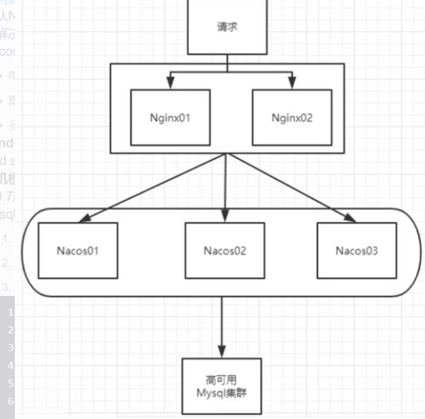

## 106_Nacos集群_架构说明


真实业务场景: 




用户请求 通过nginx集群路由到 Nacos集群,  nacos使用同一份数据(持久化到Mysql数据库) 


按照上述，**我们需要mysql数据库**。


默认Nacos使用嵌入式数据库实现数据的存储。所以，如果启动多个默认配置下的Nacos节点，数据存储是存在一致性问题的。为了解决这个问题，Nacos采用了集中式存储的方式来支持集群化部署，目前只支持MySQL的存储。

Nacos支持三种部署模式

    单机模式-用于测试和单机试用。
    集群模式-用于生产环境，确保高可用。
    多集群模式-用于多数据中心场景。

Windows

cmd startup.cmd或者双击startup.cmd文件

单机模式支持mysql

在0.7版本之前，在单机模式时nacos使用嵌入式数据库实现数据的存储，不方便观察数据存储的基本情况。0.7版本增加了支持mysql数据源能力，具体的操作步骤:

    安装数据库，版本要求:5.6.5+
    初始化mysq数据库，数据库初始化文件: nacos-mysql.sql
    修改conf/application.properties文件，增加支持mysql数据源配置（目前只支持mysql)，添加mysql数据源的url、用户名和密码。
nacos  -- application.properties文件相关配置

```
spring.datasource.platform=mysql

db.num=1
db.url.0=jdbc:mysql://127.0.0.1:3306/nacos_config?characterEncoding=utf8&connectTimeout=1000&socketTimeout=3000&autoReconnect=true
db.user=root
db.password=XXXX

```

再以单机模式启动nacos，nacos所有写嵌入式数据库的数据都写到了mysql。

