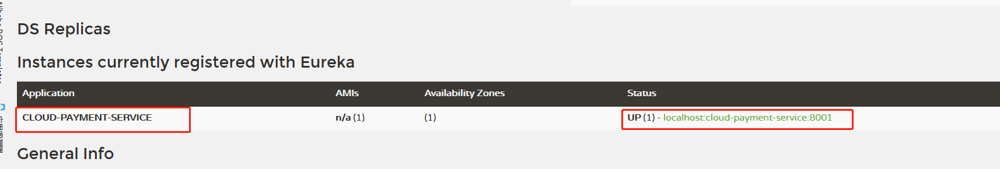

# 17_支付微服务8001入驻进EurekaServer

EurekaClient端cloud-provider-payment8001将注册进EurekaServer成为服务提供者provider，类似学校对外提供授课服务。

1.修改cloud-provider-payment8001

2.改POM

添加spring-cloud-starter-netflix-eureka-client依赖

3.写YML

4.主启动

5.测试

    启动cloud-provider-payment8001和cloud-eureka-server7001工程。
    
    浏览器输入 - http://localhost:7001/ 主页内的Instances currently registered with Eureka会显示cloud-provider-payment8001的配置文件application.yml设置的应用名cloud-payment-service
即  http://localhost:7001/  会显示Eureka注册了的client服务.

6.自我保护机制

EMERGENCY! EUREKA MAY BE INCORRECTLY CLAIMING INSTANCES ARE UP WHEN THEY’RE NOT. RENEWALS ARELESSER THAN THRESHOLD AND HENCFT ARE NOT BEING EXPIRED JUST TO BE SAFE.

紧急情况！EUREKA可能错误地声称实例在没有启动的情况下启动了。续订小于阈值，因此实例不会为了安全而过期。
