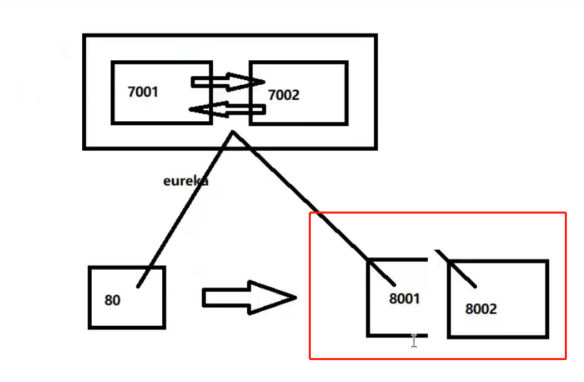
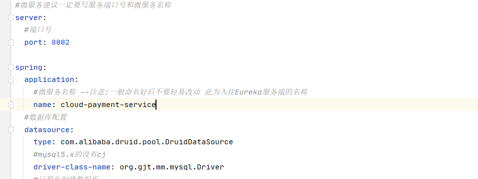
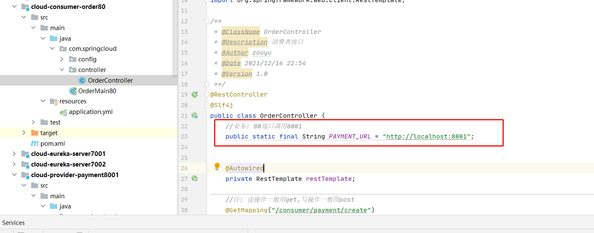
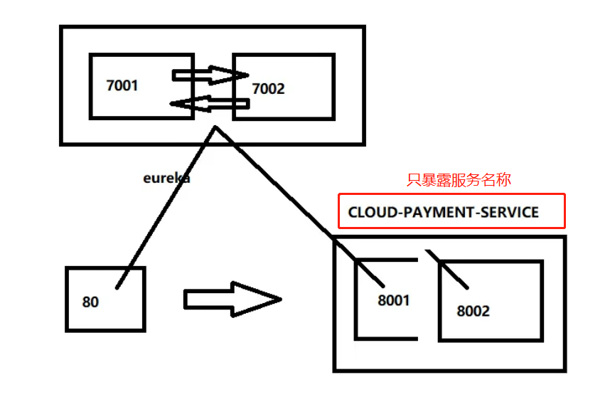
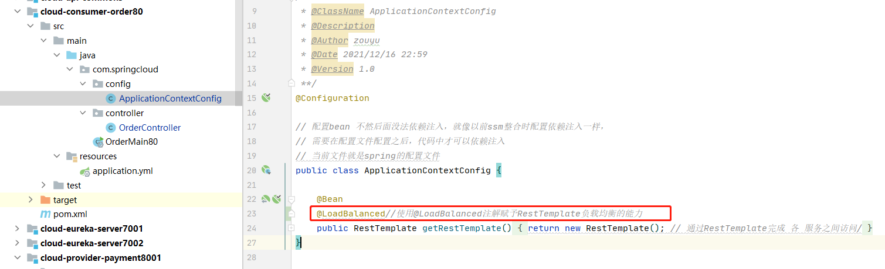

# 22_支付微服务集群配置

目前为止，rureka注册服务中心 为集群形式 。下面进行 支付 服务的环境搭建




 支付服务提供者8001集群环境构建

参考cloud-provicer-payment8001

1.新建cloud-provider-payment8002

2.改POM

3.写YML - 端口8002

4.主启动

5.业务类

6.修改8001/8002的Controller，添加serverPort

说明： 

此时支付微服务向外暴露是  ：cloud-payment-service ，81订单微服务调用支付微服务不确定为哪一个提供的，就需要在controller添加调用的服务和 接口 




```
@RestController
@Slf4j
public class PaymentController {

    @Autowired
    private PaymentService paymentService;

    //集群 确定是哪个服务
    @Value("${server.port}")
    private String serverPort;

    @PostMapping(value = "/payment/create")
    //localhost:8001/payment/create?serial=today1216
    public CommonResult create(@RequestBody  Payment payment){
        //插入条数
        int result = paymentService.create(payment);

        log.info("***插入结果: "+ result);

        if(result>0){
            return new CommonResult(200,"操作成功!,serverPort:"+serverPort,result);
        }else{
            return new CommonResult(500,"操作失败!");
        }
    }

    @GetMapping(value = "/payment/get/{id}")
    //localhost:8001/payment/get/1
    public CommonResult getPaymentById(@PathVariable("id") Long id){
        //查询实体
        Payment payment = paymentService.getPaymentById(id);


        log.info("***查询结果: "+ payment);

        if(payment != null){
            return new CommonResult(200,"查询成功,serverPort:"+serverPort,payment);
        }else{
            return new CommonResult(500,"没有对应记录,查询ID: "+id,null);
        }
    }

}
```


配置好后,访问如下接口

```
http://localhost:8002/payment/get/1
http://localhost:8001/payment/get/1
http://localhost:81/consumer/payment/get/1
```


都可以访问通，但是，http://localhost:81/consumer/payment/get/1  只可以访问到8001端口服务，原因是消费者访问端口是写死的。




**负载均衡**

cloud-consumer-order80订单服务访问地址不能写死，改为支付服务名 http://CLOUD-PAYMENT-SERVICE

```
@Slf4j
@RestController
public class OrderController {

    //public static final String PAYMENT_URL = "http://localhost:8001";
    public static final String PAYMENT_URL = "http://CLOUD-PAYMENT-SERVICE";
    
    ...
}
```



如果此时重启服务访问会报错，是因为没配置负载均衡功能（不知道集群中的哪个给我提供服务）！

使用@LoadBalanced注解赋予RestTemplate负载均衡的能力 -- 默认轮询




ApplicationContextBean - 提前说一下Ribbon的负载均衡功能

测试

先要启动EurekaServer，7001/7002服务

再要启动服务提供者provider，8001/8002服务

浏览器输入 - http://localhost/consumer/payment/get/31

结果：负载均衡效果达到，8001/8002端口交替出现

Ribbon和Eureka整合后Consumer可以直接调用服务而不用再关心地址和端口号，且该服务还有负载功能。
