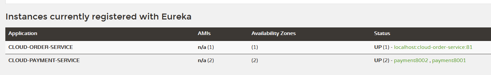
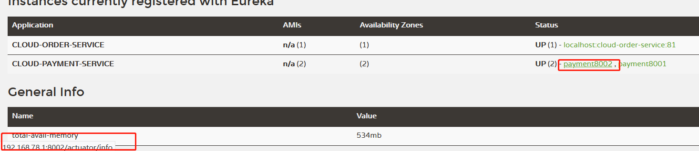

## 23_actuator微服务信息完善

主机名称：服务名称修改（也就是将IP地址，换成可读性高的名字）

修改cloud-provider-payment8001，cloud-provider-payment8002

修改部分 - YML - eureka.instance.instance-id

```
eureka:
  ...
  instance:
    instance-id: payment8001 #添加此处

```

```
eureka:
  ...
  instance:
    instance-id: payment8002 #添加此处

```

修改之后

eureka主页将显示payment8001，payment8002代替原来显示的IP地址。




访问信息有IP信息提示，（就是将鼠标指针移至payment8001，payment8002名下，会有IP地址提示）

查看状态

```
http://localhost:8002/actuator/health
```


修改部分 - YML - eureka.instance.prefer-ip-address  可以显示 ip

```
eureka:
  ...
  instance:
    instance-id: payment8001 
    prefer-ip-address: true #添加此处

```


