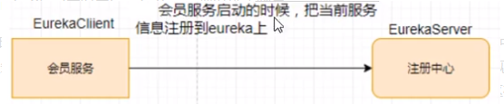

# 25_Eureka自我保护理论知识

概述

保护模式主要用于一组客户端和Eureka Server之间存在网络分区场景下的保护。一旦进入保护模式，Eureka Server将会尝试保护其服务注册表中的信息，不再删除服务注册表中的数据，也就是不会注销任何微服务。

如果在Eureka Server的首页看到以下这段提示，则说明Eureka进入了保护模式:

EMERGENCY! EUREKA MAY BE INCORRECTLY CLAIMING INSTANCES ARE UP WHEN THEY’RE NOT. RENEWALS ARE LESSER THANTHRESHOLD AND HENCE THE INSTANCES ARE NOT BEING EXPIRED JUSTTO BE SAFE

导致原因

一句话：某时刻某一个微服务不可用了，Eureka不会立刻清理，依旧会对该微服务的信息进行保存。

属于CAP里面的AP分支。

为什么会产生Eureka自我保护机制?

为了EurekaClient可以正常运行，防止与EurekaServer网络不通情况下，EurekaServer不会立刻将EurekaClient服务剔除

什么是自我保护模式?

默认情况下，如果EurekaServer在一定时间内没有接收到某个微服务实例的心跳，EurekaServer将会注销该实例(默认90秒)。但是当网络分区故障发生(延时、卡顿、拥挤)时，微服务与EurekaServer之间无法正常通信，以上行为可能变得非常危险了——因为微服务本身其实是健康的，此时本不应该注销这个微服务。Eureka通过“自我保护模式”来解决这个问题——当EurekaServer节点在短时间内丢失过多客户端时(可能发生了网络分区故障)，那么这个节点就会进入自我保护模式。

自我保护机制∶默认情况下EurekaClient定时向EurekaServer端发送心跳包

如果Eureka在server端在一定时间内(默认90秒)没有收到EurekaClient发送心跳包，便会直接从服务注册列表中剔除该服务，但是在短时间( 90秒中)内丢失了大量的服务实例心跳，这时候Eurekaserver会开启自我保护机制，不会剔除该服务（该现象可能出现在如果网络不通但是EurekaClient为出现宕机，此时如果换做别的注册中心如果一定时间内没有收到心跳会将剔除该服务，这样就出现了严重失误，因为客户端还能正常发送心跳，只是网络延迟问题，而保护机制是为了解决此问题而产生的)。

在自我保护模式中，Eureka Server会保护服务注册表中的信息，不再注销任何服务实例。

它的设计哲学就是宁可保留错误的服务注册信息，也不盲目注销任何可能健康的服务实例。一句话讲解：好死不如赖活着。

综上，自我保护模式是一种应对网络异常的安全保护措施。它的架构哲学是宁可同时保留所有微服务（健康的微服务和不健康的微服务都会保留）也不盲目注销任何健康的微服务。使用自我保护模式，可以让Eureka集群更加的健壮、稳定。
