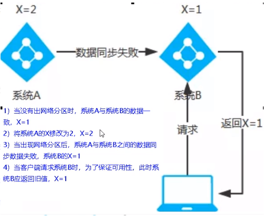
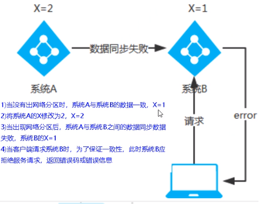

## 35_三个注册中心异同点 CAP理论

CAP：

- C：Consistency (强一致性)
- A：Availability (可用性)
- P：Partition tolerance （分区容错性)  -- 分布式 P一定要保证

- C（一致性）：所有的节点上的数据时刻保持同步
- A（可用性）：每个请求都能接受到一个响应，无论响应成功或失败
- P（分区容错）：系统应该能持续提供服务，即使系统内部有消息丢失（分区）

最多只能同时较好的满足两个。

CAP理论的核心是：一个分布式系统不可能同时很好的满足一致性，可用性和分区容错性这三个需求。

因此，根据CAP原理将NoSQL数据库分成了满足CA原则、满足CP原则和满足AP原则三大类:

    CA - 单点集群，满足—致性，可用性的系统，通常在可扩展性上不太强大。
    CP - 满足一致性，分区容忍性的系统，通常性能不是特别高。
    AP - 满足可用性，分区容忍性的系统，通常可能对一致性要求低一些。

AP架构（Eureka）

当网络分区出现后，为了保证可用性，系统B可以返回旧值，保证系统的可用性。

结论：违背了一致性C的要求，只满足可用性和分区容错，即AP

CP架构（ZooKeeper/Consul）

当网络分区出现后，为了保证一致性，就必须拒接请求，否则无法保证一致性。

结论：违背了可用性A的要求，只满足一致性和分区容错，即CP。

CP 与 AP 对立同一的矛盾关系。