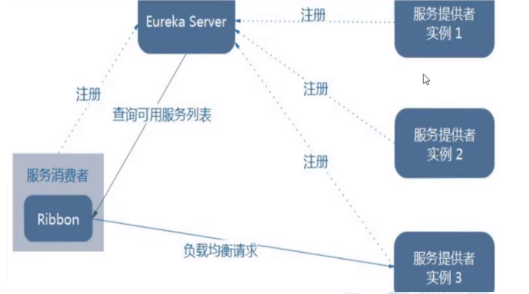
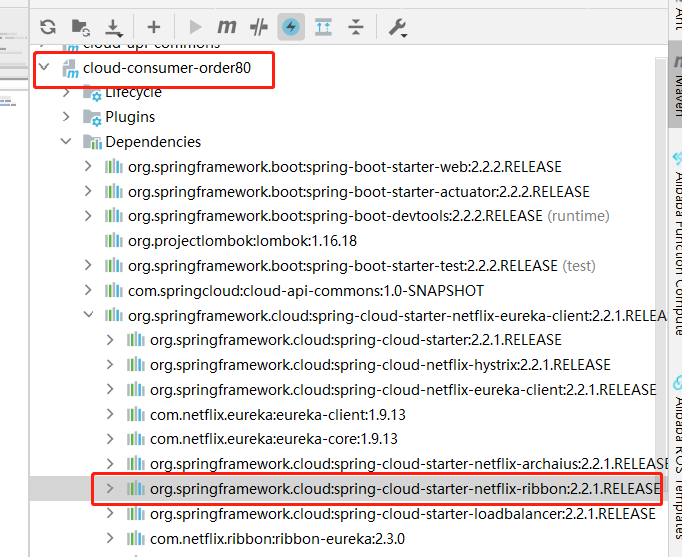

## 37_Ribbon的负载均衡和Rest调用

**架构说明**

总结：Ribbon其实就是一个软负载均衡的客户端组件，它可以和其他所需请求的客户端结合使用，和Eureka结合只是其中的一个实例。




Ribbon在工作时分成两步：

    第一步先选择EurekaServer ,它优先选择在同一个区域内负载较少的server。
    
    第二步再根据用户指定的策略，在从server取到的服务注册列表中选择一个地址。

其中Ribbon提供了多种策略：比如轮询、随机和根据响应时间加权。

POM

先前工程项目没有引入spring-cloud-starter-ribbon也可以使用ribbon。


```
<dependency>
    <groupld>org.springframework.cloud</groupld>
    <artifactld>spring-cloud-starter-netflix-ribbon</artifactid>
</dependency>

```

这是因为spring-cloud-starter-netflix-eureka-client自带了spring-cloud-starter-ribbon引用。




二说RestTemplate的使用

RestTemplate Java Doc

getForObject() / getForEntity() - GET请求方法

getForObject()：返回对象为响应体中数据转化成的对象，基本上可以理解为Json。

getForEntity()：返回对象为ResponseEntity对象，包含了响应中的一些重要信息，比如响应头、响应状态码、响应体等。

**postForObject() / postForEntity()** - POST请求方法

下面熟悉方法

```
    @GetMapping("/consumer/payment/getForEntity/{id}")
    public CommonResult<Payment> getPayment2(@PathVariable("id") Long id){
        ResponseEntity<CommonResult> entity = restTemplate.getForEntity(PAYMENT_URL + "/payment/get/" + id, CommonResult.class);

        //判断编码
        if(entity.getStatusCode().is2xxSuccessful()){
            //2xx开头 为成功
            return  entity.getBody();
        }else {
            //返回失败
            return new CommonResult<>(500,"操作失败,请重试.");
        }
    }
```


