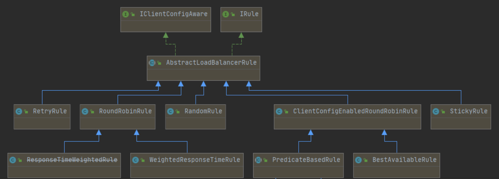

## 38_Ribbon默认自带的负载规则

lRule：根据特定算法中从服务列表中选取一个要访问的服务

RoundRobinRule 轮询
RandomRule 随机
RetryRule 先按照RoundRobinRule的策略获取服务，如果获取服务失败则在指定时间内会进行重试
WeightedResponseTimeRule 对RoundRobinRule的扩展，响应速度越快的实例选择权重越大，越容易被选择
BestAvailableRule 会先过滤掉由于多次访问故障而处于断路器跳闸状态的服务，然后选择一个并发量最小的服务
AvailabilityFilteringRule 先过滤掉故障实例，再选择并发较小的实例
ZoneAvoidanceRule 默认规则,复合判断server所在区域的性能和server的可用性选择服务器
