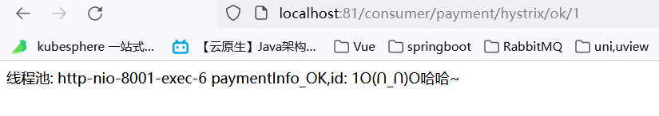
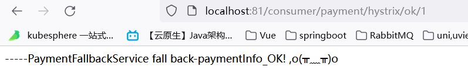
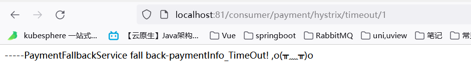
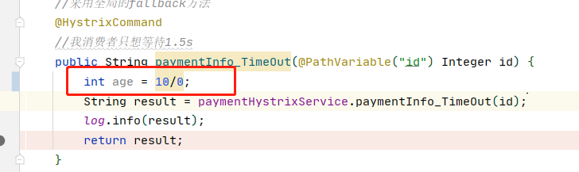

# 57_Hystrix之通配服务降级FeignFallback

目前问题2 统一和自定义的分开，代码混乱

服务降级，客户端去调用服务端，碰上服务端宕机或关闭

本次案例服务降级处理是在客户端80实现完成的，与服务端8001没有关系，只需要为Feign客户端定义的接口添加一个服务降级处理的实现类即可实现解耦

未来我们要面对的异常

    运行
    超时
    宕机

修改cloud-consumer-feign-hystrix-order80 --**消费者端**

根据cloud-consumer-feign-hystrix-order80已经有的PaymentHystrixService接口，
重新新建一个类(AaymentFallbackService)**实现** 该接口，统一为接口里面的方法进行异常处理

PaymentFallbackService类实现PaymentHystrixService接口


```java
package com.springcloud.service;

import org.springframework.stereotype.Component;

/**
 * @ClassName PaymentFallbackService
 * @Description PaymentHystrixService实现类,为了处理服务降级 统一为接口里面的方法进行异常处理
 * @Author zouyu
 * @Date 2021/12/28 23:48
 * @Version 1.0
 **/
@Component
public class PaymentFallbackService implements PaymentHystrixService {
    @Override
    public String paymentInfo_OK(Integer id) {
        return "-----PaymentFallbackService fall back-paymentInfo_OK! ,o(╥﹏╥)o";
    }

    @Override
    public String paymentInfo_TimeOut(Integer id) {
        return "-----PaymentFallbackService fall back-paymentInfo_TimeOut! ,o(╥﹏╥)o";
    }
}

```

YML

```
#开启
feign:
  hystrix:
    enabled: true
```

PaymentHystrixService接口

```java
@Component
@FeignClient(value = "CLOUD-PROVIDER-HYSTRIX-PAYMENT" //激活   找哪个微服务
                ,fallback = PaymentFallbackService.class)   //指定PaymentFallbackService类  所有方法异常处理类
public interface PaymentHystrixService {

    @GetMapping("/payment/hystrix/ok/{id}")
    public String paymentInfo_OK(@PathVariable("id") Integer id);

    @GetMapping("/payment/hystrix/timeout/{id}")
    public String paymentInfo_TimeOut(@PathVariable("id") Integer id);


}
```

测试

单个eureka先启动7001

PaymentHystrixMain8001启动

正常访问测试 - http://localhost:81/consumer/payment/hystrix/ok/1

故意关闭微服务8001 !! 

客户端自己调用提示 - 此时服务端provider已经down了，但是我们做了服务降级处理，让客户端在服务端不可用时也会获得提示信息而不会挂起耗死服务器

8001未关闭



8001已关闭





## 如果方法上没有/或者有    @HystrixCommand  注解  访问8001服务的方法都是显示异常实现类中的方法



## 但是,如果是80服务自身报错和8001方法无关就会调用80全局异常处理逻辑



