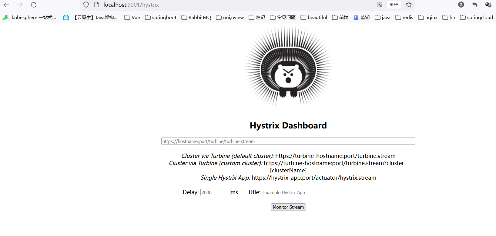

## 63_Hystrix图形化Dashboard搭建

概述

除了隔离依赖服务的调用以外，Hystrix还提供了准实时的调用监控(Hystrix Dashboard)，Hystrix会持续地记录所有通过Hystrix发起的请求的执行信息，并以统计报表和图形的形式展示给用户，包括每秒执行多少请求多少成功，多少失败等。

Netflix通过hystrix-metrics-event-stream项目实现了对以上指标的监控。Spring Cloud也提供了Hystrix Dashboard的整合，对监控内容转化成可视化界面。

仪表盘9001

1新建cloud-consumer-hystrix-dashboard9001

2.POM

```xml
<dependencies>
        <dependency>
            <groupId>org.springframework.cloud</groupId>
            <artifactId>spring-cloud-starter-netflix-hystrix-dashboard</artifactId>
        </dependency>
        <dependency>
            <groupId>org.springframework.boot</groupId>
            <artifactId>spring-boot-starter-actuator</artifactId>
        </dependency>

        <dependency>
            <groupId>org.springframework.boot</groupId>
            <artifactId>spring-boot-devtools</artifactId>
            <scope>runtime</scope>
            <optional>true</optional>
        </dependency>
        <dependency>
            <groupId>org.projectlombok</groupId>
            <artifactId>lombok</artifactId>
            <optional>true</optional>
        </dependency>
        <dependency>
            <groupId>org.springframework.boot</groupId>
            <artifactId>spring-boot-starter-test</artifactId>
            <scope>test</scope>
        </dependency>
    </dependencies>

```

yml

```
server:
  port: 9001
```


HystrixDashboardMain9001+新注解@EnableHystrixDashboard

```
/**
 * @ClassName HystrixDashboardMain9001
 * @Description  Dashboard监控服务
 * @Author zouyu
 * @Date 2021/12/29 12:23
 * @Version 1.0
 **/
@SpringBootApplication
@EnableHystrixDashboard
public class HystrixDashboardMain9001 {
    public static void main(String[] args) {
        SpringApplication.run(HystrixDashboardMain9001.class, args);
    }
}
```


注意: 所有Provider微服务提供类(8001/8002/8003)都需要监控依赖配置

```xml
<dependency>
    <groupId>org.springframework.boot</groupId>
    <artifactId>spring-boot-starter-actuator</artifactId>
</dependency>
```


6.启动cloud-consumer-hystrix-dashboard9001该微服务后续将监控微服务8001

浏览器输入http://localhost:9001/hystrix


访问成功说明搭建完成.

