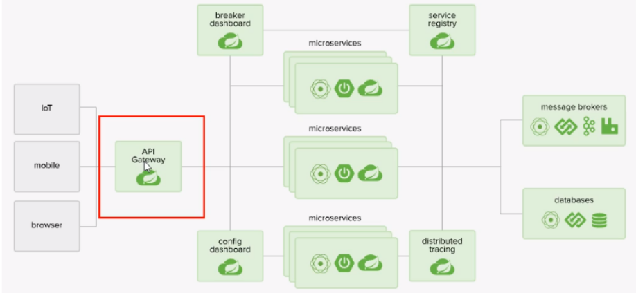
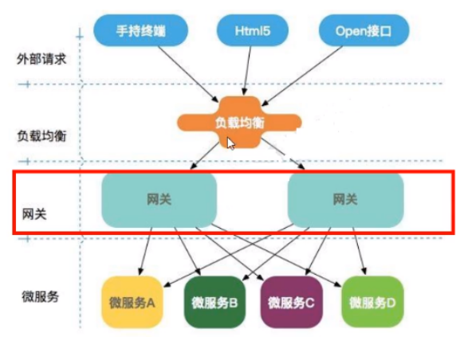

# 66_GateWay是什么

概述

Cloud全家桶中有个很重要的组件就是网关，在1.x版本中都是采用的Zuul网关;

但在2.x版本中，zuul的升级一直跳票，SpringCloud最后自己研发了一个网关替代Zuul，那就是SpringCloud Gateway—句话：gateway是原zuul1.x版的替代

Gateway是在Spring生态系统之上构建的API网关服务，基于Spring 5，Spring Boot 2和Project Reactor等技术。

Gateway旨在提供一种简单而有效的方式来对API进行路由，以及提供一些强大的过滤器功能，例如:熔断、限流、重试等。

SpringCloud Gateway是Spring Cloud的一个全新项目，基于Spring 5.0+Spring Boot 2.0和Project Reactor等技术开发的网关，它旨在为微服务架构提供—种简单有效的统一的API路由管理方式。

SpringCloud Gateway作为Spring Cloud 生态系统中的网关，目标是替代Zuul，在Spring Cloud 2.0以上版本中，没有对新版本的Zul 2.0以上最新高性能版本进行集成，仍然还是使用的Zuul 1.x非Reactor模式的老版本。而为了提升网关的性能，SpringCloud Gateway是基于WebFlux框架实现的，而WebFlux框架底层则使用了高性能的Reactor模式通信框架Netty。

Spring Cloud Gateway的目标提供统一的路由方式且基于 Filter链的方式提供了网关基本的功能，例如:安全，监控/指标，和限流。

作用

    方向代理
    鉴权
    流量控制
    熔断
    日志监控
    …

微服务架构中网关的位置

