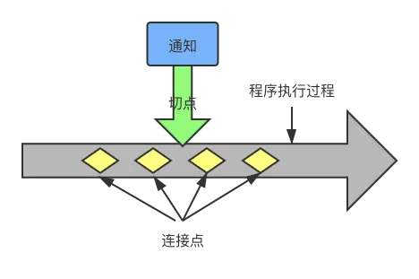
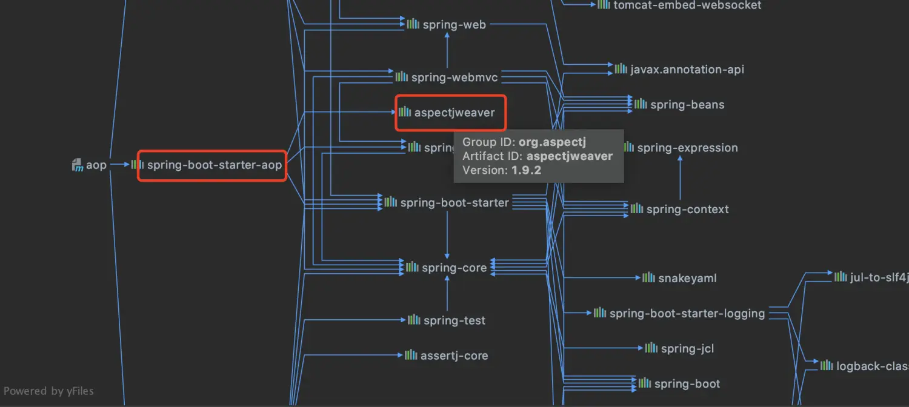
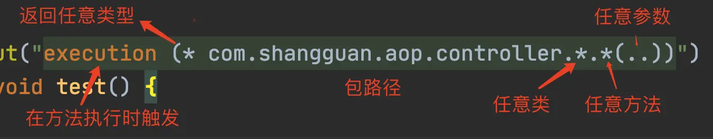

## 一、为什么需要面向切面编程？

面向对象编程（OOP）的好处是显而易见的，缺点也同样明显。当需要为多个不具有继承关系的对象添加一个公共的方法的时候，例如日志记录、性能监控等，如果采用面向对象编程的方法，需要在每个对象里面都添加相同的方法，这样就产生了较大的重复工作量和大量的重复代码，不利于维护。面向切面编程（AOP）是面向对象编程的补充，简单来说就是统一处理某一“切面”的问题的编程思想。如果使用AOP的方式进行日志的记录和处理，所有的日志代码都集中于一处，不需要再每个方法里面都去添加，极大减少了重复代码

## 二、Spring AOP术语



**通知**（Advice）包含了需要用于多个应用对象的横切行为，完全听不懂，没关系，通俗一点说就是定义了“什么时候”和“做什么”。

**连接点**（Join Point）是程序执行过程中能够应用通知的所有点。

**切点**（Poincut）是定义了在“什么地方”进行切入，哪些连接点会得到通知。显然，切点一定是连接点。

**切面**（Aspect）是通知和切点的结合。通知和切点共同定义了切面的全部内容——是什么，何时，何地完成功能。

**引入**（Introduction）允许我们向现有的类中添加新方法或者属性。

**织入**（Weaving）是把切面应用到目标对象并创建新的代理对象的过程，分为编译期织入、类加载期织入和运行期织入。


## 三、Spring Boot AOP实战


### 3.1 引入依赖

Spring Boot使用AOP需要添加spring-boot-starter-aop依赖，如下：

```xml
<dependency>
    <groupId>org.springframework.boot</groupId>
    <artifactId>spring-boot-starter-aop</artifactId>
</dependency>
```

不需要再添加aspectjweaver的依赖了，因为spring-boot-starter-aop包含了aspectjweaver，并且版本是较新的版本，如果在添加老版本（如1.5.4）启动会报错。



### 3.2 编写用于拦截的bean

直接定义一个controller，代码如下：

```kotlin
@RestController
public class AopController {

    @RequestMapping("/hello")
    public String sayHello(){
        System.out.println("hello");
        return "hello";
    }
}
```


### 3.3 定义切面

Spring采用@AspectJ注解对POJO进行标注，该注解表明该类不仅仅是一个POJO，还是一个切面。切面是切点和通知的结合，那么定义一个切面就需要编写切点和通知。在代码中，只需要添加@Aspect注解即可。


#### 3.3.1 定义切点

切点是通过@Pointcut注解和切点表达式定义的。

@Pointcut注解可以在一个切面内定义可重用的切点。

由于Spring切面粒度最小是达到方法级别，而execution表达式可以用于明确指定方法返回类型，类名，方法名和参数名等与方法相关的部件，并且实际中，大部分需要使用AOP的业务场景也只需要达到方法级别即可，因而execution表达式的使用是最为广泛的。如图是execution表达式的语法：

execution表示在方法执行的时候触发。以“*”开头，表明方法返回值类型为任意类型。然后是全限定的类名和方法名，“*”可以表示任意类和任意方法。对于方法参数列表，可以使用“..”表示参数为任意类型。如果需要多个表达式，可以使用“&&”、“||”和“!”完成与、或、非的操作。

“!”完成与、或、非的操作。




#### 3.3.2 定义通知

通知有五种类型，分别是：

前置通知（@Before）：在目标方法调用之前调用通知

后置通知（@After）：在目标方法完成之后调用通知

环绕通知（@Around）：在被通知的方法调用之前和调用之后执行自定义的方法

返回通知（@AfterReturning）：在目标方法成功执行之后调用通知

异常通知（@AfterThrowing）：在目标方法抛出异常之后调用通知

代码中定义了三种类型的通知，使用@Before注解标识前置通知，打印“beforeAdvice...”，使用@After注解标识后置通知，打印“AfterAdvice...”，使用@Around注解标识环绕通知，在方法执行前和执行之后分别打印“before”和“after”。这样一个切面就定义好了，代码如下：

```java
@Aspect
@Component
public class AopAdvice {

    @Pointcut("execution (* com.shangguan.aop.controller.*.*(..))")
    public void test() {

    }

    @Before("test()")
    public void beforeAdvice() {
        System.out.println("beforeAdvice...");
    }

    @After("test()")
    public void afterAdvice() {
        System.out.println("afterAdvice...");
    }

    @Around("test()")
    public void aroundAdvice(ProceedingJoinPoint proceedingJoinPoint) {
        System.out.println("before");
        try {
            proceedingJoinPoint.proceed();
        } catch (Throwable t) {
            t.printStackTrace();
        }
        System.out.println("after");
    }

}
before
beforeAdvice...

    hello //业务出参

after
afterAdvice...
```


## 日志打印案例

### aop

```java
package xyz.oahoushs.vote.common.aspect;

import com.alibaba.fastjson.JSON;
import com.alibaba.nacos.shaded.com.google.gson.Gson;
import org.aspectj.lang.JoinPoint;
import org.aspectj.lang.ProceedingJoinPoint;
import org.aspectj.lang.annotation.*;
import org.slf4j.Logger;
import org.slf4j.LoggerFactory;
import org.springframework.stereotype.Component;
import org.springframework.web.context.request.RequestContextHolder;
import org.springframework.web.context.request.ServletRequestAttributes;

import javax.servlet.http.HttpServletRequest;
import java.util.Arrays;


@Aspect // 定义一个切面
@Component
public class WebLogAspect {

    private final static Logger logger = LoggerFactory.getLogger(WebLogAspect.class);

    @Pointcut("execution( * xyz.oahoushs.vote.controller..*.*(..)) ")
    public void webLog() {}
    /**
     * 在切点之前织入
     * @param joinPoint
     * @throws Throwable
     */
    @Before("webLog()")
    public void doBefore(JoinPoint joinPoint) throws Throwable {
        // 开始打印请求日志
        ServletRequestAttributes attributes = (ServletRequestAttributes) RequestContextHolder.getRequestAttributes();
        HttpServletRequest request = attributes.getRequest();
        // 打印请求相关参数
        logger.info("========================================== Start ==========================================");
        // 打印请求 url
        logger.info("URL            : {}", request.getRequestURL().toString());
        // 打印 Http method
        logger.info("HTTP Method    : {}", request.getMethod());
        // 打印调用 controller 的全路径以及执行方法
        logger.info("Class Method   : {}.{}", joinPoint.getSignature().getDeclaringTypeName(), joinPoint.getSignature().getName());
        // 打印请求的 IP
        logger.info("IP             : {}", request.getRemoteAddr());
        // 打印请求入参
        logger.info("Request Args   : {}",Arrays.toString(joinPoint.getArgs()));
        //logger.info("Request Args   : {}", JSON.toJSONString(joinPoint.getArgs()));
    }
    /**
     * 在切点之后织入
     * @throws Throwable
     */
    @After("webLog()")
    public void doAfter() throws Throwable {
        logger.info("=========================================== End ===========================================");
        // 每个请求之间空一行
        logger.info("");
    }

    @AfterReturning("webLog()")
    public void AfterReturning() throws Throwable {
        logger.info("返回通知AfterReturning");

    }
    @AfterThrowing("webLog()")
    public void AfterThrowing() throws Throwable {
        logger.error("异常通知AfterThrowing");

    }
    /**
     * 环绕
     * @param proceedingJoinPoint
     * @return
     * @throws Throwable
     */
    @Around("webLog()")
    public Object doAround(ProceedingJoinPoint proceedingJoinPoint) throws Throwable {
        long startTime = System.currentTimeMillis();
        Object result = proceedingJoinPoint.proceed();
        // 打印出参
        logger.info("Response Args  : {}", new Gson().toJson(result));
        // 执行耗时
        logger.info("Time-Consuming 响应执行耗时: {} ms", System.currentTimeMillis() - startTime);
        return result;
    }


}

```


日志输出-异常

```
[2023/04/25-10:53:51] [http-nio-8443-exec-5] [INFO ] [xyz.oahoushs.vote.common.aspect.WebLogAspect] : ========================================== Start ==========================================
[2023/04/25-10:53:51] [http-nio-8443-exec-5] [INFO ] [xyz.oahoushs.vote.common.aspect.WebLogAspect] : URL            : http://192.168.31.102:8443/api/user/captcha
[2023/04/25-10:53:51] [http-nio-8443-exec-5] [INFO ] [xyz.oahoushs.vote.common.aspect.WebLogAspect] : HTTP Method    : GET
[2023/04/25-10:53:51] [http-nio-8443-exec-5] [INFO ] [xyz.oahoushs.vote.common.aspect.WebLogAspect] : Class Method   : xyz.oahoushs.vote.controller.user.UserApi.getCaptcha
[2023/04/25-10:53:51] [http-nio-8443-exec-5] [INFO ] [xyz.oahoushs.vote.common.aspect.WebLogAspect] : IP             : 192.168.31.102
[2023/04/25-10:53:51] [http-nio-8443-exec-5] [INFO ] [xyz.oahoushs.vote.common.aspect.WebLogAspect] : Request Args   : [org.apache.catalina.connector.ResponseFacade@5a726235, 1682391178000]
[2023/04/25-10:53:51] [http-nio-8443-exec-5] [INFO ] [xyz.oahoushs.vote.common.aspect.WebLogAspect] : =========================================== End ===========================================
[2023/04/25-10:53:51] [http-nio-8443-exec-5] [INFO ] [xyz.oahoushs.vote.common.aspect.WebLogAspect] : 
[2023/04/25-10:53:51] [http-nio-8443-exec-5] [ERROR] [xyz.oahoushs.vote.common.aspect.WebLogAspect] : 异常通知AfterThrowing
```


```
[2023/04/25-10:59:34] [http-nio-8443-exec-10] [INFO ] [xyz.oahoushs.vote.common.aspect.WebLogAspect] : ========================================== Start ==========================================
[2023/04/25-10:59:34] [http-nio-8443-exec-10] [INFO ] [xyz.oahoushs.vote.common.aspect.WebLogAspect] : URL            : http://192.168.31.102:8443/api/user/captcha
[2023/04/25-10:59:34] [http-nio-8443-exec-10] [INFO ] [xyz.oahoushs.vote.common.aspect.WebLogAspect] : HTTP Method    : GET
[2023/04/25-10:59:34] [http-nio-8443-exec-10] [INFO ] [xyz.oahoushs.vote.common.aspect.WebLogAspect] : Class Method   : xyz.oahoushs.vote.controller.user.UserApi.getCaptcha
[2023/04/25-10:59:34] [http-nio-8443-exec-10] [INFO ] [xyz.oahoushs.vote.common.aspect.WebLogAspect] : IP             : 192.168.31.102
[2023/04/25-10:59:34] [http-nio-8443-exec-10] [INFO ] [xyz.oahoushs.vote.common.aspect.WebLogAspect] : Request Args   : [org.apache.catalina.connector.ResponseFacade@5a726235, 1682391178000]
[2023/04/25-10:59:34] [http-nio-8443-exec-10] [INFO ] [xyz.oahoushs.vote.service.impl.UserServiceImpl] : captcha font type index == > 2
[2023/04/25-10:59:34] [http-nio-8443-exec-10] [INFO ] [xyz.oahoushs.vote.service.impl.UserServiceImpl] : captcha content == > 6tagb
[2023/04/25-10:59:34] [http-nio-8443-exec-10] [INFO ] [xyz.oahoushs.vote.common.aspect.WebLogAspect] : Response Args  : null
[2023/04/25-10:59:34] [http-nio-8443-exec-10] [INFO ] [xyz.oahoushs.vote.common.aspect.WebLogAspect] : Time-Consuming 响应执行耗时: 62 ms
[2023/04/25-10:59:34] [http-nio-8443-exec-10] [INFO ] [xyz.oahoushs.vote.common.aspect.WebLogAspect] : =========================================== End ===========================================
[2023/04/25-10:59:34] [http-nio-8443-exec-10] [INFO ] [xyz.oahoushs.vote.common.aspect.WebLogAspect] : 
[2023/04/25-10:59:34] [http-nio-8443-exec-10] [INFO ] [xyz.oahoushs.vote.common.aspect.WebLogAspect] : 返回通知AfterReturning

```

