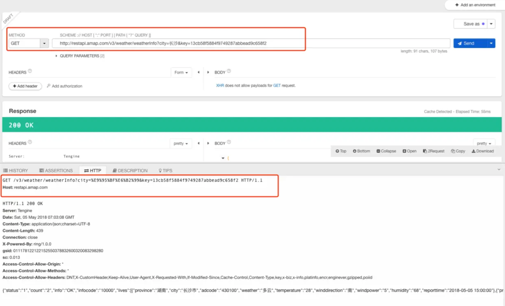

## 一、前言

本篇文章主要是简单讲述一下socket的使用.

## 二、什么是Socket

回答这个问题前我们要先看下TCP/IP四层模型，想必这个图大家都有见过，下面就解释下这四层分别的表现形式是什么（理论解释比较让人摸不着头脑，所以这里以其表现形式来阐述）

1. 网络接口层：主要表现为识别mac间比特流的传输
2. 网络层：表现为IP协议
3. 传输层：表现为TCP、UDP
4. 应用层：表现为Http、Https、RTSP等（这里的协议比较多，我们经常使用的http协议就属于应用层）

> Tip：顺便说下TCP和UDP的区别。TCP提供可靠的通信传输，类似于打电话，需要等待另一方的接听，才能进行真正的通讯；而UDP则不是可靠的，类似发短信，只将信息发出，至于对方有没收到，这个就不关心了。


而我们关心的socket是什么呢？**socket其实是TCP连接的抽象，利用socket进行TCP的连接**（这个解释可能比较片面，但个人觉得是最为直观的解释，毕竟全面的解释比较晦涩难懂）


## 二、如何使用Socket进行http请求

### 1、建立socket连接

在java中使用socket，其实非常的简单。如果只是需要一个普通的socket，只需通过如下代码，便可以建立一个socket连接


```
Socket socket = new Socket(“ip或域名”, 端口);
```

如果想建立一个sslSocket，用于https的通讯（例如：[www.baidu.com）只需要通过sslSocketFactory进行创建sslSocket即可。代码如下：](https://link.juejin.cn?target=https%3A%2F%2Fwww.baidu.com%EF%BC%89%E5%8F%AA%E9%9C%80%E8%A6%81%E9%80%9A%E8%BF%87sslSocketFactory%E8%BF%9B%E8%A1%8C%E5%88%9B%E5%BB%BAsslSocket%E5%8D%B3%E5%8F%AF%E3%80%82%E4%BB%A3%E7%A0%81%E5%A6%82%E4%B8%8B%EF%BC%9A)

```ini
Socket socket = SSLSocketFactory.getDefault().createSocket("www.baidu.com", 443);

```


### 2、http协议请求和响应格式解析

在使用socket进行发起请求前，我们要先来了解下http协议。简单一点的理解，http协议其实就是发起一个按照格式约定的字符串，服务器响应一串按格式组装的数据。 这里不使用教科书式的数据格式，我们使用从"Restlet Client"发起一次请求，观察其请求报文和响应报文来进行讲解。

> Tip：Restlet Client是一个api请求工具，日常开发中也可以用来向服务器发起请求，获取数据结构方便调试。可以在chrome的应用商店下载。

这里使用的api是高德的天气预报接口，点击了“send”后，获取到请求报文和响应报文，如下图所示



#### 我们先单独说下这次请求的请求报文（第二个红框中内容，如下所示）

```
GET /v3/weather/weatherInfo?city=%E9%95%BF%E6%B2%99&key=13cb58f5884f9749287abbead9c658f2 HTTP/1.1
Host: restapi.amap.com
```


#### （1）第一行为发起请求信息，其格式为：

1. 发起的请求形式（这里使用的是GET，如果为POST的话，这里便为POST）,即这里的“GET”
2. 一个空格，即“ ”
3. 请求的路径（不包括域名，因为域名已经在建立socket连接时确定，如果为GET请求，则参数追加在后面以“?”隔开；如果为POST请求，则请求参数会在body中增加，具体见第四小点），即这里的“/v3/weather/weatherInfo?city=%E9%95%BF%E6%B2%99&key=13cb58f5884f9749287abbead9c658f2”
4. 一个空格，即“ ”
5. http请求的版本，即“HTTP/1.1”
6. \r\n，此处没有显示出来，但是自己在组装报文时，需要增加这个表示一行已经结束

#### （2）第二行的格式为：

1. host字段名，即“Host”
2. 一个冒号加一个空格，即“: ”（敲黑板！！冒号后面有一个空格，这个在组装请求报文时，尤为重要）
3. host的内容，即“restapi.amap.com”
4. \r\n，此处没有显示出来，但是自己在组装报文时，需要增加这个表示一行已经结束

> tip：这里其实是请求头部，如果头部参数有多个的话，就按照这种格式进行拼装。例如还有一个“Connection为keep-alive”的头部参数，则以“Connection: keep-alive\r\n”的形式写入输出流中，具体会在后面的例子中展示。

#### （3）第三行的格式为：(没想到吧！！！这里有第三行)

1. \r\n，此处没有显示出来，但是自己在组装报文时，**需要增加这个表示头部参数已写完** 

#### （4）如果为POST请求，接下来还需要进行body参数的拼装，这里以form表单为例，拼接上面接口的参数。规则就是“键=值”，键值对间用“&”隔开。

```
city=长沙&key=13cb58f5884f9749287abbead9c658f2
```

至此一个请求报文便拼装完毕，将其用输出流写出即可获得服务器的响应报文。

#### 我们接着说下这次请求的响应报文

```
HTTP/1.1 200 OK
Server: Tengine
Date: Sun, 06 May 2018 08:22:10 GMT
Content-Type: application/json;charset=UTF-8
Content-Length: 445
Connection: close
X-Powered-By: ring/1.0.0
gsid: 010185222147152559493030300162313551811
sc: 0.013
Access-Control-Allow-Origin: *
Access-Control-Allow-Methods: *
Access-Control-Allow-Headers: DNT,X-CustomHeader,Keep-Alive,User-Agent,X-Requested-With,If-Modified-Since,Cache-Control,Content-Type,key,x-biz,x-info,platinfo,encr,enginever,gzipped,poiid

{"status":"1","count":"2","info":"OK","infocode":"10000","lives":[{"province":"湖南","city":"长沙市","adcode":"430100","weather":"阵雨","temperature":"25","winddirection":"东北","windpower":"7","humidity":"78","reporttime":"2018-05-06 16:00:00"},{"province":"湖南","city":"长沙县","adcode":"430121","weather":"阵雨","temperature":"25","winddirection":"东北","windpower":"7","humidity":"78","reporttime":"2018-05-06 16:00:00"}]}


```


#### （1）第一行为响应状态，格式为

1. http的版本信息，即“HTTP/1.1”
2. 一个空格，即“ ”
3. 状态码，即“200”
4. 一个空格，即“ ”
5. 状态，即“OK”
6. \r\n，此处没有显示出来，但是解析响应报文时，需要通过这两个字符进行判断是否一行结束

#### （2）第二行至第十二行为响应头，每一行的格式为

1. 头名称，即“Server”
2. 一个冒号加一个空格，即“: ”
3. 头部参数值，即“Tengine”
4. \r\n，此处没有显示出来，但是解析响应报文时，需要通过这两个字符进行判断是否一行结束

#### （3）第十三行，格式为

1. \r\n，用于区分头部参数和内容的区分

#### （4）第十四行为响应内容，格式为

这里便是接口给我们的数据，即此处给到我们的天气json数据，而此处json的长度为头部中有一个参数为“Content-Length”决定的，例子中内容的长度为445。值得一提的是，有些接口返回的头部参数并没有“Content-Length”这一头部参数，而是返回了“Transfer-Encoding: chunked”这样的头部参数，则表明是以块的形式给到我们数据。 块的形式会以如下格式，第一行的“10\r\n”表明接下来的一行会有10个字节的内容，第二行便是10字节的内容，同样以“\r\n”结束一行（\r\n这两个字符不算在内容长度中），每一块的格式都按这样的形式，如果遇到“0\r\n\r\n”就说明内容结束。


```
10\r\n      //（注意！！！这里是10是16进制，即如果进行内容读取需要将其进行做10进制的转换）
10字节长度的内容\r\n

//结束格式
0\r\n
\r\n
```


至此响应报文解析完毕。

### 3、进行http请求

逼逼叨逼逼叨了这么久，很多小伙伴已经很迫不及待的想知道怎么请求和获取响应了。我们这里便直接上代码，代码很简单，并没有什么知识难点。


```
public class MySocket {

    public static void main(String[] args) throws IOException {
        //如果需要进行https的请求只需要换成如下一句（https的默认端口为443，http默认端口为80）
        //Socket socket = SSLSocketFactory.getDefault().createSocket("xxx", 443);
        Socket socket = new Socket("restapi.amap.com", 80);

        //获取输入流，即从服务器获取的数据
        final BufferedReader bufferedReader = new BufferedReader(new InputStreamReader(socket.getInputStream()));
        //获取输出流，即我们写出给服务器的数据
        BufferedWriter bufferedWriter = new BufferedWriter(new OutputStreamWriter(socket.getOutputStream()));

        //使用一个线程来进行读取服务器的响应
        new Thread() {
            @Override
            public void run() {
                while (true) {
                    String line = null;
                    try {
                        while ((line = bufferedReader.readLine()) != null) {
                            System.out.println("recv : " + line);
                        }
                    } catch (IOException e) {
                        e.printStackTrace();
                    }
                }
            }
        }.start();

        bufferedWriter.write("GET /v3/weather/weatherInfo?city=%E9%95%BF%E6%B2%99&key=13cb58f5884f9749287abbead9c658f2 HTTP/1.1\r\n");
        bufferedWriter.write("Host: restapi.amap.com\r\n\r\n");
        bufferedWriter.flush();

    }

}

```


跑起来后会看到控制台输出如下信息，这个时候我们就可以按照第二小结中的格式进行解析到一个模型中，最终返回给UI或是逻辑层去使用。


