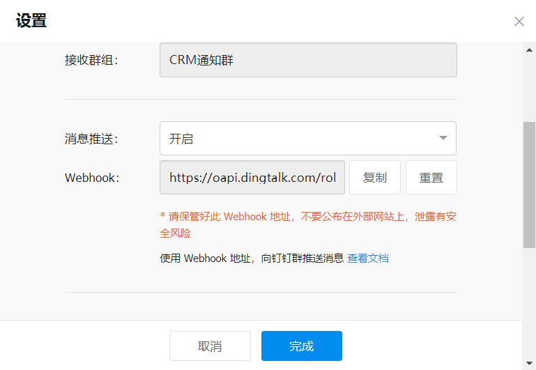
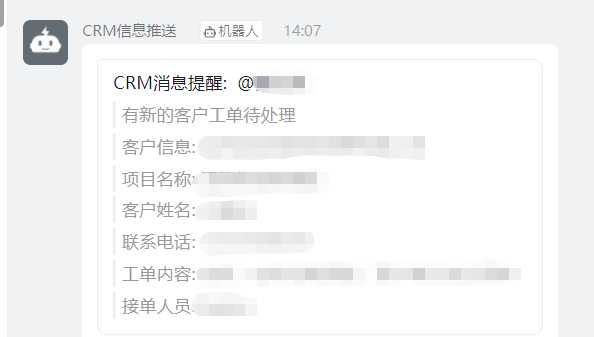

# 钉钉机器人搭建

## 业务背景

CRM系统使用短信提醒，但是时效性不强，特此与钉钉进行对接。


## 实现流程
###  前期准备
新建测试群，获取自定义机器人Webhook,并进行相关配置

参考

```
https://open.dingtalk.com/document/robots/custom-robot-access#title-zob-eyu-qse
```





### 代码实现

### 集成SDK

```
https://open.dingtalk.com/document/resourcedownload/download-server-sdk?spm=ding_open_doc.document.0.0.27405e59psf4Qq#title-dyi-gqb-z18
```

maven 依赖

```xml
<dependency>
 <groupId>com.aliyun</groupId>
 <artifactId>alibaba-dingtalk-service-sdk</artifactId>
 <version>2.0.0</version>
</dependency>
```


#### 代码实现 新建工具类

```java
public class SendDingtalkUtil {

    /**
     *  推送钉钉机器人方法
     * @param phone
     * @param sendUserName
     * @param chatWorkLists
     * @throws ApiException
     */
    public static void sendDingtalk(String phone, String sendUserName, ChatWorkList chatWorkLists) throws ApiException {

        //机器人token
        DingTalkClient client = new DefaultDingTalkClient("https://oapi.dingtalk.com/robot/send?access_token=7758473423c67700bb466c16bc9b9e58bd302067a12XXX");
        OapiRobotSendRequest request = new OapiRobotSendRequest();
        request.setMsgtype("text");
        OapiRobotSendRequest.Text text = new OapiRobotSendRequest.Text();
        text.setContent("CRM测试文本消息");
        request.setText(text);
        OapiRobotSendRequest.At at = new OapiRobotSendRequest.At();
        at.setAtMobiles(Arrays.asList(phone));
        // isAtAll类型如果不为Boolean，请升级至最新SDK
        at.setIsAtAll(false);
        //at.setAtUserIds(Arrays.asList("109929","32099"));
        request.setAt(at);

        request.setMsgtype("markdown");
        OapiRobotSendRequest.Markdown markdown = new OapiRobotSendRequest.Markdown();
        markdown.setTitle("CRM消息提醒");

        
        markdown.setText("#### CRM消息提醒:  @"+phone+" \n" +
                "> 有新的客户工单待处理  \n\n" +
                "> 客户信息: "+chatWorkLists.getSubmitCompanyname()+" \n\n" +
                "> 项目名称: "+chatWorkLists.getSubmitAname()+" \n\n" +
                "> 客户姓名: "+chatWorkLists.getSubmitUsername()+" \n\n" +
                "> 联系电话: "+chatWorkLists.getSubmitTelphone()+" \n\n" +
                "> 工单内容: "+chatWorkLists.getGdDescription()+" \n\n"  +
                "> 接单人员: "+sendUserName+" \n");
        request.setMarkdown(markdown);
        OapiRobotSendResponse response = client.execute(request);
    }
}
```


可使用 link,text,markdown等格式


## 实现效果




## 参考文档

https://zhuanlan.zhihu.com/p/372597713

https://ld246.com/article/1626853213351

https://open.dingtalk.com/document/orgapp/group-assistant-sends-a-message


# 配置

webhook

```
https://oapi.dingtalk.com/robot/send?access_token=7758473423c67700bb466xxx
```

官方文档;

https://open.dingtalk.com/document/robots/custom-robot-access


接入测试

https://open.dingtalk.com/document/robots/custom-robot-access#title-zob-eyu-qse


