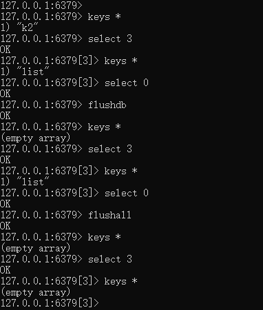

# Redis键（key）

案例

## 1.keys *

### 查看当前库所有的key

## 2.exists key

判断某个key是否存在

## 3.type key

查看你的key是什么类型

## 4.del key

删除指定的key数据

## 5.unlink key

非阻塞删除，仅仅将keys从keyspace元数据中删除，真正的删除会在后续异步中操作。

del key 是原子的删除，只有删除成功了才会返回删除结果，如果是删除大key用del会将后面的操作都阻塞，而unlink key 不会阻塞，它会在后台异步删除数据。

## 6.ttl key

查看还有多少秒过期，-1表示永不过期，-2表示已过期

## 7.expire key 秒钟

为给定的key设置过期时间

## 8.move key dbindex[0-15]

将当前数据库的key移动到给定的数据库DB当中

## 9.select dbindex

切换数据库【0-15】，默认为0

## 10.dbsize

查看当前数据库key的数量

## 11.flushdb

清空当前库

## 12.flushall

通杀全部库

